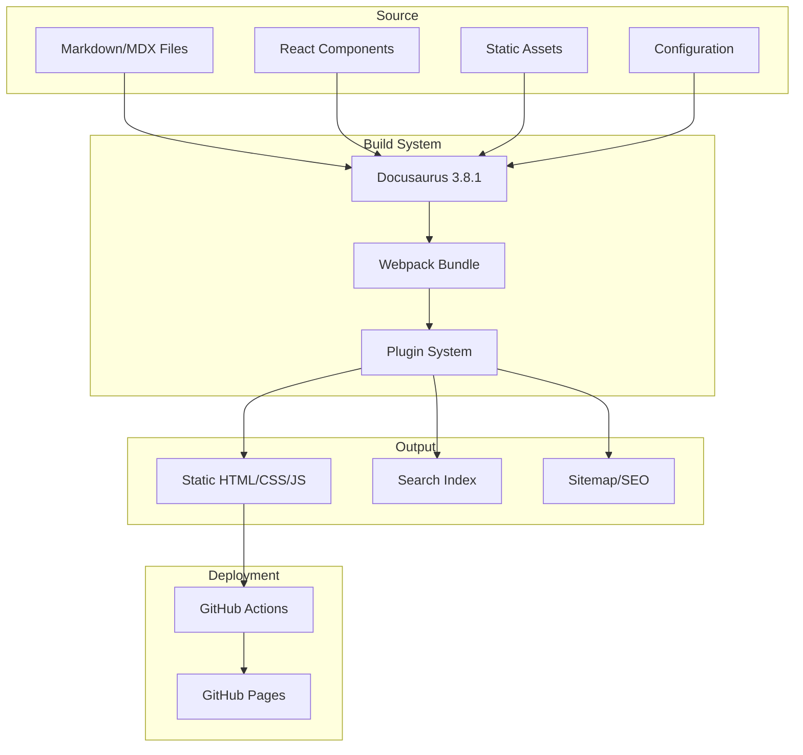
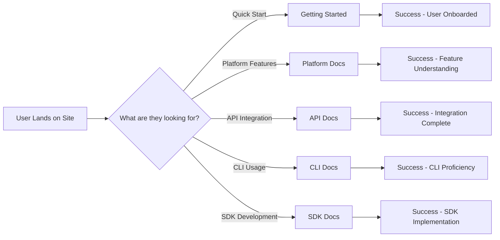
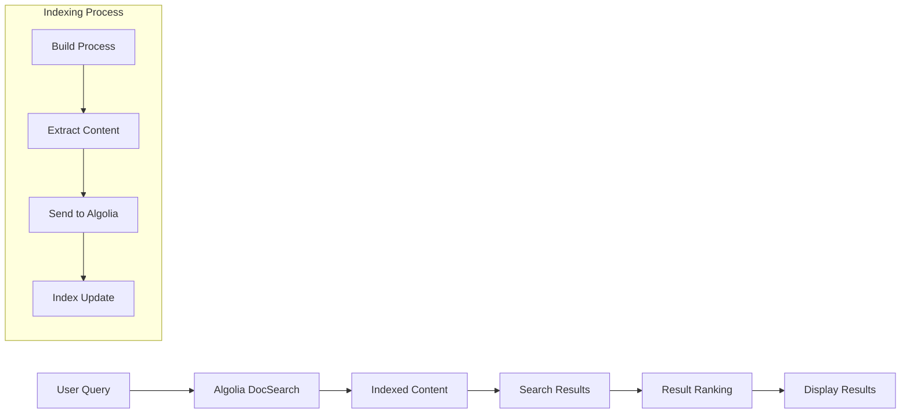
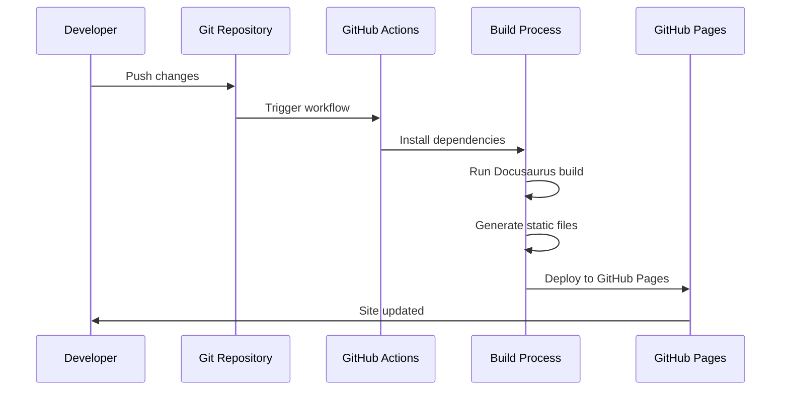
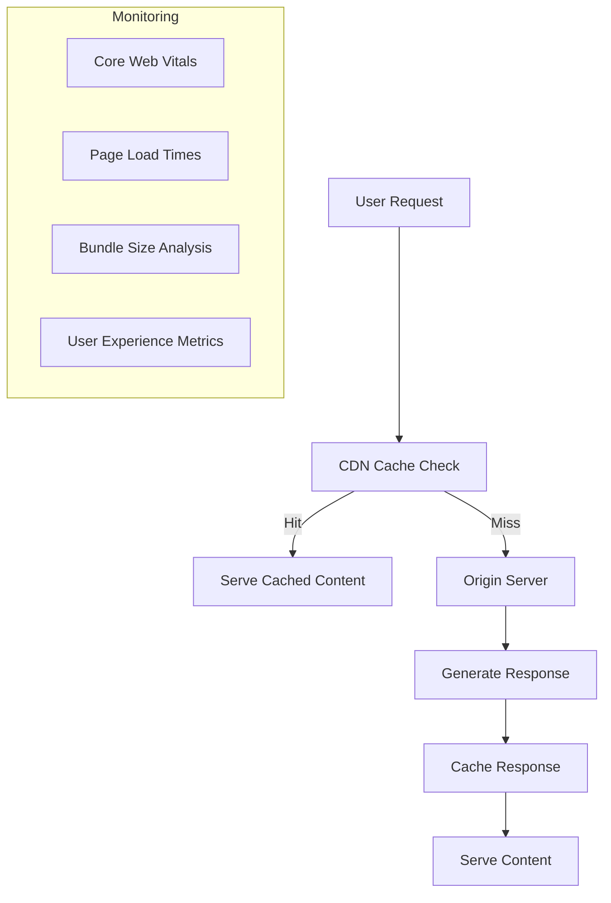

# Architecture Overview for Vantage Documentation

This document provides a comprehensive overview of the architecture, design decisions, and technical implementation of the Vantage documentation site.

## 🏗️ System Architecture

### High-Level Architecture



### Technology Stack

**Core Framework**
- **Docusaurus 3.8.1**: React-based static site generator
- **React 18**: Component framework with hooks and modern patterns
- **TypeScript**: Type safety for components and configurations
- **Webpack 5**: Module bundling with code splitting and optimization

**Content Management**
- **MDX**: Markdown with embedded JSX components
- **Frontmatter**: YAML metadata for pages
- **Sidebar Generation**: Automatic navigation from file structure
- **Search Integration**: Algolia DocSearch for full-text search

**Build and Deployment**
- **Just**: Task runner for development and build commands
- **Yarn**: Package management and dependency resolution
- **GitHub Actions**: CI/CD pipeline for automated deployment
- **GitHub Pages**: Static site hosting with custom domain

## 🔧 Plugin Architecture

### Multi-Plugin Structure

The documentation site uses multiple Docusaurus plugins to organize different content types:

```javascript
// Plugin configuration structure
const plugins = [
  // Main documentation plugin
  ['@docusaurus/plugin-content-docs', {
    id: 'default',
    path: 'docs',
    routeBasePath: '/',
    sidebarPath: './sidebars-main.js'
  }],
  
  // Platform documentation
  ['@docusaurus/plugin-content-docs', {
    id: 'platform',
    path: 'docs-platform',
    routeBasePath: '/platform',
    sidebarPath: './sidebars-platform.js'
  }],
  
  // API documentation
  ['@docusaurus/plugin-content-docs', {
    id: 'api',
    path: 'docs-api',
    routeBasePath: '/api',
    sidebarPath: './sidebars-api.js'
  }],
  
  // CLI documentation
  ['@docusaurus/plugin-content-docs', {
    id: 'cli',
    path: 'docs-cli',
    routeBasePath: '/cli',
    sidebarPath: './sidebars-cli.js'
  }],
  
  // SDK documentation
  ['@docusaurus/plugin-content-docs', {
    id: 'sdk',
    path: 'docs-sdk',
    routeBasePath: '/sdk',
    sidebarPath: './sidebars-sdk.js'
  }]
];
```

### Plugin Benefits
- **Separation of Concerns**: Each documentation type has its own structure
- **Independent Navigation**: Separate sidebars for different content areas
- **Routing Isolation**: Clean URL structure per documentation type
- **Content Organization**: Logical grouping of related documentation

## 📁 Content Architecture

### Documentation Structure

```text
Content Organization:
├── docs/                     # Main/general documentation
│   ├── index.md             # Site homepage
│   └── getting-started/     # Initial user guidance
├── docs-platform/           # Platform-specific features
│   ├── clusters/           # Cluster management
│   ├── jobs/               # Job execution
│   ├── storage/            # Storage management
│   └── teams/              # Team collaboration
├── docs-api/               # API reference and guides
│   ├── authentication.md  # Auth methods
│   ├── reference.md        # Endpoint documentation
│   └── quickstart.md       # Getting started with API
├── docs-cli/               # Command-line interface
│   ├── installation/       # CLI setup
│   ├── command-reference/  # Command documentation
│   └── configuration/      # CLI configuration
└── docs-sdk/               # Software development kits
    ├── installation/       # SDK setup
    ├── quickstart/         # Getting started guides
    └── api/                # SDK API reference
```

### Content Flow



## 🎨 Theme and Styling Architecture

### CSS Architecture

```text
Styling Hierarchy:
├── Docusaurus Core Styles    # Base framework styles
├── Theme Configuration       # CSS custom properties
├── Global Custom Styles      # Site-wide customizations
├── Component Module Styles   # Component-specific styles
└── Inline Styles            # Component-level styling
```

### CSS Custom Properties Structure

```css
:root {
  /* Color System */
  --ifm-color-primary: #007acc;
  --ifm-color-primary-dark: #0066b3;
  --ifm-color-primary-darker: #005999;
  
  /* Typography Scale */
  --ifm-font-family-base: 'Satoshi', system-ui, sans-serif;
  --ifm-font-size-base: 16px;
  --ifm-line-height-base: 1.6;
  
  /* Spacing System */
  --ifm-spacing-horizontal: 1.5rem;
  --ifm-spacing-vertical: 1rem;
  
  /* Layout Properties */
  --ifm-container-width: 1200px;
  --ifm-navbar-height: 60px;
}
```

### Component Styling Strategy
- **CSS Modules**: Scoped styles for custom components
- **BEM Methodology**: Consistent naming for global styles
- **Responsive Design**: Mobile-first approach with breakpoints
- **Dark Mode**: Automatic support through CSS custom properties

## 🔍 Search Architecture

### Search Implementation



### Search Configuration

```javascript
// Algolia DocSearch configuration
const themeConfig = {
  algolia: {
    appId: process.env.ALGOLIA_APP_ID,
    apiKey: process.env.ALGOLIA_SEARCH_API_KEY,
    indexName: 'vantage-docs',
    contextualSearch: true,
    searchParameters: {
      facetFilters: [['type:content']],
    },
    searchPagePath: 'search',
  },
};
```

## 🚀 Build and Deployment Architecture

### Build Process



### Deployment Pipeline

```yaml
# .github/workflows/deploy.yml
name: Deploy Documentation

on:
  push:
    branches: [main]
  repository_dispatch:
    types: [docs-update]

jobs:
  deploy:
    runs-on: ubuntu-latest
    steps:
      - name: Checkout
        uses: actions/checkout@v4
        
      - name: Setup Node.js 22
        uses: actions/setup-node@v4
        with:
          node-version: '22'
          cache: 'yarn'
          
      - name: Install dependencies
        run: yarn install --frozen-lockfile
        
      - name: Build
        run: yarn build
        
      - name: Deploy to GitHub Pages
        uses: peaceiris/actions-gh-pages@v3
        with:
          github_token: ${{ secrets.GITHUB_TOKEN }}
          publish_dir: ./build
```

## 📊 Performance Architecture

### Optimization Strategies

**Code Splitting**
- Route-based splitting for each documentation section
- Component-level splitting for heavy components
- Dynamic imports for non-critical features

**Asset Optimization**
- Image optimization with WebP format
- Font loading optimization with font-display: swap
- CSS minification and critical CSS inlining

**Caching Strategy**
- Static asset caching with long-term cache headers
- Service worker for offline functionality
- CDN caching for global content delivery

### Performance Monitoring



## 🔐 Security Architecture

### Security Measures

**Content Security Policy**
```javascript
// Security headers configuration
const securityConfig = {
  contentSecurityPolicy: {
    directives: {
      defaultSrc: ["'self'"],
      scriptSrc: ["'self'", "'unsafe-inline'", "https://cdn.jsdelivr.net"],
      styleSrc: ["'self'", "'unsafe-inline'", "https://fonts.googleapis.com"],
      fontSrc: ["'self'", "https://fonts.gstatic.com"],
      imgSrc: ["'self'", "data:", "https:"],
    },
  },
};
```

**Dependency Management**
- Regular dependency updates via Dependabot
- Security vulnerability scanning
- Automated dependency review in pull requests

## 📈 Scalability Considerations

### Content Scalability
- Modular documentation structure
- Plugin-based architecture for new content types
- Automated content validation and link checking

### Technical Scalability
- Static site generation for fast loading
- CDN distribution for global availability
- Horizontal scaling through GitHub Pages

### Maintenance Scalability
- Automated testing and validation
- Contributor guidelines and templates
- GitHub Copilot integration for AI-assisted development

## 🔄 Future Architecture Considerations

### Planned Enhancements
- **Content Management**: Headless CMS integration for non-technical contributors
- **Internationalization**: Multi-language support with translation management
- **Advanced Search**: Enhanced search with filters and faceted navigation
- **Analytics**: Comprehensive user behavior tracking and analysis

### Technical Roadmap
- **Framework Upgrades**: Keep pace with Docusaurus and React updates
- **Performance Optimization**: Continued optimization of Core Web Vitals
- **Accessibility**: Enhanced accessibility features and compliance
- **Developer Experience**: Improved tooling and development workflows

This architecture provides a solid foundation for the Vantage documentation site while maintaining flexibility for future growth and enhancement.