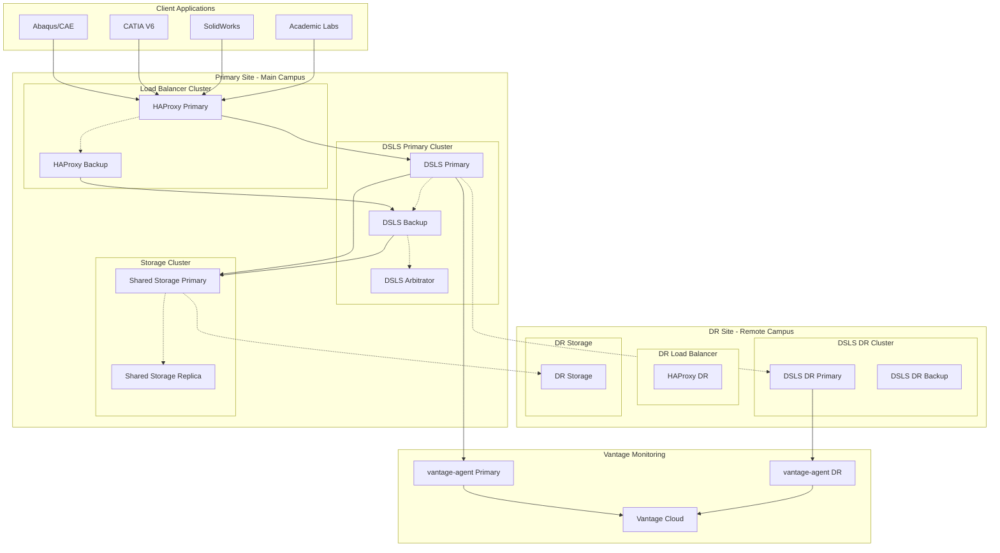

# DSLS High Availability & Disaster Recovery

This guide covers implementing high availability, redundancy, and disaster recovery for Dassault Systèmes License Server (DSLS) to ensure continuous access to critical engineering software licenses. DSLS supports native clustering and failover mechanisms optimized for token-based licensing systems.

## Architecture Overview

DSLS high availability architecture ensures zero-downtime license access:



## Primary-Backup Configuration

### Primary Server Configuration

Configure the primary DSLS server with clustering support:

```bash
# /opt/dsls/config/primary.conf
# DSLS Primary Server Configuration

# Basic server settings
DSLS_PORT=27000
DSLS_CLUSTER_MODE=primary
DSLS_NODE_ID=dsls-primary-01

# High availability settings
DSLS_HA_ENABLED=true
DSLS_HA_ROLE=primary
DSLS_HA_CLUSTER_NAME=production-cluster
DSLS_HA_PEER_SERVERS=dsls-backup-01:27000,dsls-arbitrator-01:27000

# Clustering configuration
DSLS_CLUSTER_TOKEN_SYNC=true
DSLS_CLUSTER_STATE_SYNC=true
DSLS_CLUSTER_HEARTBEAT_INTERVAL=30
DSLS_CLUSTER_ELECTION_TIMEOUT=120

# Shared storage configuration
DSLS_SHARED_LICENSE_PATH=/shared/dsls/licenses
DSLS_SHARED_STATE_PATH=/shared/dsls/state
DSLS_SHARED_LOG_PATH=/shared/dsls/logs

# Token pool management
DSLS_TOKEN_POOL_SIZE=1000
DSLS_TOKEN_REPLICATION=true
DSLS_TOKEN_FAILOVER_TIMEOUT=60

# Performance tuning for clustering
DSLS_CLUSTER_MAX_CONNECTIONS=2000
DSLS_CLUSTER_CONNECTION_TIMEOUT=30
DSLS_CLUSTER_BUFFER_SIZE=128MB
```

### Backup Server Configuration

```bash
# /opt/dsls/config/backup.conf
# DSLS Backup Server Configuration

# Basic server settings
DSLS_PORT=27000
DSLS_CLUSTER_MODE=backup
DSLS_NODE_ID=dsls-backup-01

# High availability settings
DSLS_HA_ENABLED=true
DSLS_HA_ROLE=backup
DSLS_HA_CLUSTER_NAME=production-cluster
DSLS_HA_PEER_SERVERS=dsls-primary-01:27000,dsls-arbitrator-01:27000

# Backup-specific settings
DSLS_BACKUP_SYNC_INTERVAL=60
DSLS_BACKUP_TAKEOVER_TIMEOUT=90
DSLS_BACKUP_STATE_VERIFICATION=true

# Token synchronization
DSLS_TOKEN_SYNC_MODE=real_time
DSLS_TOKEN_CONSISTENCY_CHECK=true
DSLS_TOKEN_RECOVERY_ENABLED=true
```

### Arbitrator Configuration

```bash
# /opt/dsls/config/arbitrator.conf
# DSLS Arbitrator Configuration

# Arbitrator settings
DSLS_CLUSTER_MODE=arbitrator
DSLS_NODE_ID=dsls-arbitrator-01
DSLS_ARBITRATOR_ROLE=witness

# Cluster coordination
DSLS_ARBITRATOR_VOTE_WEIGHT=1
DSLS_ARBITRATOR_QUORUM_SIZE=2
DSLS_ARBITRATOR_SPLIT_BRAIN_DETECTION=true

# Health monitoring
DSLS_HEALTH_CHECK_INTERVAL=15
DSLS_HEALTH_CHECK_TIMEOUT=30
DSLS_HEALTH_CHECK_RETRIES=3
```

## Load Balancer Configuration

### HAProxy Configuration

Configure HAProxy for DSLS license server load balancing:

```bash
# /etc/haproxy/haproxy.cfg
global
    daemon
    log 127.0.0.1:514 local0
    chroot /var/lib/haproxy
    stats socket /run/haproxy/admin.sock mode 660
    stats timeout 30s
    user haproxy
    group haproxy

defaults
    mode tcp
    log global
    option tcplog
    option dontlognull
    option tcp-check
    timeout connect 5000ms
    timeout client 50000ms
    timeout server 50000ms
    retries 3

# DSLS License Server Backend
backend dsls_servers
    mode tcp
    balance roundrobin
    option tcp-check
    tcp-check send "STATUS\r\n"
    tcp-check expect string "Server Status: Running"
    
    server dsls-primary dsls-primary-01:27000 check port 27000 inter 30s rise 2 fall 3 weight 100
    server dsls-backup dsls-backup-01:27000 check port 27000 inter 30s rise 2 fall 3 weight 50 backup

# Frontend for license clients
frontend dsls_frontend
    bind *:27000
    mode tcp
    option tcplog
    default_backend dsls_servers

# Statistics interface
frontend stats
    bind *:8404
    mode http
    stats enable
    stats uri /stats
    stats refresh 30s
    stats admin if TRUE
```

### Keepalived Configuration

Configure VRRP for HAProxy high availability:

```bash
# /etc/keepalived/keepalived.conf - Primary HAProxy
vrrp_script chk_haproxy {
    script "/bin/kill -0 `cat /var/run/haproxy.pid`"
    interval 2
    weight 2
    fall 3
    rise 2
}

vrrp_instance VI_1 {
    state MASTER
    interface eth0
    virtual_router_id 51
    priority 101
    advert_int 1
    authentication {
        auth_type PASS
        auth_pass dsls_ha_2024
    }
    virtual_ipaddress {
        192.168.1.100/24
    }
    track_script {
        chk_haproxy
    }
}
```

## Shared Storage Configuration

### NFS Shared Storage

Configure NFS for license file and state sharing:

```bash
# NFS Server configuration (/etc/exports)
/shared/dsls/licenses 192.168.1.0/24(rw,sync,no_subtree_check,no_root_squash)
/shared/dsls/state 192.168.1.0/24(rw,sync,no_subtree_check,no_root_squash)
/shared/dsls/logs 192.168.1.0/24(rw,sync,no_subtree_check,no_root_squash)

# Mount on DSLS servers
echo "nfs-server:/shared/dsls/licenses /shared/dsls/licenses nfs defaults,_netdev 0 0" >> /etc/fstab
echo "nfs-server:/shared/dsls/state /shared/dsls/state nfs defaults,_netdev 0 0" >> /etc/fstab
echo "nfs-server:/shared/dsls/logs /shared/dsls/logs nfs defaults,_netdev 0 0" >> /etc/fstab

mount -a
```

### Cluster File System (Alternative)

```bash
# Configure GFS2 cluster filesystem
sudo yum install -y gfs2-utils
sudo pcs cluster setup dsls-cluster dsls-primary-01 dsls-backup-01 dsls-arbitrator-01
sudo pcs cluster start --all
sudo pcs cluster enable --all

# Create GFS2 filesystem
sudo pcs resource create dsls-storage ocf:heartbeat:Filesystem \
    device="/dev/sdb1" \
    directory="/shared/dsls" \
    fstype="gfs2" \
    options="defaults" \
    --group dsls-group
```

## Token Pool Synchronization

### Real-Time Token Synchronization

Configure real-time token state synchronization between cluster nodes:

```bash
# /opt/dsls/bin/token-sync.sh
#!/bin/bash

DSLS_PRIMARY="dsls-primary-01:27000"
DSLS_BACKUP="dsls-backup-01:27000"
SYNC_INTERVAL=5

while true; do
    # Get token state from primary
    PRIMARY_STATE=$(/opt/dsls/bin/DSLicSrv -tokens -format json)
    
    # Sync to backup server
    echo "$PRIMARY_STATE" | /opt/dsls/bin/DSLicSrv -sync-tokens -target $DSLS_BACKUP
    
    # Verify synchronization
    BACKUP_STATE=$(/opt/dsls/bin/DSLicSrv -tokens -format json -server $DSLS_BACKUP)
    
    if [ "$PRIMARY_STATE" != "$BACKUP_STATE" ]; then
        logger "DSLS: Token synchronization mismatch detected"
        /opt/dsls/bin/DSLicSrv -force-sync -target $DSLS_BACKUP
    fi
    
    sleep $SYNC_INTERVAL
done
```

### Academic Token Pool Management

```bash
# Configure academic token pool replication
/opt/dsls/bin/DSLicSrv -configure-academic-ha \
    --primary-pool 500 \
    --backup-pool 500 \
    --sync-interval 30 \
    --failover-priority academic

# Academic semester synchronization
/opt/dsls/bin/DSLicSrv -academic-calendar-sync \
    --semester-start "2024-01-15" \
    --semester-end "2024-05-15" \
    --enrollment-sync enabled \
    --course-schedule-sync enabled
```

## Failover Procedures

### Automatic Failover Configuration

```bash
# /opt/dsls/config/failover.conf
# Automatic Failover Configuration

# Failover triggers
FAILOVER_TRIGGERS=server_down,network_partition,license_corruption,token_exhaustion
FAILOVER_DETECTION_TIMEOUT=60
FAILOVER_EXECUTION_TIMEOUT=120

# Failover actions
FAILOVER_PROMOTE_BACKUP=true
FAILOVER_NOTIFY_CLIENTS=true
FAILOVER_UPDATE_DNS=true
FAILOVER_SYNC_STATE=true

# Recovery settings
RECOVERY_MODE=automatic
RECOVERY_VERIFICATION=true
RECOVERY_ROLLBACK_ENABLED=true
RECOVERY_NOTIFICATION=true

# Client handling during failover
CLIENT_NOTIFICATION_DELAY=30
CLIENT_RECONNECT_GRACE_PERIOD=300
CLIENT_QUEUE_PRESERVATION=true
CLIENT_TOKEN_PRESERVATION=true
```

### Manual Failover Procedures

```bash
# Manual failover script
#!/bin/bash
# /opt/dsls/bin/manual-failover.sh

echo "Initiating manual DSLS failover..."

# Step 1: Verify cluster status
/opt/dsls/bin/DSLicSrv -cluster-status

# Step 2: Stop primary server gracefully
echo "Stopping primary server..."
systemctl stop dsls-primary

# Step 3: Promote backup to primary
echo "Promoting backup server..."
/opt/dsls/bin/DSLicSrv -promote-to-primary -node dsls-backup-01

# Step 4: Update load balancer configuration
echo "Updating load balancer..."
curl -X POST http://haproxy:8404/stats \
    -d "action=disable&b=dsls_servers&s=dsls-primary"

# Step 5: Verify failover completion
echo "Verifying failover..."
/opt/dsls/bin/DSLicSrv -status -server dsls-backup-01

# Step 6: Notify administrators
echo "Failover completed. Primary role transferred to dsls-backup-01"
```

## Disaster Recovery Configuration

### DR Site Setup

Configure disaster recovery site with automated replication:

```bash
# DR site configuration
# /opt/dsls/config/dr-site.conf

# DR site identification
DR_SITE_ID=campus-backup
DR_REPLICATION_MODE=asynchronous
DR_SYNC_INTERVAL=300

# License file replication
DR_LICENSE_SYNC=true
DR_LICENSE_PATH=/dr/dsls/licenses
DR_LICENSE_VALIDATION=true

# State replication
DR_STATE_SYNC=true
DR_STATE_PATH=/dr/dsls/state
DR_STATE_COMPRESSION=true

# Recovery configuration
DR_RECOVERY_MODE=manual
DR_RECOVERY_VERIFICATION=comprehensive
DR_RECOVERY_ROLLBACK=enabled
```

### Automated DR Synchronization

```bash
# /opt/dsls/bin/dr-sync.sh
#!/bin/bash

DR_SERVER="dr-dsls-01.backup-campus.edu"
PRIMARY_SERVER="dsls-primary-01.main-campus.edu"

# Sync license files
rsync -avz --delete \
    /shared/dsls/licenses/ \
    $DR_SERVER:/dr/dsls/licenses/

# Sync configuration
rsync -avz --delete \
    /opt/dsls/config/ \
    $DR_SERVER:/opt/dsls/config/

# Sync token state (compressed)
/opt/dsls/bin/DSLicSrv -export-state | \
    gzip | \
    ssh $DR_SERVER "/opt/dsls/bin/DSLicSrv -import-state"

# Verify DR synchronization
ssh $DR_SERVER "/opt/dsls/bin/DSLicSrv -verify-dr-sync"
```

### DR Activation Procedures

```bash
# DR activation script
#!/bin/bash
# /opt/dsls/bin/activate-dr.sh

echo "Activating disaster recovery site..."

# Step 1: Verify primary site unavailability
if ping -c 3 dsls-primary-01.main-campus.edu > /dev/null; then
    echo "WARNING: Primary site appears to be accessible"
    read -p "Continue with DR activation? (y/N): " confirm
    [ "$confirm" != "y" ] && exit 1
fi

# Step 2: Activate DR DSLS servers
echo "Starting DR DSLS servers..."
systemctl start dsls-dr-primary
systemctl start dsls-dr-backup

# Step 3: Update DNS records
echo "Updating DNS for failover..."
nsupdate -k /etc/bind/keys/dsls-update.key << EOF
server dns-server.company.com
update delete dsls.company.com A
update add dsls.company.com 300 A 10.1.1.100
send
EOF

# Step 4: Notify academic users
echo "Notifying academic users of DR activation..."
curl -X POST https://api.company.com/notifications \
    -H "Content-Type: application/json" \
    -d '{
        "type": "emergency",
        "audience": "all_users",
        "message": "DSLS disaster recovery activated. All licenses now served from backup campus.",
        "channels": ["email", "slack", "dashboard"]
    }'

# Step 5: Verify DR functionality
echo "Testing DR license functionality..."
/opt/dsls/bin/DSLicSrv -test-checkout abaqus_standard 1
/opt/dsls/bin/DSLicSrv -test-checkout catia_v6 1

echo "DR activation completed successfully"
```

## Monitoring and Health Checks

### Cluster Health Monitoring

```bash
# /opt/dsls/bin/cluster-health.sh
#!/bin/bash

# Check all cluster nodes
NODES="dsls-primary-01 dsls-backup-01 dsls-arbitrator-01"

for node in $NODES; do
    echo "Checking node: $node"
    
    # Basic connectivity
    if ! ping -c 1 $node > /dev/null; then
        echo "ERROR: Node $node is unreachable"
        continue
    fi
    
    # DSLS service status
    SERVICE_STATUS=$(ssh $node "systemctl is-active dsls")
    echo "  Service status: $SERVICE_STATUS"
    
    # Token availability
    TOKEN_STATUS=$(ssh $node "/opt/dsls/bin/DSLicSrv -tokens | grep Available")
    echo "  Token status: $TOKEN_STATUS"
    
    # Cluster membership
    CLUSTER_STATUS=$(ssh $node "/opt/dsls/bin/DSLicSrv -cluster-status | grep Role")
    echo "  Cluster role: $CLUSTER_STATUS"
    
    echo ""
done
```

### Vantage Integration for HA Monitoring

```yaml
# /etc/vantage-agent/ha-monitoring.yaml
ha_monitoring:
  cluster_health:
    check_interval: 30
    failover_detection: true
    split_brain_detection: true
    quorum_monitoring: true
    
  metrics:
    - cluster_node_status
    - token_synchronization_lag
    - failover_readiness
    - replication_health
    - dr_sync_status
    
  alerts:
    node_failure:
      severity: critical
      notification: immediate
    sync_lag:
      threshold: 300    # 5 minutes
      severity: warning
    split_brain:
      severity: critical
      action: auto_quarantine
    dr_sync_failure:
      severity: warning
      retry_count: 3
```

### Academic Continuity Monitoring

```bash
# Academic-specific HA monitoring
vantage-agent monitor dsls \
    --academic-continuity \
    --course-schedule-awareness \
    --exam-period-priority

# Academic continuity checks:
# - Student access during class hours: CRITICAL
# - Faculty research access: HIGH
# - Administrative access: MEDIUM
# - Guest access: LOW
```

## Performance Optimization for HA

### Load Distribution Optimization

```bash
# Configure intelligent load distribution
/opt/dsls/bin/DSLicSrv -configure-load-balancing \
    --algorithm weighted_round_robin \
    --weights "primary:100,backup:50" \
    --health_check_interval 30 \
    --failover_threshold 3

# Academic workload distribution
/opt/dsls/bin/DSLicSrv -configure-academic-balancing \
    --course_hours "high_priority" \
    --research_hours "balanced" \
    --off_hours "backup_preferred"
```

### Network Optimization

```bash
# Network optimization for cluster communication
echo "net.core.rmem_max = 134217728" >> /etc/sysctl.conf
echo "net.core.wmem_max = 134217728" >> /etc/sysctl.conf
echo "net.ipv4.tcp_rmem = 4096 87380 134217728" >> /etc/sysctl.conf
echo "net.ipv4.tcp_wmem = 4096 65536 134217728" >> /etc/sysctl.conf
sysctl -p
```

## Testing and Validation

### HA Testing Procedures

```bash
# Comprehensive HA testing script
#!/bin/bash
# /opt/dsls/bin/test-ha.sh

echo "Starting DSLS High Availability testing..."

# Test 1: Planned failover
echo "Test 1: Planned failover"
/opt/dsls/bin/manual-failover.sh
sleep 60
/opt/dsls/bin/DSLicSrv -test-checkout abaqus_standard 1

# Test 2: Simulated primary failure
echo "Test 2: Simulated primary failure"
ssh dsls-primary-01 "iptables -A INPUT -p tcp --dport 27000 -j DROP"
sleep 120
/opt/dsls/bin/DSLicSrv -test-checkout catia_v6 1

# Test 3: Network partition recovery
echo "Test 3: Network partition recovery"
ssh dsls-primary-01 "iptables -F"
sleep 180
/opt/dsls/bin/DSLicSrv -cluster-status

# Test 4: DR activation
echo "Test 4: DR site activation"
/opt/dsls/bin/activate-dr.sh --test-mode

echo "HA testing completed"
```

### Academic Scenario Testing

```bash
# Test academic-specific scenarios
/opt/dsls/bin/test-academic-ha.sh

# Scenarios:
# 1. Mid-semester failover during peak usage
# 2. Finals week disaster recovery
# 3. Summer session maintenance windows
# 4. New semester capacity planning
```

## Next Steps

With DSLS high availability configured, proceed to:

- **[Troubleshooting](/platform/licenses/how-to-guides/dsls/troubleshooting)**: Resolve HA and performance issues

---

> **High Availability Best Practice**: DSLS high availability requires careful planning of token synchronization, cluster quorum, and academic continuity. The combination of native clustering, load balancing, and comprehensive monitoring through Vantage ensures maximum uptime for critical engineering software licenses. Regular testing of failover procedures is essential for maintaining confidence in your disaster recovery capabilities.
