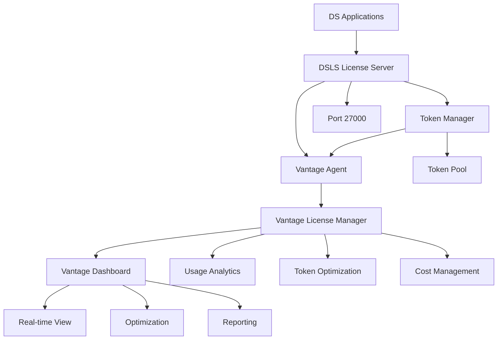

# DSLS License Management with Vantage

DSLS (Dassault Systèmes License Server) is the centralized licensing system used by Dassault Systèmes software including SIMULIA Abaqus, CATIA, SolidWorks Simulation, and other DS products. Vantage provides comprehensive integration with DSLS servers for advanced license monitoring, token optimization, and enterprise-grade license management.

## Overview

DSLS features integrated with Vantage:

- **Token-based Licensing**: Flexible license allocation using token credits across multiple DS products
- **Centralized Management**: Unified license management for all Dassault Systèmes products
- **Academic Licensing**: Special configurations and reduced token requirements for educational institutions
- **High Availability**: Redundant license server configurations with automatic failover
- **Usage Tracking**: Comprehensive license utilization monitoring and analytics
- **Integration APIs**: REST APIs for custom license management and automation

## Vantage Integration Benefits

### Comprehensive Monitoring
The Vantage License Manager dashboard provides:
- **Real-time Token Usage**: Monitor token consumption across all DS products
- **Product-specific Analytics**: Detailed usage patterns for Abaqus, CATIA, SolidWorks, and other tools
- **User Activity Tracking**: Individual and team-based license usage analytics
- **Cost Optimization**: Identify underutilized tokens and optimize allocation

### Advanced Token Management
- **Dynamic Token Allocation**: Automatically adjust token distribution based on demand
- **Peak Usage Analysis**: Identify high-demand periods for capacity planning
- **Academic vs Commercial Tracking**: Separate monitoring for different license types
- **Multi-site Coordination**: Manage token usage across distributed teams

### Enterprise Integration
- **Job Scheduling Integration**: Automatically reserve tokens for computational jobs
- **User Access Controls**: Role-based access to license management features
- **Automated Alerting**: Notifications for token shortages or optimization opportunities
- **API Automation**: Integrate with existing workflows and management systems

## Supported Dassault Systèmes Products

### SIMULIA Product Suite
- **Abaqus/Standard**: Implicit finite element analysis (5 tokens)
- **Abaqus/Explicit**: Explicit dynamics simulation (5 tokens)
- **Abaqus/CFD**: Computational fluid dynamics (10 tokens)
- **Tosca**: Topology and shape optimization (15 tokens)
- **Isight**: Design exploration and optimization (10 tokens)
- **fe-safe**: Fatigue and durability analysis (8 tokens)

### Design and PLM Products
- **CATIA**: 3D design and engineering platform (variable tokens)
- **SolidWorks**: 3D CAD design software (3 tokens)
- **ENOVIA**: Collaborative lifecycle management (5 tokens)
- **DELMIA**: Digital manufacturing and operations (8 tokens)

### Academic Licensing
Special token requirements for educational institutions:
- **Abaqus Academic**: 1 token per instance (vs 5 commercial)
- **CATIA Academic**: 1 token per instance (vs variable commercial)
- **SolidWorks Academic**: 1 token per instance (vs 3 commercial)

## Architecture Integration

### Vantage Integration Architecture



**Key Components**:
- **DSLS License Server**: Core token distribution and license management
- **Vantage Agent**: Data collection and monitoring integration
- **Token Manager**: Handles token allocation and tracking
- **Vantage License Manager**: Centralized analytics and optimization platform

### Network Architecture

**Default Configuration**:
- **Port 27000**: DSLS license server communication
- **Port 443**: HTTPS for web-based administration
- **Dynamic Ports**: Additional vendor daemon ports as needed

## Token Management

### Token Requirements by Product

| Product | Commercial Tokens | Academic Tokens | Typical Usage |
|---------|------------------|-----------------|---------------|
| Abaqus/Standard | 5 | 1 | Structural analysis |
| Abaqus/Explicit | 5 | 1 | Crash simulation |
| Abaqus/CFD | 10 | 2 | Fluid dynamics |
| Tosca | 15 | 3 | Optimization |
| Isight | 10 | 2 | Design exploration |
| CATIA | Variable | 1 | 3D design |
| SolidWorks | 3 | 1 | CAD modeling |

### Token Pool Optimization

**Best Practices**:
- **Peak Hour Analysis**: Monitor usage patterns to optimize token allocation
- **Product Mix Planning**: Balance high-token products (Tosca) with standard products (SolidWorks)
- **Academic Efficiency**: Leverage academic licensing for eligible institutions
- **Queue Management**: Implement token queuing for high-demand periods

## License Server Management

### Single Server Configuration

Basic DSLS server setup for development and small teams:

```bash
# DSLS server installation
sudo mkdir -p /opt/dsls/{bin,licenses,logs,config}
sudo useradd -r -s /bin/false dsls
sudo chown -R dsls:dsls /opt/dsls

# Download and install DSLS
wget https://download.3ds.com/dsls/DSLicSrv_latest.tar.gz
tar -xzf DSLicSrv_latest.tar.gz
sudo ./install_dsls.sh --prefix=/opt/dsls
```

### Enterprise Configuration

Advanced setup for production environments:

```bash
# High-availability configuration
sudo systemctl enable dsls
sudo systemctl start dsls

# Configure token pools
sudo /opt/dsls/bin/DSLicSrv -configure \
  --token-pool=1000 \
  --max-users=100 \
  --enable-web-admin \
  --log-level=INFO
```

### License File Management

```bash
# Install license files
sudo cp DS_license.txt /opt/dsls/licenses/
sudo chown dsls:dsls /opt/dsls/licenses/DS_license.txt
sudo chmod 644 /opt/dsls/licenses/DS_license.txt

# Validate license configuration
sudo /opt/dsls/bin/DSLicSrv -validate /opt/dsls/licenses/DS_license.txt
```

## Vantage Integration Setup

### Step 1: Prepare DSLS Server

Ensure your DSLS server is properly configured:

```bash
# Verify DSLS status
sudo /opt/dsls/bin/DSLicSrv -status
sudo systemctl status dsls

# Check token availability
sudo /opt/dsls/bin/DSLicSrv -tokens
```

### Step 2: Install Vantage Agent

Deploy monitoring agent for DSLS integration:

```bash
# Download and install Vantage agent
curl -O https://releases.vantagecompute.ai/vantage-agent/latest/vantage-agent-linux.tar.gz
tar -xzf vantage-agent-linux.tar.gz
sudo ./install-vantage-agent.sh

# Configure for DSLS monitoring
sudo vantage-agent configure \
  --server-type dsls \
  --server-host license.company.com \
  --server-port 27000 \
  --token-monitoring enabled
```

### Step 3: Configure Vantage Dashboard

Set up license monitoring in Vantage:

1. **Login to Vantage**: Access your organization dashboard
2. **Navigate to Licenses**: Select license management section
3. **Add DSLS Server**: Configure server connection details
4. **Token Monitoring**: Enable comprehensive token tracking
5. **Set Alerts**: Configure notifications for token shortages

### Step 4: Verify Integration

Confirm monitoring is operational:

```bash
# Test agent connectivity
vantage-agent test-connection dsls

# Verify data collection
vantage-agent status --verbose
```

## Advanced Features

### Academic License Optimization

For educational institutions:

```bash
# Configure academic token pools
sudo /opt/dsls/bin/DSLicSrv -academic-mode \
  --reduced-tokens \
  --student-access \
  --course-scheduling
```

### Multi-Site License Management

For distributed organizations:

```bash
# Configure license borrowing
sudo /opt/dsls/bin/DSLicSrv -borrowing \
  --max-borrow-days=7 \
  --allow-offline \
  --sync-interval=60
```

### API Integration

Automate license management:

```python
import requests

# Check available tokens
response = requests.get('http://dsls-server:27000/api/tokens')
available_tokens = response.json()['available']

# Reserve tokens for job
reserve_request = {
    'product': 'abaqus_standard',
    'tokens_required': 5,
    'duration': 3600
}
requests.post('http://dsls-server:27000/api/reserve', json=reserve_request)
```

## Best Practices

### Token Pool Management
- **Monitor Peak Usage**: Track high-demand periods for capacity planning
- **Optimize Product Mix**: Balance high-token and low-token products
- **Academic Utilization**: Maximize academic licensing benefits
- **Queue Strategies**: Implement fair token allocation policies

### Performance Optimization
- **Server Placement**: Position DSLS servers close to user populations
- **Network Optimization**: Ensure low-latency connections
- **Load Balancing**: Distribute token requests across multiple servers
- **Caching Strategy**: Implement local token caching for remote sites

### Security and Compliance
- **Access Controls**: Implement role-based license access
- **Audit Logging**: Maintain comprehensive usage logs
- **License Compliance**: Regular audits of token utilization
- **Data Protection**: Secure license server communications

## Troubleshooting Common Issues

### Token Checkout Failures

**Issue**: Applications cannot checkout required tokens

**Solutions**:
```bash
# Check token availability
sudo /opt/dsls/bin/DSLicSrv -tokens

# Verify license file validity
sudo /opt/dsls/bin/DSLicSrv -validate

# Review server logs
sudo tail -f /opt/dsls/logs/dsls.log
```

### Performance Issues

**Issue**: Slow token checkout or application startup

**Solutions**:
```bash
# Check server performance
sudo /opt/dsls/bin/DSLicSrv -performance

# Monitor network connectivity
ping dsls-server.company.com
telnet dsls-server.company.com 27000
```

### High Availability Issues

**Issue**: License server failover problems

**Solutions**:
```bash
# Check cluster status
sudo /opt/dsls/bin/DSLicSrv -cluster-status

# Verify backup server configuration
sudo /opt/dsls/bin/DSLicSrv -backup-check
```

## Next Steps

This introduction provides the foundation for understanding DSLS integration with Vantage. For detailed implementation guidance, explore the following sections:

- **[Server Setup](dsls-server-setup)**: Deploy and configure DSLS servers
- **[Monitoring & Analytics](dsls-monitoring)**: Set up comprehensive monitoring
- **[High Availability](dsls-high-availability)**: Configure redundancy and failover
- **[Troubleshooting](dsls-troubleshooting)**: Resolve common issues

---

> **DSLS Tip**: Dassault Systèmes licensing uses a token-based system that differs from traditional concurrent licensing. Understanding token requirements for each product is crucial for effective license management. The combination of DSLS's flexible token allocation with Vantage's analytics provides powerful optimization capabilities for engineering teams using DS software portfolios.
