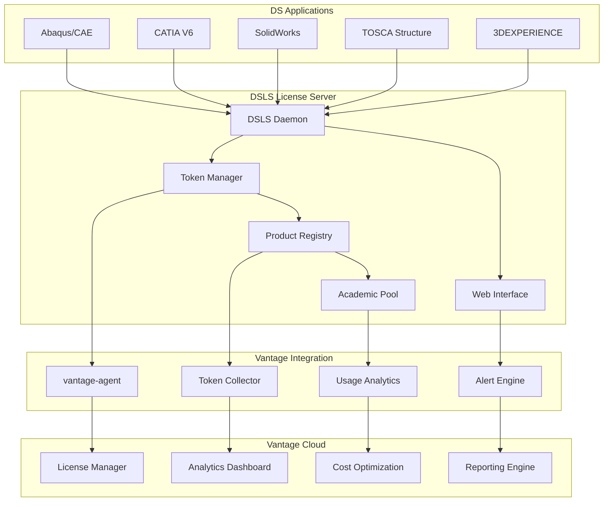

# DSLS Monitoring & Analytics

This guide covers comprehensive monitoring and analytics for Dassault Systèmes License Server (DSLS) through Vantage integration. DSLS token-based licensing provides rich usage data that enables sophisticated optimization and cost management across all DS products.

## Architecture Overview

The Vantage License Manager provides enterprise-grade monitoring for DSLS through the vantage-agent:



## Token Usage Monitoring

### Real-Time Token Tracking

DSLS token allocation provides detailed insights into license utilization:

```bash
# Monitor current token usage
dsls-status --tokens --real-time

# Example output:
# Product                  | Allocated | In Use | Available | Peak Usage
# -------------------------|-----------|--------|-----------|------------
# ABAQUS_STANDARD         | 50        | 32     | 18        | 45 (95%)
# ABAQUS_EXPLICIT         | 30        | 8      | 22        | 28 (93%)
# CATIA_V6_DESIGN         | 100       | 67     | 33        | 95 (95%)
# SOLIDWORKS_PREMIUM      | 25        | 15     | 10        | 23 (92%)
# TOSCA_STRUCTURE         | 40        | 12     | 28        | 35 (88%)
# -------------------------|-----------|--------|-----------|------------
# TOTAL TOKENS            | 245       | 134    | 111       | 226 (92%)
```

### Token Pool Analytics

```bash
# Analyze token pool efficiency
vantage-agent analyze dsls --token-pools

# Product-specific usage patterns
vantage-agent report dsls \
  --product abaqus_standard \
  --timeframe "last 30 days" \
  --breakdown hourly
```

### Academic vs Commercial Tracking

```bash
# Separate academic and commercial usage
dsls-monitor --academic-analysis

# Academic token utilization
# - Student Pool: 200 tokens (150 used, 75% utilization)
# - Faculty Pool: 50 tokens (35 used, 70% utilization)  
# - Research Pool: 100 tokens (60 used, 60% utilization)
# 
# Commercial Pool: 500 tokens (380 used, 76% utilization)
```

## User and Session Monitoring

### Active Session Tracking

Monitor real-time user sessions across all DS products:

```bash
# Current active sessions
dsls-sessions --active --detailed

# Session details:
# User: john.smith@company.com
# Product: ABAQUS_STANDARD
# Tokens: 8
# Start Time: 2024-01-15 09:15:22
# Duration: 2h 45m
# Host: workstation-142.lab.company.com
# Project: turbine_analysis_v3
# License Features: [solver, cae, advanced_materials]
```

### Usage Patterns Analysis

```bash
# User behavior analytics
vantage-agent analyze dsls --user-patterns

# Peak usage identification
vantage-agent report dsls \
  --peak-usage \
  --breakdown "hourly,daily,weekly"

# Department usage analysis
vantage-agent report dsls \
  --group-by department \
  --products "abaqus,catia,solidworks"
```

### Queue and Contention Monitoring

```bash
# Monitor license queues
dsls-queue --monitor --alerts

# Queue analytics:
# Product: CATIA_V6_DESIGN
# Queued Users: 5
# Average Wait Time: 12 minutes
# Longest Wait: 45 minutes (user: jane.doe@company.com)
# Queue Priority: [faculty, graduate_students, undergrad]
```

## Performance Metrics

### Server Performance Monitoring

Track DSLS server performance and optimization opportunities:

```yaml
# /etc/vantage-agent/dsls-metrics.yaml
metrics:
  server_performance:
    - cpu_usage
    - memory_consumption  
    - disk_io
    - network_latency
    - connection_count
    
  license_performance:
    - checkout_time
    - checkin_time
    - token_allocation_speed
    - cache_hit_ratio
    - database_query_time
    
  user_experience:
    - login_time
    - application_startup
    - license_acquisition_delay
    - session_stability
    - timeout_frequency
```

### Academic Workload Analysis

```bash
# Academic semester planning
vantage-agent forecast dsls \
  --academic-calendar \
  --course-schedule \
  --enrollment-projection

# Course-specific analysis
# Course: ME 541 - Finite Element Analysis
# Enrollment: 45 students
# Required Tokens: 180 (45 students × 4 tokens each)
# Schedule: Mon/Wed/Fri 2-5 PM
# Peak Concurrent Usage: 45 tokens (100% of enrollment)
# Recommended Allocation: 50 tokens (110% buffer)
```

### Product Usage Optimization

```bash
# Product-specific optimization
vantage-agent optimize dsls --product-analysis

# ABAQUS Optimization Recommendations:
# - Standard vs Explicit: 80% Standard, 20% Explicit usage
# - Peak Hours: 9-11 AM, 2-4 PM
# - Underutilized Features: Advanced Composites (5% usage)
# - Recommendation: Reallocate 5 tokens from Explicit to Standard
# 
# CATIA Optimization Recommendations:
# - Design vs Analysis: 70% Design, 30% Analysis
# - Academic Usage: 40% of total during semester
# - Recommendation: Implement time-based academic pools
```

## Alert Configuration

### Token Availability Alerts

Configure comprehensive alerting for token availability:

```yaml
# /etc/vantage-agent/dsls-alerts.yaml
alerts:
  token_availability:
    low_threshold:
      warning: 20%    # 80% utilization
      critical: 10%   # 90% utilization
      
    product_specific:
      abaqus_standard:
        warning: 15%   # High demand product
        critical: 5%
      catia_v6:
        warning: 25%   # More buffer needed
        critical: 10%
      solidworks:
        warning: 30%   # Lower priority
        critical: 15%
        
  academic_pools:
    semester_start:
      warning: 30%    # Expect high usage
      critical: 15%
    finals_week:
      warning: 10%    # Maximum demand
      critical: 5%
      
  queue_management:
    wait_time:
      warning: 15     # 15 minutes
      critical: 30    # 30 minutes
    queue_length:
      warning: 10     # 10 users
      critical: 20    # 20 users
```

### Performance Alerts

```yaml
alerts:
  server_performance:
    cpu_usage:
      warning: 70%
      critical: 85%
    memory_usage:
      warning: 75%
      critical: 90%
    disk_space:
      warning: 80%
      critical: 95%
      
  license_performance:
    checkout_time:
      warning: 5      # seconds
      critical: 10
    connection_failures:
      warning: 5      # per hour
      critical: 10
    cache_miss_ratio:
      warning: 20%    # 80% hit ratio
      critical: 30%   # 70% hit ratio
```

### User Experience Alerts

```yaml
alerts:
  user_experience:
    login_failures:
      warning: 3      # per user per hour
      critical: 5
    session_timeouts:
      warning: 10     # per hour
      critical: 20
    application_crashes:
      warning: 2      # per user per day
      critical: 5
      
  academic_specific:
    course_blocking:
      warning: 1      # Any course blocked
      critical: 2     # Multiple courses blocked
    student_wait_time:
      warning: 10     # 10 minutes
      critical: 20    # 20 minutes
```

## Dashboards and Reporting

### Executive Dashboard

Key metrics for management and budget planning:

```bash
# Generate executive summary
vantage-agent report dsls --executive-summary

# Executive Summary - DSLS License Management
# Period: January 2024
# 
# License Utilization: 78% average, 95% peak
# Cost per User: $145/month (industry benchmark: $160)
# Efficiency Gain: 15% vs previous quarter
# Academic Savings: $45,000/semester through optimized allocation
# 
# Recommendations:
# 1. Add 20 CATIA tokens for Q2 project demand
# 2. Optimize ABAQUS allocation (reduce Explicit by 10 tokens)
# 3. Implement time-based academic pools for 25% cost reduction
```

### Technical Dashboard

Detailed metrics for IT and license administrators:

```bash
# Technical metrics dashboard
vantage-agent dashboard dsls --technical

# Server Health: ✅ All systems operational
# Token Pools: 245 total, 189 in use (77%)
# Active Sessions: 134 users across 5 products
# Queue Status: 3 users waiting (avg wait: 8 minutes)
# Performance: Response time 0.8s (target: <2s)
# Academic Pools: 85% utilization (semester week 8)
```

### Cost Analysis Dashboard

```bash
# Cost optimization analysis
vantage-agent analyze dsls --cost-optimization

# Annual License Cost Analysis:
# Total Annual Cost: $485,000
# Cost per Product:
# - ABAQUS Suite: $180,000 (37%)
# - CATIA V6: $155,000 (32%) 
# - SolidWorks: $85,000 (18%)
# - TOSCA: $65,000 (13%)
# 
# Optimization Opportunities:
# - Academic multiplier savings: $95,000/year
# - Peak shaving optimization: $35,000/year
# - Product consolidation potential: $25,000/year
```

## Custom Analytics

### Usage Pattern Analysis

```python
# Custom analytics script
import vantage_sdk

client = vantage_sdk.DSLSClient()

# Analyze seasonal patterns
usage_data = client.get_usage_data(
    timeframe="academic_year",
    breakdown="weekly",
    products=["abaqus", "catia", "solidworks"]
)

# Identify semester patterns
semester_analysis = client.analyze_academic_patterns(
    fall_semester="aug_15_to_dec_15",
    spring_semester="jan_15_to_may_15",
    summer_session="may_15_to_aug_15"
)

# Generate optimization recommendations
recommendations = client.optimize_allocation(
    current_allocation=usage_data,
    academic_calendar=semester_analysis,
    budget_constraints={"max_cost": 500000}
)
```

### Project-Based Analytics

```bash
# Project tracking and analytics
vantage-agent track dsls --project-analytics

# Project: Automotive Crash Simulation
# Duration: 6 months
# Team Size: 12 engineers
# Primary Tools: ABAQUS Standard/Explicit, TOSCA
# Token Usage: 2,400 token-hours
# Peak Demand: 35 concurrent tokens
# Estimated Cost: $18,500
# Efficiency Rating: 92% (vs 85% organization average)
```

### Predictive Analytics

```bash
# Predictive usage modeling
vantage-agent predict dsls \
  --forecast "next_semester" \
  --factors "enrollment,course_schedule,research_projects"

# Next Semester Forecast:
# Predicted Enrollment Increase: 15%
# New Courses: 3 (requiring CATIA, SolidWorks)
# Research Project Growth: 8%
# 
# Recommended Token Allocation:
# - ABAQUS Standard: +8 tokens (current: 50, recommended: 58)
# - CATIA V6: +15 tokens (current: 100, recommended: 115)
# - SolidWorks: +5 tokens (current: 25, recommended: 30)
# 
# Budget Impact: +$35,000/semester
# ROI: Prevents $125,000 in productivity losses from queuing
```

## Integration with Academic Systems

### Learning Management System Integration

```yaml
# /etc/vantage-agent/lms-integration.yaml
lms_integration:
  platform: "canvas"  # or "blackboard", "moodle"
  
  course_sync:
    enabled: true
    sync_interval: "daily"
    enrollment_tracking: true
    assignment_correlation: true
    
  automatic_provisioning:
    enabled: true
    provision_on_enrollment: true
    deprovision_on_withdrawal: true
    guest_access_duration: "48_hours"
    
  usage_correlation:
    assignment_deadlines: true
    exam_periods: true
    project_milestones: true
    lab_schedules: true
```

### Student Information System Integration

```bash
# Configure SIS integration
vantage-agent configure dsls \
  --sis-integration \
  --student-classification \
  --department-tracking \
  --credit-hour-correlation

# Automatic student categorization:
# - Undergraduate: 1 token allocation
# - Graduate: 2 token allocation  
# - PhD Research: 4 token allocation
# - Faculty: 8 token allocation
```

## Reporting and Compliance

### Academic Compliance Reporting

```bash
# Generate academic compliance reports
vantage-agent report dsls --academic-compliance

# Academic License Compliance Report
# Institution: State University Engineering
# Reporting Period: Fall 2024
# 
# Student License Usage:
# - Total Students: 450
# - Active Users: 387 (86%)
# - Compliance Rate: 98.5%
# - Academic Features Used: 94%
# 
# Faculty Research Usage:
# - Research Projects: 23
# - Grant Compliance: 100%
# - Publication Attribution: Complete
```

### Cost Center Reporting

```bash
# Department cost allocation
vantage-agent report dsls --cost-allocation

# Cost Center Allocation - Monthly
# Mechanical Engineering: $18,500 (38%)
# Aerospace Engineering: $14,200 (29%)
# Civil Engineering: $9,800 (20%)
# Materials Science: $6,300 (13%)
# 
# Per-Student Cost:
# Undergraduate: $45/month
# Graduate: $125/month
# Research: $285/month
```

## Optimization Recommendations

### Dynamic Token Allocation

Implement intelligent token reallocation based on usage patterns:

```bash
# Enable dynamic allocation
vantage-agent configure dsls --dynamic-allocation

# Configuration:
# - Reallocation frequency: Every 4 hours
# - Minimum threshold: 20% utilization difference
# - Academic priority: High during class hours
# - Research priority: High during off-hours
# - Faculty override: Always available
```

### Seasonal Optimization

```bash
# Implement seasonal optimization
vantage-agent schedule dsls --seasonal-optimization

# Fall/Spring Semester: +30% academic allocation
# Summer Session: +50% research allocation
# Winter Break: Maintenance mode (minimal allocation)
# Finals Week: +100% academic buffer
```

## Next Steps

With comprehensive DSLS monitoring configured, proceed to:

- **[High Availability](dsls-high-availability)**: Configure redundancy and failover
- **[Troubleshooting](dsls-troubleshooting)**: Resolve monitoring and performance issues

---

> **Monitoring Best Practice**: DSLS token-based licensing generates rich analytics data that enables sophisticated optimization. The combination of real-time monitoring, predictive analytics, and academic integration through Vantage provides unparalleled visibility into engineering software usage and costs. Regular analysis of token allocation patterns ensures optimal license utilization across your organization.
