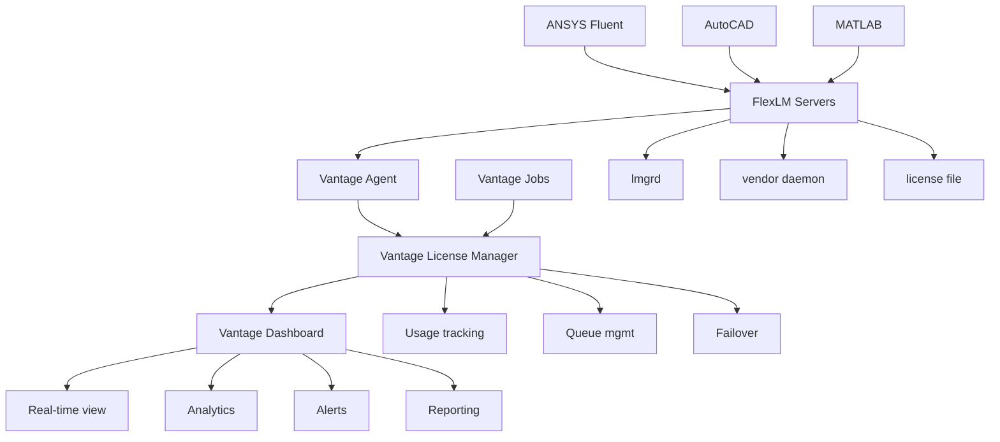

# FlexLM License Management with Vantage

FlexLM (Flexible License Manager) is one of the most widely used floating license systems in engineering and scientific computing. Vantage provides comprehensive FlexLM integration through the Vantage License Manager, offering centralized monitoring, automatic failover, and advanced analytics for your FlexLM infrastructure.

## What is FlexLM?

FlexLM is a floating license management system that allows software licenses to be shared across multiple users and systems. Instead of binding licenses to specific machines, FlexLM enables:

- **Floating licenses**: Multiple users can share a pool of licenses
- **License borrowing**: Users can temporarily check out licenses for offline use
- **Usage tracking**: Detailed monitoring of license utilization
- **High availability**: Redundant server configurations for continuous service

## Vantage License Manager Integration

Vantage License Manager provides a modern interface and advanced capabilities for managing FlexLM servers:

### Centralized Dashboard

The Vantage License Manager dashboard provides:

- **Real-time usage monitoring**: Live view of license consumption across all applications
- **User analytics**: Track individual and team license usage patterns
- **Cost optimization**: Identify underutilized licenses and optimize allocations
- **Historical trends**: Analyze usage patterns over time for capacity planning

### Automated License Management

- **Auto-discovery**: Automatically detect and configure FlexLM servers
- **Health monitoring**: Continuous monitoring with automatic alerts
- **Failover support**: Seamless failover between redundant license servers
- **Queue management**: Intelligent license queuing for high-demand scenarios

### Enterprise Integration

- **SSO integration**: Single sign-on with your organization's identity provider
- **RBAC**: Role-based access control for license administration
- **API access**: RESTful APIs for integration with existing workflows
- **Audit logging**: Comprehensive audit trails for compliance requirements

## Common FlexLM Applications

FlexLM is used by many major engineering and scientific software vendors:

### ANSYS Suite
- **ANSYS Fluent**: CFD simulation software
- **ANSYS Mechanical**: Structural analysis
- **ANSYS Maxwell**: Electromagnetic field simulation
- **ANSYS HFSS**: High-frequency electromagnetic simulation

### Autodesk Products
- **AutoCAD**: Computer-aided design
- **Inventor**: 3D mechanical design
- **Maya**: 3D animation and modeling

### Other Major Applications
- **MATLAB**: Technical computing platform
- **Abaqus**: Finite element analysis
- **LS-DYNA**: Explicit dynamic simulation
- **Cadence tools**: Electronic design automation

## Getting Started with Vantage

### Quick Setup Guide

1. **Add FlexLM Server to Vantage**
   ```bash
   vantage licenses add flexlm-server \
     --host license-server.company.com \
     --port 27000 \
     --vendor ansyslmd \
     --name "ANSYS License Server"
   ```

2. **Verify Connection**
   ```bash
   vantage licenses test flexlm-server
   ```

3. **Enable Monitoring**
   ```bash
   vantage licenses monitor flexlm-server --enable
   ```

4. **Access Dashboard**
   Navigate to the Vantage web interface and view real-time license usage under "License Management"

### Configuration for Jobs

Configure Vantage jobs to use FlexLM licenses:

```yaml
apiVersion: batch.vantage.com/v1
kind: Job
metadata:
  name: fluent-simulation
spec:
  template:
    spec:
      containers:
      - name: fluent
        image: vantage/ansys-fluent:2023R1
        resources:
          requests:
            licenses:
              flexlm/FLUENT: 4  # Request 4 FLUENT licenses
          limits:
            licenses:
              flexlm/FLUENT: 8  # Maximum 8 licenses
```

## Architecture Overview

### License Server Components

FlexLM consists of several key components:

- **lmgrd**: Main license manager daemon
- **Vendor daemon**: Application-specific license server (e.g., ansyslmd)
- **License file**: Contains license definitions and server configuration
- **Client libraries**: Applications link to FlexLM client libraries

### Vantage Integration Architecture



## License Types and Features

### Node-Locked vs Floating

- **Node-locked**: License tied to specific hardware (MAC address, hostname)
- **Floating**: License can be used by any authorized client

### License Features

- **Counted features**: Limited number of concurrent users
- **Uncounted features**: Unlimited concurrent usage
- **Borrowed licenses**: Temporary checkout for offline use
- **Reserved licenses**: Guaranteed allocation for specific users/groups

### Example License File Structure

```bash
# Server definitions
SERVER license1.company.com 001122334455 27000
SERVER license2.company.com 002233445566 27000

# Vendor daemon
VENDOR ansyslmd /opt/flexlm/ansyslmd

# Feature definitions
FEATURE FLUENT ansyslmd 2023.1000 permanent 50 \
    VENDOR_STRING=ANSYS \
    HOSTID=ANY \
    SIGN=60B459C90C71

FEATURE CFX ansyslmd 2023.1000 permanent 25 \
    VENDOR_STRING=ANSYS \
    HOSTID=ANY \
    SIGN=50A348B80B62
```

## Best Practices

### License Server Management

1. **High Availability Setup**
   - Use three-server redundancy for critical applications
   - Implement automated failover procedures
   - Regular backup of license files and configurations

2. **Performance Optimization**
   - Monitor license checkout times
   - Optimize network connectivity between servers and clients
   - Use local license caching where appropriate

3. **Security Considerations**
   - Restrict network access to license servers
   - Use encrypted connections where supported
   - Implement audit logging for license usage

### Cost Optimization

1. **Usage Analytics**
   - Monitor peak usage patterns
   - Identify underutilized licenses
   - Track user behavior and adjust allocations

2. **License Pooling**
   - Share licenses across departments
   - Implement time-based usage policies
   - Use license borrowing for mobile workers

3. **Capacity Planning**
   - Analyze historical usage trends
   - Plan license purchases based on actual needs
   - Consider term licenses for seasonal usage

## Monitoring and Alerting

### Key Metrics to Monitor

- **License utilization**: Percentage of licenses in use
- **Queue times**: How long users wait for licenses
- **Server availability**: Uptime of license servers
- **Feature usage patterns**: Which applications are most/least used

### Automated Alerts

Configure alerts for:
- License server failures
- High utilization (approaching license limits)
- Unusual usage patterns
- License expiration warnings

### Reporting Capabilities

Vantage provides comprehensive reporting:
- Daily/weekly/monthly usage reports
- Cost analysis and chargeback reports
- User productivity metrics
- Compliance and audit reports

## FlexLM Documentation Sections

This documentation is organized into specialized sections:

### [Server Setup](/platform/licenses/how-to-guides/flexlm/server-setup)
Complete guide to installing and configuring FlexLM servers, including:
- Installation procedures for different operating systems
- License file configuration and management
- Network configuration and security setup
- Integration with Vantage License Manager

### [High Availability](/platform/licenses/how-to-guides/flexlm/high-availability)
Configure redundant FlexLM servers for continuous operation:
- Three-server redundancy setup
- Load balancing and failover procedures
- Backup and disaster recovery
- Performance optimization for HA environments

### [Monitoring & Analytics](/platform/licenses/how-to-guides/flexlm/monitoring)
Leverage Vantage's monitoring capabilities for comprehensive license oversight:
- Real-time usage dashboards
- User and team analytics
- Cost optimization insights
- Historical trend analysis and reporting

### [Troubleshooting](/platform/licenses/how-to-guides/flexlm/troubleshooting)
Diagnose and resolve common FlexLM issues:
- Server connectivity problems
- License checkout failures
- Performance optimization
- Integration troubleshooting with Vantage

## Getting Help

### Vantage Support Resources

- **Documentation**: Comprehensive guides and API references
- **Support Portal**: Submit tickets and track issues
- **Community Forums**: Connect with other Vantage users
- **Training Resources**: Webinars and certification programs

### FlexLM Vendor Support

For application-specific issues, contact the software vendor:
- ANSYS: support.ansys.com
- Autodesk: support.autodesk.com
- MathWorks: mathworks.com/support

### Emergency Procedures

For critical license server failures:
1. Check Vantage dashboard for server status
2. Use automated failover if configured
3. Contact Vantage support for assistance
4. Implement emergency license server procedures

---

> **Next Steps**: Choose the appropriate section based on your needs - start with [Server Setup](/platform/licenses/how-to-guides/flexlm/server-setup) for new installations, [High Availability](/platform/licenses/how-to-guides/flexlm/high-availability) for redundancy, or [Monitoring](/platform/licenses/how-to-guides/flexlm/monitoring) to optimize existing deployments.
   Vendor: ansys
   Server: license-server.vantage.com
   Port: 27000
   Daemon: ansyslmd
   ```

3. **Automatic Discovery**:
   - Vantage can automatically discover FlexLM servers on your network
   - Use the "Scan Network" feature to detect existing installations
   - Review and confirm discovered servers before adding

### Configuration via CLI

```bash
# Register FlexLM server with Vantage
vantage licenses add \
  --type flexlm \
  --vendor ansys \
  --server license-server.vantage.com:27000 \
  --daemon ansyslmd \
  --name "ANSYS FlexLM Server"

# Verify registration
vantage licenses list
vantage licenses test ansys-flexlm
```

### Web Interface Configuration

**Step 1: Basic Information**
- License Server Type: FlexLM
- Vendor: Select from dropdown (ANSYS, Altair, MATLAB, etc.)
- Server Hostname: `license-server.vantage.com`
- Port: `27000` (default for most FlexLM servers)

**Step 2: Features Discovery**
- Vantage automatically queries the server for available features
- Review detected licenses and their counts
- Configure feature-specific settings if needed

**Step 3: Monitoring Setup**
- Enable real-time monitoring (recommended)
- Set monitoring interval (default: 60 seconds)
- Configure alert thresholds for usage and availability

**Step 4: Job Integration**
- Enable automatic license allocation for jobs
- Set priority rules for license distribution
- Configure queue management for license shortages

## Verification and Testing

### Test License Connectivity

```bash
# Test server connectivity
vantage licenses test flexlm-server-name

# Check available features
vantage licenses features flexlm-server-name

# Monitor real-time usage
vantage licenses monitor flexlm-server-name
```

### Job Submission with License Requirements

```yaml
# Example job requiring ANSYS Fluent licenses
apiVersion: batch.vantage.com/v1
kind: Job
metadata:
  name: fluent-simulation
spec:
  template:
    spec:
      containers:
      - name: fluent
        image: vantage/ansys-fluent:2023R1
        resources:
          requests:
            cpu: 4
            memory: 16Gi
            licenses:
              ansys/FLUENT: 4  # Automatically managed by Vantage
```

## License Manager Dashboard

Once configured, the Vantage License Manager provides:

### Real-time Monitoring
- Current license usage across all FlexLM servers
- Feature-level utilization statistics
- User session information and checkout times
- Server health and connectivity status

### Analytics and Reporting
- Historical usage trends and patterns
- Peak usage analysis and capacity planning
- Cost optimization recommendations
- License efficiency metrics

### Alert Management
- Configurable alerts for high usage, server downtime, or license expiration
- Integration with email, Slack, and other notification systems
- Automated escalation procedures

## Getting Started Checklist

- [ ] Access Vantage License Manager from the main dashboard
- [ ] Add your FlexLM license server using the guided setup
- [ ] Verify connectivity and feature discovery
- [ ] Configure monitoring and alert preferences
- [ ] Test license allocation with a sample job
- [ ] Review usage analytics and optimization recommendations

## Next Steps

After adding your FlexLM server to Vantage License Manager, explore these advanced configuration options:

- **[Server Configuration](/platform/licenses/how-to-guides/flexlm/server-setup)**: Detailed FlexLM server installation and configuration
- **[High Availability](/platform/licenses/how-to-guides/flexlm/high-availability)**: Setting up redundant license servers
- **[Monitoring & Analytics](/platform/licenses/how-to-guides/flexlm/monitoring)**: Advanced usage tracking and reporting
- **[Troubleshooting](/platform/licenses/how-to-guides/flexlm/troubleshooting)**: Common issues and diagnostic tools

---

> **Quick Tip**: Start with the basic server registration above, then explore advanced features once your FlexLM integration is working. The Vantage License Manager handles most complex configurations automatically.
