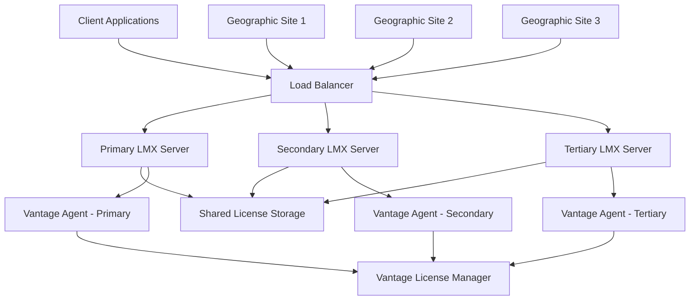

# LMX High Availability

This guide covers the configuration of highly available X-Formation LMX license servers with automatic failover, load balancing, and geographic redundancy. The Vantage License Manager provides enterprise-grade high availability features that ensure continuous license service even during server outages or network issues.

## High Availability Architecture

### Multi-Server Configuration

LMX supports several high availability configurations optimized for different business requirements:



**Architecture Components**:
- **Load Balancer**: Intelligent traffic distribution with health checking
- **Multiple LMX Servers**: Redundant license servers with synchronized configuration
- **Shared Storage**: Centralized license file storage with high availability
- **Vantage Agents**: Distributed monitoring agents on each server collecting license data
- **Vantage Integration**: Coordinated monitoring and failover management via agents
- **Geographic Distribution**: Multi-site redundancy for disaster recovery

### Redundancy Models

**Active-Passive Configuration**:
- Primary server handles all license requests
- Secondary server remains on standby for automatic failover
- Shared license file storage ensures consistency
- Typical failover time: 30-60 seconds

**Active-Active Configuration**:
- Multiple servers handle license requests simultaneously
- Load balancing distributes traffic across all servers
- Enhanced performance and availability
- Immediate failover with no service interruption

**Geographic Redundancy**:
- License servers distributed across multiple data centers
- Cross-site replication for disaster recovery
- Network-aware routing for optimal performance
- Complete site failover capabilities

## Primary-Secondary Setup

### Configure Primary LMX Server

```bash
# Install and configure primary LMX server
sudo useradd -r -s /bin/bash -d /opt/lmx -m lmx
sudo mkdir -p /opt/lmx/{bin,licenses,logs,config,shared}

# Primary server configuration
sudo -u lmx tee /opt/lmx/config/lmx-primary.conf <<EOF
# LMX Primary Server Configuration
HOSTNAME $(hostname -f)
SERVER_TYPE primary
SERVER_ID lmx-primary

# Network Configuration
TCPPORT 6200
WEBINTERFACE_ENABLE true
WEBINTERFACE_PORT 8080
WEBINTERFACE_SSL_PORT 8443

# High Availability Configuration
HA_ENABLE true
HA_MODE active_passive
HA_PARTNER_SERVERS lmx-secondary.company.com:6200,lmx-tertiary.company.com:6200
HA_HEARTBEAT_INTERVAL 30
HA_FAILOVER_TIMEOUT 60

# Shared Storage Configuration
LICENSEFILE /opt/lmx/shared/licenses/
SHARED_CONFIG_PATH /opt/lmx/shared/config/
SYNC_INTERVAL 300

# Clustering Configuration
CLUSTER_ENABLE true
CLUSTER_NAME production-lmx
CLUSTER_PRIORITY 100
CLUSTER_WEIGHT 1.0

# Performance Settings
MAX_CONNECTIONS 1000
CONNECTION_TIMEOUT 300
THREAD_POOL_SIZE 50
EOF
```

### Configure Secondary LMX Server

```bash
# Secondary server configuration (on secondary host)
sudo -u lmx tee /opt/lmx/config/lmx-secondary.conf <<EOF
# LMX Secondary Server Configuration
HOSTNAME $(hostname -f)
SERVER_TYPE secondary
SERVER_ID lmx-secondary

# Network Configuration
TCPPORT 6200
WEBINTERFACE_ENABLE true
WEBINTERFACE_PORT 8080
WEBINTERFACE_SSL_PORT 8443

# High Availability Configuration
HA_ENABLE true
HA_MODE active_passive
HA_PARTNER_SERVERS lmx-primary.company.com:6200,lmx-tertiary.company.com:6200
HA_HEARTBEAT_INTERVAL 30
HA_FAILOVER_TIMEOUT 60
HA_STANDBY_MODE true

# Shared Storage Configuration
LICENSEFILE /opt/lmx/shared/licenses/
SHARED_CONFIG_PATH /opt/lmx/shared/config/
SYNC_INTERVAL 300

# Clustering Configuration
CLUSTER_ENABLE true
CLUSTER_NAME production-lmx
CLUSTER_PRIORITY 90
CLUSTER_WEIGHT 0.8

# Performance Settings
MAX_CONNECTIONS 1000
CONNECTION_TIMEOUT 300
THREAD_POOL_SIZE 50
EOF
```

### Shared Storage Setup

```bash
# Configure NFS shared storage for license files and configuration
# On NFS server:
sudo mkdir -p /nfs/lmx/{licenses,config,logs}
sudo chown -R lmx:lmx /nfs/lmx/

# Export NFS shares
sudo tee -a /etc/exports <<EOF
/nfs/lmx/licenses lmx-primary.company.com(rw,sync,no_root_squash)
/nfs/lmx/licenses lmx-secondary.company.com(rw,sync,no_root_squash)
/nfs/lmx/config lmx-primary.company.com(rw,sync,no_root_squash)
/nfs/lmx/config lmx-secondary.company.com(rw,sync,no_root_squash)
EOF

sudo exportfs -ra

# On LMX servers:
sudo mkdir -p /opt/lmx/shared/{licenses,config}
sudo mount -t nfs nfs-server.company.com:/nfs/lmx/licenses /opt/lmx/shared/licenses
sudo mount -t nfs nfs-server.company.com:/nfs/lmx/config /opt/lmx/shared/config

# Add to /etc/fstab for persistent mounting
echo "nfs-server.company.com:/nfs/lmx/licenses /opt/lmx/shared/licenses nfs defaults 0 0" | sudo tee -a /etc/fstab
echo "nfs-server.company.com:/nfs/lmx/config /opt/lmx/shared/config nfs defaults 0 0" | sudo tee -a /etc/fstab
```

## Load Balancer Configuration

### HAProxy Setup

```bash
# Install and configure HAProxy for LMX load balancing
sudo yum install -y haproxy  # RHEL/CentOS
# or
sudo apt install -y haproxy  # Ubuntu/Debian

# Configure HAProxy for LMX
sudo tee /etc/haproxy/haproxy.cfg <<EOF
global
    log 127.0.0.1:514 local0
    chroot /var/lib/haproxy
    stats timeout 30s
    user haproxy
    group haproxy
    daemon

defaults
    mode tcp
    log global
    option tcplog
    option dontlognull
    retries 3
    timeout connect 5000ms
    timeout client 50000ms
    timeout server 50000ms

# LMX License Server Load Balancing
frontend lmx_frontend
    bind *:6200
    mode tcp
    default_backend lmx_backend
    
    # Health check based on LMX status
    option tcpka
    timeout client 300s

backend lmx_backend
    mode tcp
    balance roundrobin
    option tcp-check
    tcp-check connect port 6200
    
    # Primary server (higher weight)
    server lmx-primary lmx-primary.company.com:6200 check weight 100 inter 30s fastinter 5s downinter 30s
    
    # Secondary server (lower weight)
    server lmx-secondary lmx-secondary.company.com:6200 check weight 80 inter 30s fastinter 5s downinter 30s backup
    
    # Tertiary server (backup only)
    server lmx-tertiary lmx-tertiary.company.com:6200 check weight 60 inter 30s fastinter 5s downinter 30s backup

# LMX Web Interface Load Balancing
frontend lmx_web_frontend
    bind *:8080
    mode http
    default_backend lmx_web_backend

backend lmx_web_backend
    mode http
    balance roundrobin
    option httpchk GET /status
    http-check expect status 200
    
    server lmx-primary-web lmx-primary.company.com:8080 check
    server lmx-secondary-web lmx-secondary.company.com:8080 check backup

# HAProxy Statistics
frontend stats
    bind *:8404
    mode http
    stats enable
    stats uri /stats
    stats refresh 5s
    stats admin if TRUE
EOF

# Enable and start HAProxy
sudo systemctl enable haproxy
sudo systemctl start haproxy
sudo systemctl status haproxy
```

### NGINX Load Balancer Alternative

```bash
# Configure NGINX for LMX load balancing
sudo tee /etc/nginx/nginx.conf <<EOF
events {
    worker_connections 1024;
}

stream {
    # LMX License Server Load Balancing
    upstream lmx_servers {
        server lmx-primary.company.com:6200 weight=100 max_fails=2 fail_timeout=30s;
        server lmx-secondary.company.com:6200 weight=80 max_fails=2 fail_timeout=30s backup;
        server lmx-tertiary.company.com:6200 weight=60 max_fails=2 fail_timeout=30s backup;
    }
    
    server {
        listen 6200;
        proxy_pass lmx_servers;
        proxy_timeout 300s;
        proxy_connect_timeout 10s;
        proxy_responses 1;
    }
    
    # Health check configuration
    server {
        listen 6201;
        proxy_pass lmx_servers;
        health_check interval=30s fails=2 passes=1;
    }
}

http {
    # LMX Web Interface Load Balancing
    upstream lmx_web_servers {
        server lmx-primary.company.com:8080;
        server lmx-secondary.company.com:8080 backup;
    }
    
    server {
        listen 8080;
        location / {
            proxy_pass http://lmx_web_servers;
            proxy_set_header Host \$host;
            proxy_set_header X-Real-IP \$remote_addr;
            proxy_set_header X-Forwarded-For \$proxy_add_x_forwarded_for;
        }
        
        location /health {
            access_log off;
            return 200 "healthy\n";
            add_header Content-Type text/plain;
        }
    }
}
EOF

sudo nginx -t
sudo systemctl enable nginx
sudo systemctl restart nginx
```

## Active-Active Configuration

### Configure Multiple Active Servers

```bash
# Active-Active LMX configuration for high performance
sudo -u lmx tee /opt/lmx/config/lmx-active-active.conf <<EOF
# LMX Active-Active Configuration
HA_MODE active_active
LOAD_SHARING_ENABLE true
LICENSE_SHARING_ENABLE true

# Distributed License Pool Configuration
DISTRIBUTED_POOL_ENABLE true
POOL_SHARING_ALGORITHM round_robin
POOL_STICKY_SESSIONS false

# Server-specific Pool Allocation
SERVER_POOL_WEIGHT 1.0
PREFERRED_FEATURES "ANSYS_CFX,ANSYS_FLUENT"
BACKUP_FEATURES "*"

# Inter-server Communication
INTER_SERVER_COMMUNICATION_ENABLE true
INTER_SERVER_PORT 6250
INTER_SERVER_SSL_ENABLE true
SYNC_FREQUENCY 60

# Load Balancing Configuration
CLIENT_AFFINITY_ENABLE false
SESSION_PERSISTENCE_ENABLE true
FAILOVER_TRANSPARENT true

# Performance Optimization
CONCURRENT_CHECKOUTS_MAX 500
PARALLEL_PROCESSING_ENABLE true
CACHE_COORDINATION_ENABLE true
EOF
```

### Database Synchronization

```bash
# Configure PostgreSQL for LMX state synchronization
sudo -u lmx tee /opt/lmx/config/database.conf <<EOF
# Database Configuration for HA State Management
DATABASE_ENABLE true
DATABASE_TYPE postgresql
DATABASE_HOST lmx-db-cluster.company.com
DATABASE_PORT 5432
DATABASE_NAME lmx_ha_state
DATABASE_USER lmx_ha
DATABASE_SSL_ENABLE true
DATABASE_SSL_CERT /opt/lmx/ssl/db-client.crt
DATABASE_SSL_KEY /opt/lmx/ssl/db-client.key

# State Management Tables
STATE_TABLE_PREFIX lmx_
SYNC_STATE_INTERVAL 30
CONFLICT_RESOLUTION_STRATEGY timestamp_priority

# High Availability Database Features
CONNECTION_POOLING_ENABLE true
CONNECTION_POOL_SIZE 20
FAILOVER_DB_HOSTS lmx-db-replica1.company.com,lmx-db-replica2.company.com
EOF
```

## Geographic Redundancy

### Multi-Site Configuration

```bash
# Configure geographic redundancy across data centers
sudo -u lmx tee /opt/lmx/config/geographic-ha.conf <<EOF
# Geographic High Availability Configuration
GEOGRAPHIC_HA_ENABLE true
LOCAL_SITE_ID "datacenter-east"
REMOTE_SITES "datacenter-west,datacenter-central"

# Site-specific Configuration
SITE_DATACENTER_EAST_SERVERS "lmx-east-1.company.com:6200,lmx-east-2.company.com:6200"
SITE_DATACENTER_WEST_SERVERS "lmx-west-1.company.com:6200,lmx-west-2.company.com:6200"
SITE_DATACENTER_CENTRAL_SERVERS "lmx-central-1.company.com:6200"

# Cross-site License Sharing
CROSS_SITE_SHARING_ENABLE true
CROSS_SITE_SHARING_THRESHOLD 80
CROSS_SITE_BORROWING_ENABLE true
NETWORK_LATENCY_THRESHOLD 100ms

# Disaster Recovery Configuration
DR_ENABLE true
DR_REPLICATION_INTERVAL 300
DR_FAILOVER_AUTOMATIC true
DR_FAILOVER_THRESHOLD 300  # 5 minutes

# Site Priority and Failover
SITE_PRIORITY_DATACENTER_EAST 100
SITE_PRIORITY_DATACENTER_WEST 90
SITE_PRIORITY_DATACENTER_CENTRAL 80
AUTOMATIC_SITE_FAILOVER true
FAILOVER_DECISION_TIMEOUT 180
EOF
```

### Cross-Site Replication

```bash
# Configure license file replication across sites
sudo -u lmx tee /opt/lmx/bin/cross-site-sync.sh <<'EOF'
#!/bin/bash
# Cross-site license file synchronization

SITES=("datacenter-east" "datacenter-west" "datacenter-central")
SYNC_SOURCE="/opt/lmx/shared/licenses/"
LOG_FILE="/opt/lmx/logs/cross-site-sync.log"

log_message() {
    echo "$(date '+%Y-%m-%d %H:%M:%S') - $1" >> "$LOG_FILE"
}

for site in "${SITES[@]}"; do
    if [ "$site" != "$(hostname | cut -d'-' -f2)" ]; then
        log_message "Syncing to $site"
        rsync -avz --delete \
            -e "ssh -o ConnectTimeout=30" \
            "$SYNC_SOURCE" \
            "lmx@$site.company.com:/opt/lmx/shared/licenses/" \
            >> "$LOG_FILE" 2>&1
        
        if [ $? -eq 0 ]; then
            log_message "Sync to $site completed successfully"
        else
            log_message "Sync to $site failed"
        fi
    fi
done

log_message "Cross-site synchronization completed"
EOF

sudo chmod +x /opt/lmx/bin/cross-site-sync.sh
sudo chown lmx:lmx /opt/lmx/bin/cross-site-sync.sh

# Schedule regular synchronization
sudo -u lmx crontab -l 2>/dev/null | grep -v cross-site-sync.sh | \
  sudo -u lmx crontab -
echo "*/15 * * * * /opt/lmx/bin/cross-site-sync.sh" | sudo -u lmx crontab -
```

## Vantage Integration for HA

### Configure Vantage HA Management

```bash
# Register HA LMX cluster with Vantage
vantage license-servers create lmx-production \
  --type lmx \
  --load-balancer lmx-lb.company.com:6200 \
  --primary-server lmx-primary.company.com:6200 \
  --secondary-server lmx-secondary.company.com:6200 \
  --tertiary-server lmx-tertiary.company.com:6200 \
  --ha-mode active-passive \
  --failover-timeout 60 \
  --health-check-interval 30

# Configure HA monitoring and alerting
vantage licenses ha-monitoring lmx-production \
  --enable-failover-alerts \
  --enable-performance-monitoring \
  --enable-geographic-monitoring \
  --alert-channels slack email teams \
  --escalation-policy critical

# Set up automated failover policies
vantage licenses failover-policy lmx-production \
  --automatic-failover true \
  --failover-threshold 3 \
  --failback-automatic true \
  --failback-delay 300 \
  --cross-site-failover true \
  --site-failover-threshold 600
```

### Health Monitoring Integration

```bash
# Configure comprehensive health monitoring
vantage licenses health-monitoring lmx-production \
  --monitor-server-health \
  --monitor-license-availability \
  --monitor-response-times \
  --monitor-connection-counts \
  --monitor-geographic-distribution \
  --health-check-frequency 30s

# Set up predictive failure detection
vantage licenses predictive-monitoring lmx-production \
  --enable-anomaly-detection \
  --enable-performance-trending \
  --enable-capacity-prediction \
  --machine-learning-models failure-prediction,load-forecasting \
  --prediction-horizon 24h
```

## Automated Failover Procedures

### Failover Scripts

```bash
# Automated failover script for LMX servers
sudo -u lmx tee /opt/lmx/bin/automated-failover.sh <<'EOF'
#!/bin/bash
# LMX Automated Failover Script

CONFIG_FILE="/opt/lmx/config/lmx.conf"
LOG_FILE="/opt/lmx/logs/failover.log"
VANTAGE_CLI="/usr/local/bin/vantage"

log_message() {
    echo "$(date '+%Y-%m-%d %H:%M:%S') - $1" >> "$LOG_FILE"
    echo "$1"
}

check_server_health() {
    local server=$1
    local port=$2
    
    # Test LMX server response
    timeout 10 /opt/lmx/bin/lmxendutil -licstat -c "$port@$server" > /dev/null 2>&1
    return $?
}

initiate_failover() {
    local failed_server=$1
    local backup_server=$2
    
    log_message "Initiating failover from $failed_server to $backup_server"
    
    # Update load balancer configuration
    # (Implementation depends on your load balancer)
    
    # Notify Vantage of failover
    "$VANTAGE_CLI" licenses failover lmx-production \
        --from "$failed_server" \
        --to "$backup_server" \
        --reason "automated-health-check-failure"
    
    # Send notifications
    "$VANTAGE_CLI" alerts send \
        --severity critical \
        --message "LMX server failover: $failed_server -> $backup_server" \
        --channels slack email
    
    log_message "Failover completed: $failed_server -> $backup_server"
}

# Main failover logic
PRIMARY_SERVER="lmx-primary.company.com"
SECONDARY_SERVER="lmx-secondary.company.com"
PORT="6200"

if ! check_server_health "$PRIMARY_SERVER" "$PORT"; then
    log_message "Primary server $PRIMARY_SERVER health check failed"
    
    if check_server_health "$SECONDARY_SERVER" "$PORT"; then
        initiate_failover "$PRIMARY_SERVER" "$SECONDARY_SERVER"
    else
        log_message "CRITICAL: Both primary and secondary servers are down!"
        "$VANTAGE_CLI" alerts send \
            --severity critical \
            --message "CRITICAL: All LMX servers are down - manual intervention required" \
            --channels slack email teams
    fi
else
    log_message "Primary server $PRIMARY_SERVER is healthy"
fi
EOF

sudo chmod +x /opt/lmx/bin/automated-failover.sh

# Schedule regular health checks
echo "*/5 * * * * /opt/lmx/bin/automated-failover.sh" | sudo -u lmx crontab -
```

### Failback Procedures

```bash
# Automated failback script
sudo -u lmx tee /opt/lmx/bin/automated-failback.sh <<'EOF'
#!/bin/bash
# LMX Automated Failback Script

CONFIG_FILE="/opt/lmx/config/lmx.conf"
LOG_FILE="/opt/lmx/logs/failback.log"
VANTAGE_CLI="/usr/local/bin/vantage"

log_message() {
    echo "$(date '+%Y-%m-%d %H:%M:%S') - $1" >> "$LOG_FILE"
    echo "$1"
}

check_failback_conditions() {
    local primary_server=$1
    local port=$2
    
    # Check primary server health for extended period
    for i in {1..6}; do
        if ! timeout 10 /opt/lmx/bin/lmxendutil -licstat -c "$port@$primary_server" > /dev/null 2>&1; then
            log_message "Primary server health check $i/6 failed"
            return 1
        fi
        sleep 30
    done
    
    return 0
}

initiate_failback() {
    local primary_server=$1
    local current_server=$2
    
    log_message "Initiating failback to primary server $primary_server"
    
    # Gradually shift traffic back to primary
    "$VANTAGE_CLI" licenses failback lmx-production \
        --to "$primary_server" \
        --gradual-shift true \
        --shift-percentage 25,50,75,100 \
        --shift-interval 120
    
    log_message "Failback to $primary_server completed"
}

# Check if failback is needed and safe
CURRENT_ACTIVE=$("$VANTAGE_CLI" licenses status lmx-production --active-server)
PRIMARY_SERVER="lmx-primary.company.com"

if [ "$CURRENT_ACTIVE" != "$PRIMARY_SERVER" ]; then
    log_message "Checking failback conditions for $PRIMARY_SERVER"
    
    if check_failback_conditions "$PRIMARY_SERVER" "6200"; then
        initiate_failback "$PRIMARY_SERVER" "$CURRENT_ACTIVE"
    else
        log_message "Failback conditions not met - primary server not stable"
    fi
else
    log_message "Primary server is already active - no failback needed"
fi
EOF

sudo chmod +x /opt/lmx/bin/automated-failback.sh
```

## Monitoring and Alerting

### HA-Specific Monitoring

```bash
# Configure HA monitoring dashboards
vantage licenses ha-dashboard lmx-production \
  --create-dashboard "LMX High Availability" \
  --widgets server-status,failover-history,geographic-health \
  --real-time-updates true \
  --alert-integration true

# Set up HA-specific alerts
vantage licenses ha-alerts lmx-production \
  --server-down-alert 60s \
  --failover-alert immediate \
  --performance-degradation-alert 180s \
  --geographic-connectivity-alert 300s \
  --license-pool-imbalance-alert 300s

# Configure escalation procedures
vantage licenses escalation-policy lmx-production \
  --level-1 "team-leads@company.com" \
  --level-2 "infrastructure-team@company.com" \
  --level-3 "management@company.com" \
  --escalation-time 15m \
  --business-hours-only false
```

### Performance Impact Monitoring

```bash
# Monitor HA impact on performance
vantage licenses ha-performance lmx-production \
  --monitor-failover-time \
  --monitor-synchronization-lag \
  --monitor-cross-site-latency \
  --monitor-load-balancer-efficiency \
  --generate-ha-reports weekly

# Capacity planning for HA
vantage licenses ha-capacity-planning lmx-production \
  --analyze-redundancy-costs \
  --optimize-server-allocation \
  --predict-scaling-needs \
  --recommend-improvements
```

## Testing and Validation

### HA Testing Procedures

```bash
# Comprehensive HA testing script
sudo -u lmx tee /opt/lmx/bin/ha-testing.sh <<'EOF'
#!/bin/bash
# LMX High Availability Testing Script

VANTAGE_CLI="/usr/local/bin/vantage"
TEST_LOG="/opt/lmx/logs/ha-testing.log"

log_test() {
    echo "$(date '+%Y-%m-%d %H:%M:%S') - TEST: $1" >> "$TEST_LOG"
    echo "TEST: $1"
}

test_server_failover() {
    log_test "Testing server failover scenario"
    
    # Simulate primary server failure
    log_test "Simulating primary server failure"
    sudo systemctl stop lmx  # On primary server
    
    # Wait for failover
    sleep 90
    
    # Test license functionality on secondary
    if /opt/lmx/bin/lmxendutil -licstat -c 6200@lmx-secondary.company.com > /dev/null 2>&1; then
        log_test "Failover successful - secondary server operational"
    else
        log_test "FAIL: Failover failed - secondary server not responding"
        return 1
    fi
    
    # Restore primary server
    sudo systemctl start lmx  # On primary server
    sleep 60
    
    log_test "Primary server failover test completed"
    return 0
}

test_load_balancer() {
    log_test "Testing load balancer health checks"
    
    # Test load balancer response
    for i in {1..10}; do
        if timeout 5 /opt/lmx/bin/lmxendutil -licstat -c 6200@lmx-lb.company.com > /dev/null 2>&1; then
            log_test "Load balancer test $i/10 successful"
        else
            log_test "Load balancer test $i/10 failed"
        fi
        sleep 5
    done
    
    log_test "Load balancer testing completed"
}

test_geographic_failover() {
    log_test "Testing geographic site failover"
    
    # Test cross-site connectivity
    "$VANTAGE_CLI" licenses test-geographic-failover lmx-production \
        --simulate-site-failure datacenter-east \
        --verify-west-site-takeover \
        --test-duration 300
    
    log_test "Geographic failover test completed"
}

# Run all HA tests
log_test "Starting comprehensive HA testing"
test_server_failover
test_load_balancer
test_geographic_failover
log_test "HA testing completed"
EOF

sudo chmod +x /opt/lmx/bin/ha-testing.sh

# Schedule regular HA testing
echo "0 2 * * 0 /opt/lmx/bin/ha-testing.sh" | sudo -u lmx crontab -
```

### Disaster Recovery Testing

```bash
# Disaster recovery testing procedures
vantage licenses dr-test lmx-production \
  --simulate-site-failure datacenter-east \
  --verify-automatic-failover \
  --test-data-replication \
  --validate-user-experience \
  --generate-dr-report

# Regular DR drills
vantage licenses schedule-dr-drills lmx-production \
  --frequency quarterly \
  --duration 4h \
  --notification-advance 1w \
  --stakeholders "infrastructure-team@company.com"
```

## Best Practices

### HA Configuration Recommendations

**Server Placement**:
- Deploy servers in different racks/data centers
- Ensure redundant network connectivity
- Use dedicated hardware for production environments
- Implement proper backup and monitoring systems

**Configuration Management**:
- Maintain synchronized configurations across all servers
- Use version control for configuration files
- Test all changes in staging environment first
- Document all HA procedures and contact information

**Monitoring and Alerting**:
- Implement comprehensive health monitoring
- Set up appropriate alert thresholds and escalation procedures
- Regular testing of failover and failback procedures
- Monitor performance impact of HA configuration

### Performance Optimization

**Load Balancing**:
- Configure appropriate weights based on server capacity
- Use health checks specific to LMX functionality
- Implement session affinity when required
- Monitor load distribution and adjust as needed

**Network Optimization**:
- Minimize latency between HA components
- Use dedicated network segments for HA traffic
- Implement QoS policies for license traffic
- Regular network performance testing and optimization

## Next Steps

- **[LMX Introduction](./)**: Return to main LMX overview
- **[Monitoring & Analytics](lmx-monitoring)**: Configure HA monitoring
- **[Troubleshooting](lmx-troubleshooting)**: Resolve HA issues

---

> **HA Best Practice**: LMX high availability requires careful planning of both server infrastructure and license file distribution. Test failover procedures regularly and ensure that the Vantage integration properly tracks server status and automatically adjusts monitoring during failover events. Geographic redundancy is particularly important for organizations with distributed teams or critical license requirements.
