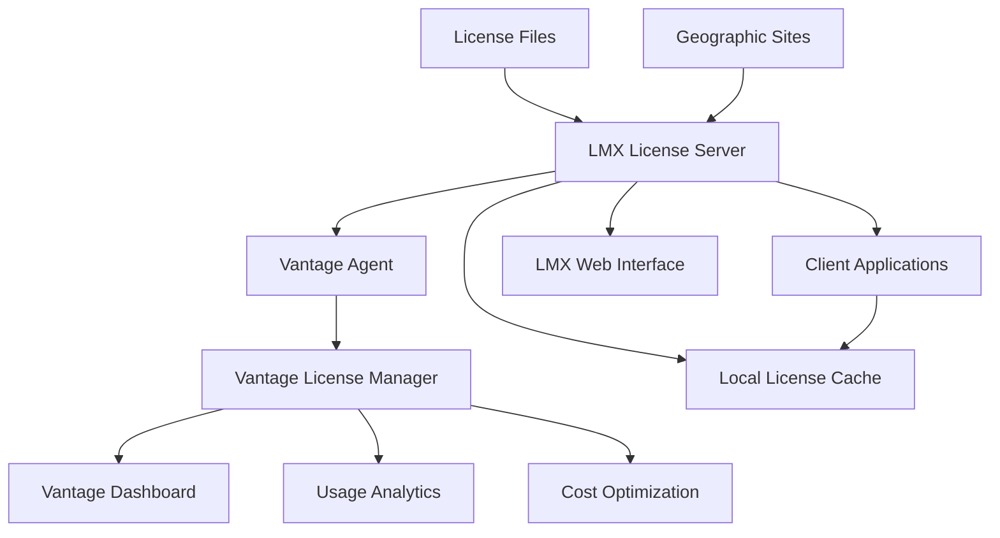
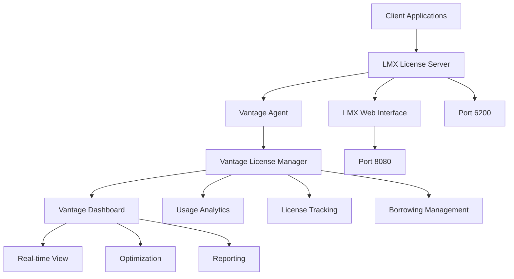

# LMX License Manager

X-Formation LMX (License Manager X) is a modern, network-based license management system designed for high-performance computing environments. LMX provides robust license distribution with advanced features including borrowing, roaming, and comprehensive usage analytics, making it ideal for engineering and scientific computing applications managed through the Vantage platform.

## Overview

LMX integrates seamlessly with Vantage to provide enterprise-grade license management with real-time monitoring, automated optimization, and comprehensive analytics. The Vantage License Manager provides centralized visibility into LMX license usage across teams, departments, and computing clusters while optimizing license allocation for maximum efficiency.

### Key Features

- **Real-time License Monitoring**: Track license usage, availability, and user sessions across all LMX-enabled applications
- **Advanced License Borrowing**: Offline license usage for mobile workstations and disconnected environments
- **Geographic Distribution**: Multi-site license sharing with intelligent routing and failover
- **Cost Analytics**: Detailed usage reporting for license cost optimization and planning
- **Queue Management**: Intelligent job scheduling based on license availability and priority
- **Integration APIs**: Native Vantage integration for automated license lifecycle management

### Supported Applications

LMX is commonly used with:
- **ANSYS products** (Fluent, CFX, Mechanical, HFSS)
- **COMSOL Multiphysics**
- **CD-adapco STAR-CCM+** (legacy versions)
- **Various CAE/CAD applications**
- **Custom applications** using LMX SDK

## Architecture

### LMX Components



**Core Components**:
- **LMX Server**: Central license distribution engine with borrowing capabilities
- **Vantage Agent**: Local monitoring agent that collects license data and forwards to Vantage
- **Vantage License Manager**: Enterprise integration layer with advanced analytics
- **LMX Web Interface**: Administrative interface for license management
- **Client Libraries**: Application integration for license checkout/checkin
- **License Cache**: Local storage for borrowed licenses and offline usage

### Network Architecture



**Default Ports**:
- **6200**: LMX license server (main communication)
- **8080**: LMX web interface (administrative)
- **Dynamic**: Additional vendor daemon ports as needed

## Vantage Integration Benefits

### Enterprise License Management

**Centralized Visibility**:
- Unified dashboard for all LMX license usage across the organization
- Real-time monitoring of license availability, usage patterns, and user sessions
- Cross-cluster license allocation optimization for maximum utilization

**Advanced Analytics**:
- Historical usage trending and peak demand analysis
- Cost-per-user and cost-per-project calculations with detailed attribution
- License ROI analysis with usage efficiency metrics
- Predictive analytics for future license capacity planning

**Intelligent Optimization**:
- Automated license borrowing based on user patterns and work schedules
- Geographic optimization for multi-site license distribution
- Queue-aware job scheduling with license availability prediction
- Idle license reclamation with configurable timeout policies

### Usage Monitoring and Analytics

**Real-time Tracking**:
- Live license usage with user, hostname, and application details
- Geographic usage distribution across sites and clusters
- Session duration tracking with idle time detection
- License borrowing status and return schedules

**Business Intelligence**:
- Department and team-based usage analytics with cost allocation
- Peak usage identification for license pool optimization
- License efficiency scoring with utilization recommendations
- Compliance reporting for license audit requirements

**Cost Management**:
- Per-license cost tracking with usage-based allocation
- Department chargeback calculations with detailed usage attribution
- Budget planning tools with historical usage projections
- License renewal optimization based on actual usage patterns

### Operational Efficiency

**Automated Management**:
- License pool optimization with demand-based allocation
- Automatic failover between redundant LMX servers
- Proactive alerting for license availability and server health
- Integration with Vantage job scheduler for license-aware scheduling

**User Experience**:
- Self-service license borrowing through Vantage interface
- License availability prediction for job planning
- Unified license status across all applications and platforms
- Mobile access to license information and borrowing controls

## Getting Started

### Prerequisites

- LMX server installed and configured (version 4.9.6 or later recommended)
- Network connectivity between Vantage and LMX server
- Administrative access to LMX configuration
- Valid license files from supported vendors

### Quick Setup

1. **[Server Configuration](lmx-server-setup)**: Install and configure LMX server with Vantage integration
2. **[High Availability](lmx-high-availability)**: Set up redundant LMX servers for production reliability
3. **[Monitoring Setup](lmx-monitoring)**: Configure Vantage dashboard for comprehensive license analytics
4. **[Troubleshooting](lmx-troubleshooting)**: Diagnose and resolve common integration issues

### Integration Workflow

```bash
# 1. Register LMX server with Vantage
vantage licenses add lmx-server \
  --type lmx \
  --host lmx-server.company.com \
  --port 6200 \
  --web-port 8080 \
  --vendor ansys

# 2. Configure monitoring and analytics
vantage licenses monitor lmx-server \
  --enable-web-integration \
  --collect-usage-data \
  --enable-cost-tracking

# 3. Test integration
vantage licenses test lmx-server \
  --feature ANSYS_CFX \
  --verbose

# 4. Enable optimization features
vantage licenses optimize lmx-server \
  --enable-borrowing \
  --enable-queuing \
  --idle-timeout 7200
```

## License Features

### Borrowing and Roaming

LMX's advanced borrowing capabilities allow users to check out licenses for offline use:

- **Flexible Borrowing**: Licenses can be borrowed for specified durations (hours to weeks)
- **Automatic Return**: Borrowed licenses return automatically when no longer needed
- **Roaming Support**: Users can access borrowed licenses from multiple workstations
- **Vantage Integration**: Borrowing managed through Vantage interface with approval workflows

### Geographic Distribution

**Multi-site License Sharing**:
- Intelligent license routing based on availability and network proximity
- Automatic failover to alternate sites during outages
- Load balancing across geographic license pools
- Site-specific license reservations for critical applications

**Network Optimization**:
- WAN-aware license distribution with bandwidth consideration
- Local caching to reduce network overhead
- Compression and optimization for remote license checkout
- VPN and firewall traversal with secure communication

### Advanced Security

**Authentication and Authorization**:
- Integration with corporate directory services (LDAP/Active Directory)
- Role-based access control for license borrowing and administrative functions
- Audit logging for compliance and security monitoring
- Encrypted communication between all components

**License Protection**:
- Hardware fingerprinting for license binding
- Tamper detection and prevention mechanisms
- Secure license file handling with digital signatures
- Anti-piracy features integrated with vendor protection schemes

## Best Practices

### Performance Optimization

**Server Configuration**:
- Use dedicated hardware or VMs with sufficient CPU and memory
- Configure appropriate connection limits and timeout values
- Implement license caching strategies for frequently used features
- Monitor server performance with Vantage analytics

**Network Design**:
- Place LMX servers close to major user populations
- Use redundant network paths for high availability
- Configure appropriate firewall rules for LMX communication
- Implement QoS policies for license traffic prioritization

### Usage Management

**License Pool Optimization**:
- Analyze usage patterns to optimize license distribution
- Implement geographic pooling based on time zones and usage patterns
- Use borrowing policies to maximize license utilization
- Configure idle timeouts to reclaim unused licenses

**User Education**:
- Train users on license borrowing best practices
- Provide guidelines for efficient license usage
- Implement approval workflows for long-term borrowing
- Communicate license availability and planned maintenance

### Monitoring and Maintenance

**Proactive Monitoring**:
- Set up alerts for license availability thresholds
- Monitor server health and performance metrics
- Track usage trends and capacity planning requirements
- Implement automated license optimization based on usage patterns

**Regular Maintenance**:
- Keep LMX server software updated to latest versions
- Review and update license files regularly
- Perform capacity planning based on usage analytics
- Test failover procedures and backup systems

## Next Steps

Choose your area of focus:

- **[Server Setup](lmx-server-setup)**: Detailed installation and configuration guide
- **[High Availability](lmx-high-availability)**: Redundancy and failover configuration
- **[Monitoring & Analytics](lmx-monitoring)**: Advanced usage tracking and optimization
- **[Troubleshooting](lmx-troubleshooting)**: Common issues and diagnostic procedures

---

> **Integration Note**: LMX's advanced borrowing and geographic distribution features make it particularly well-suited for organizations with mobile users or multiple geographic sites. The Vantage integration provides enterprise-scale visibility and management capabilities that extend LMX's native functionality with business intelligence and cost optimization tools.
