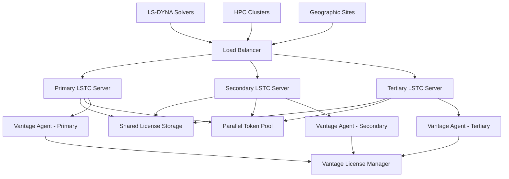

# LS-DYNA High Availability

This guide covers the configuration of highly available LSTC license servers with automatic failover, load balancing, and solver-aware redundancy. The Vantage License Manager provides enterprise-grade high availability features that ensure continuous LS-DYNA license service even during server outages, with specialized support for parallel token management and solver-specific failover scenarios.

## High Availability Architecture

### Multi-Server Configuration for LS-DYNA

LSTC license servers support several high availability configurations optimized for LS-DYNA's unique requirements:



**Architecture Components**:
- **Load Balancer**: Solver-aware traffic distribution with parallel token considerations
- **Multiple LSTC Servers**: Redundant license servers with synchronized solver configurations
- **Shared Token Pool**: Centralized parallel token management with high availability
- **Vantage Agents**: Distributed monitoring agents on each server collecting solver-specific data
- **Vantage Integration**: Coordinated monitoring and solver-aware failover management via agents
- **Geographic Distribution**: Multi-site redundancy optimized for LS-DYNA workloads

### Redundancy Models for LS-DYNA

**Active-Passive Configuration**:
- Primary server handles all LS-DYNA license requests and parallel token allocation
- Secondary server maintains synchronized solver state for immediate failover
- Shared license file storage ensures solver configuration consistency
- Typical failover time: 30-60 seconds with minimal simulation interruption

**Active-Active Configuration**:
- Multiple servers handle LS-DYNA requests with intelligent solver distribution
- Load balancing considers solver types and parallel token requirements
- Enhanced performance for mixed explicit/implicit workloads
- Immediate failover with transparent parallel token reallocation

**Solver-Aware Redundancy**:
- Dedicated server pairs for different solver types (explicit/implicit)
- Parallel token pools distributed across redundant servers
- Solver-specific failover policies for optimal performance
- Geographic redundancy with solver workload considerations

## Primary-Secondary Setup

### Configure Primary LSTC Server

```bash
# Install and configure primary LSTC server
sudo useradd -r -s /bin/bash -d /opt/lstc -m lstc
sudo mkdir -p /opt/lstc/{bin,licenses,logs,config,shared,tokens}

# Primary server configuration
sudo -u lstc tee /opt/lstc/config/primary-server.conf <<EOF
# LSTC Primary Server Configuration for HA
HOSTNAME $(hostname -f)
SERVER_TYPE primary
SERVER_ID lstc-primary

# Network Configuration
PORT 31010
PARALLEL_TOKEN_PORT 31011
MAX_CONNECTIONS 1000
CONNECTION_TIMEOUT 300

# High Availability Configuration
HA_ENABLE true
HA_MODE active_passive
HA_PARTNER_SERVERS lstc-secondary.company.com:31010,lstc-tertiary.company.com:31010
HA_HEARTBEAT_INTERVAL 30
HA_FAILOVER_TIMEOUT 60

# Solver-Specific HA Configuration
SOLVER_HA_ENABLE true
EXPLICIT_HA_PRIORITY 100
IMPLICIT_HA_PRIORITY 100
EM_HA_PRIORITY 100
THERMAL_HA_PRIORITY 100

# Shared Storage Configuration
LICENSE_FILE /opt/lstc/shared/licenses/server.lic
SHARED_CONFIG_PATH /opt/lstc/shared/config/
SHARED_TOKEN_POOL /opt/lstc/shared/tokens/
SYNC_INTERVAL 300

# Parallel Token HA Configuration
PARALLEL_TOKEN_HA_ENABLE true
SMP_TOKEN_POOL_HA true
MPP_TOKEN_POOL_HA true
TOKEN_FAILOVER_TIMEOUT 30

# Clustering Configuration
CLUSTER_ENABLE true
CLUSTER_NAME production-lsdyna
CLUSTER_PRIORITY 100
CLUSTER_WEIGHT 1.0

# Performance Settings
THREAD_POOL_SIZE 50
TOKEN_CACHE_SIZE 10000
SOLVER_CACHE_SIZE 5000
EOF
```

### Configure Secondary LSTC Server

```bash
# Secondary server configuration (on secondary host)
sudo -u lstc tee /opt/lstc/config/secondary-server.conf <<EOF
# LSTC Secondary Server Configuration for HA
HOSTNAME $(hostname -f)
SERVER_TYPE secondary
SERVER_ID lstc-secondary

# Network Configuration
PORT 31010
PARALLEL_TOKEN_PORT 31011
MAX_CONNECTIONS 1000
CONNECTION_TIMEOUT 300

# High Availability Configuration
HA_ENABLE true
HA_MODE active_passive
HA_PARTNER_SERVERS lstc-primary.company.com:31010,lstc-tertiary.company.com:31010
HA_HEARTBEAT_INTERVAL 30
HA_FAILOVER_TIMEOUT 60
HA_STANDBY_MODE true

# Solver-Specific HA Configuration
SOLVER_HA_ENABLE true
EXPLICIT_HA_PRIORITY 90
IMPLICIT_HA_PRIORITY 90
EM_HA_PRIORITY 90
THERMAL_HA_PRIORITY 90

# Shared Storage Configuration
LICENSE_FILE /opt/lstc/shared/licenses/server.lic
SHARED_CONFIG_PATH /opt/lstc/shared/config/
SHARED_TOKEN_POOL /opt/lstc/shared/tokens/
SYNC_INTERVAL 300

# Parallel Token HA Configuration
PARALLEL_TOKEN_HA_ENABLE true
SMP_TOKEN_POOL_HA true
MPP_TOKEN_POOL_HA true
TOKEN_FAILOVER_TIMEOUT 30
TOKEN_SYNC_MODE standby

# Clustering Configuration
CLUSTER_ENABLE true
CLUSTER_NAME production-lsdyna
CLUSTER_PRIORITY 90
CLUSTER_WEIGHT 0.8

# Performance Settings
THREAD_POOL_SIZE 50
TOKEN_CACHE_SIZE 10000
SOLVER_CACHE_SIZE 5000
EOF
```

### Shared Storage Setup for LS-DYNA

```bash
# Configure NFS shared storage for LS-DYNA HA
# On NFS server:
sudo mkdir -p /nfs/lstc/{licenses,config,tokens,logs}
sudo chown -R lstc:lstc /nfs/lstc/

# Export NFS shares
sudo tee -a /etc/exports <<EOF
/nfs/lstc/licenses lstc-primary.company.com(rw,sync,no_root_squash)
/nfs/lstc/licenses lstc-secondary.company.com(rw,sync,no_root_squash)
/nfs/lstc/config lstc-primary.company.com(rw,sync,no_root_squash)
/nfs/lstc/config lstc-secondary.company.com(rw,sync,no_root_squash)
/nfs/lstc/tokens lstc-primary.company.com(rw,sync,no_root_squash)
/nfs/lstc/tokens lstc-secondary.company.com(rw,sync,no_root_squash)
EOF

sudo exportfs -ra

# On LSTC servers:
sudo mkdir -p /opt/lstc/shared/{licenses,config,tokens}
sudo mount -t nfs nfs-server.company.com:/nfs/lstc/licenses /opt/lstc/shared/licenses
sudo mount -t nfs nfs-server.company.com:/nfs/lstc/config /opt/lstc/shared/config
sudo mount -t nfs nfs-server.company.com:/nfs/lstc/tokens /opt/lstc/shared/tokens

# Add to /etc/fstab for persistent mounting
echo "nfs-server.company.com:/nfs/lstc/licenses /opt/lstc/shared/licenses nfs defaults 0 0" | sudo tee -a /etc/fstab
echo "nfs-server.company.com:/nfs/lstc/config /opt/lstc/shared/config nfs defaults 0 0" | sudo tee -a /etc/fstab
echo "nfs-server.company.com:/nfs/lstc/tokens /opt/lstc/shared/tokens nfs defaults 0 0" | sudo tee -a /etc/fstab
```

## Load Balancer Configuration

### HAProxy Setup for LS-DYNA

```bash
# Install and configure HAProxy for LSTC load balancing
sudo yum install -y haproxy  # RHEL/CentOS
# or
sudo apt install -y haproxy  # Ubuntu/Debian

# Configure HAProxy for LS-DYNA
sudo tee /etc/haproxy/haproxy.cfg <<EOF
global
    log 127.0.0.1:514 local0
    chroot /var/lib/haproxy
    stats timeout 30s
    user haproxy
    group haproxy
    daemon

defaults
    mode tcp
    log global
    option tcplog
    option dontlognull
    retries 3
    timeout connect 5000ms
    timeout client 50000ms
    timeout server 50000ms

# LSTC License Server Load Balancing
frontend lstc_frontend
    bind *:31010
    mode tcp
    default_backend lstc_backend
    
    # Health check based on LSTC status
    option tcpka
    timeout client 300s

backend lstc_backend
    mode tcp
    balance roundrobin
    option tcp-check
    tcp-check connect port 31010
    
    # Primary server (higher weight)
    server lstc-primary lstc-primary.company.com:31010 check weight 100 inter 30s fastinter 5s downinter 30s
    
    # Secondary server (backup)
    server lstc-secondary lstc-secondary.company.com:31010 check weight 80 inter 30s fastinter 5s downinter 30s backup
    
    # Tertiary server (backup)
    server lstc-tertiary lstc-tertiary.company.com:31010 check weight 60 inter 30s fastinter 5s downinter 30s backup

# Parallel Token Manager Load Balancing
frontend lstc_token_frontend
    bind *:31011
    mode tcp
    default_backend lstc_token_backend

backend lstc_token_backend
    mode tcp
    balance roundrobin
    option tcp-check
    tcp-check connect port 31011
    
    server lstc-primary-tokens lstc-primary.company.com:31011 check
    server lstc-secondary-tokens lstc-secondary.company.com:31011 check backup

# HAProxy Statistics
frontend stats
    bind *:8404
    mode http
    stats enable
    stats uri /stats
    stats refresh 5s
    stats admin if TRUE
EOF

# Enable and start HAProxy
sudo systemctl enable haproxy
sudo systemctl start haproxy
sudo systemctl status haproxy
```

### Solver-Aware Load Balancing

```bash
# Advanced HAProxy configuration for solver-aware load balancing
sudo tee -a /etc/haproxy/haproxy.cfg <<EOF

# Solver-Specific Load Balancing
# Explicit Solver Backend
backend lstc_explicit_backend
    mode tcp
    balance roundrobin
    option tcp-check
    
    # Route explicit solver jobs to optimized servers
    server lstc-explicit-1 lstc-primary.company.com:31010 check weight 100
    server lstc-explicit-2 lstc-secondary.company.com:31010 check weight 80 backup

# Implicit Solver Backend  
backend lstc_implicit_backend
    mode tcp
    balance roundrobin
    option tcp-check
    
    # Route implicit solver jobs to specialized servers
    server lstc-implicit-1 lstc-primary.company.com:31010 check weight 100
    server lstc-implicit-2 lstc-secondary.company.com:31010 check weight 80 backup

# ACL-based routing (requires application-level routing)
frontend lstc_smart_frontend
    bind *:31012
    mode tcp
    
    # Route based on solver type (requires custom logic)
    default_backend lstc_backend
EOF
```

## Active-Active Configuration

### Configure Multiple Active LSTC Servers

```bash
# Active-Active LSTC configuration for high performance
sudo -u lstc tee /opt/lstc/config/active-active.conf <<EOF
# LSTC Active-Active Configuration for LS-DYNA
HA_MODE active_active
LOAD_SHARING_ENABLE true
LICENSE_SHARING_ENABLE true
SOLVER_SHARING_ENABLE true

# Distributed License Pool Configuration
DISTRIBUTED_POOL_ENABLE true
POOL_SHARING_ALGORITHM solver_aware
POOL_STICKY_SESSIONS false

# Solver-Specific Pool Allocation
EXPLICIT_POOL_WEIGHT 1.0
IMPLICIT_POOL_WEIGHT 1.0
EM_POOL_WEIGHT 0.8
THERMAL_POOL_WEIGHT 0.6

# Parallel Token Distribution
SMP_TOKEN_DISTRIBUTION round_robin
MPP_TOKEN_DISTRIBUTION performance_based
TOKEN_AFFINITY_ENABLE true

# Inter-server Communication
INTER_SERVER_COMMUNICATION_ENABLE true
INTER_SERVER_PORT 31020
INTER_SERVER_SSL_ENABLE true
SYNC_FREQUENCY 60

# Load Balancing Configuration
CLIENT_AFFINITY_ENABLE false
SESSION_PERSISTENCE_ENABLE true
SOLVER_AWARE_ROUTING true
FAILOVER_TRANSPARENT true

# Performance Optimization
CONCURRENT_CHECKOUTS_MAX 1000
PARALLEL_PROCESSING_ENABLE true
CACHE_COORDINATION_ENABLE true
SOLVER_CACHE_SYNC true
EOF
```

### Database Synchronization for LS-DYNA

```bash
# Configure PostgreSQL for LSTC state synchronization
sudo -u lstc tee /opt/lstc/config/database.conf <<EOF
# Database Configuration for LS-DYNA HA State Management
DATABASE_ENABLE true
DATABASE_TYPE postgresql
DATABASE_HOST lstc-db-cluster.company.com
DATABASE_PORT 5432
DATABASE_NAME lstc_ha_state
DATABASE_USER lstc_ha
DATABASE_SSL_ENABLE true

# LS-DYNA Specific State Tables
SOLVER_STATE_TABLE lstc_solver_state
TOKEN_STATE_TABLE lstc_token_state
SESSION_STATE_TABLE lstc_session_state
SYNC_STATE_INTERVAL 30

# Conflict Resolution
CONFLICT_RESOLUTION_STRATEGY timestamp_priority
SOLVER_PRIORITY_RESOLUTION explicit_first

# High Availability Database Features
CONNECTION_POOLING_ENABLE true
CONNECTION_POOL_SIZE 20
FAILOVER_DB_HOSTS lstc-db-replica1.company.com,lstc-db-replica2.company.com
EOF
```

## Geographic Redundancy

### Multi-Site Configuration for LS-DYNA

```bash
# Configure geographic redundancy for LS-DYNA
sudo -u lstc tee /opt/lstc/config/geographic-ha.conf <<EOF
# Geographic High Availability Configuration for LS-DYNA
GEOGRAPHIC_HA_ENABLE true
LOCAL_SITE_ID "datacenter-east"
REMOTE_SITES "datacenter-west,datacenter-central"

# Site-specific LS-DYNA Configuration
SITE_DATACENTER_EAST_SERVERS "lstc-east-1.company.com:31010,lstc-east-2.company.com:31010"
SITE_DATACENTER_WEST_SERVERS "lstc-west-1.company.com:31010,lstc-west-2.company.com:31010"
SITE_DATACENTER_CENTRAL_SERVERS "lstc-central-1.company.com:31010"

# Cross-site Solver Sharing
CROSS_SITE_SOLVER_SHARING true
CROSS_SITE_SHARING_THRESHOLD 80
CROSS_SITE_TOKEN_SHARING true
NETWORK_LATENCY_THRESHOLD 50ms

# Solver-Specific Geographic Policies
EXPLICIT_SOLVER_LOCALITY true
IMPLICIT_SOLVER_LOCALITY false
EM_SOLVER_LOCALITY true
THERMAL_SOLVER_LOCALITY false

# Disaster Recovery Configuration
DR_ENABLE true
DR_REPLICATION_INTERVAL 300
DR_FAILOVER_AUTOMATIC true
DR_FAILOVER_THRESHOLD 300
DR_SOLVER_PRIORITY_PRESERVATION true

# Site Priority and Failover
SITE_PRIORITY_DATACENTER_EAST 100
SITE_PRIORITY_DATACENTER_WEST 90
SITE_PRIORITY_DATACENTER_CENTRAL 80
AUTOMATIC_SITE_FAILOVER true
SOLVER_AWARE_SITE_FAILOVER true
FAILOVER_DECISION_TIMEOUT 180
EOF
```

### Cross-Site Token Replication

```bash
# Configure parallel token replication across sites
sudo -u lstc tee /opt/lstc/bin/token-sync.sh <<'EOF'
#!/bin/bash
# Cross-site parallel token synchronization for LS-DYNA

SITES=("datacenter-east" "datacenter-west" "datacenter-central")
TOKEN_SOURCE="/opt/lstc/shared/tokens/"
LOG_FILE="/opt/lstc/logs/token-sync.log"

log_message() {
    echo "$(date '+%Y-%m-%d %H:%M:%S') - $1" >> "$LOG_FILE"
}

sync_tokens() {
    local target_site=$1
    log_message "Syncing parallel tokens to $target_site"
    
    # Sync SMP token state
    rsync -avz --delete \
        -e "ssh -o ConnectTimeout=30" \
        "$TOKEN_SOURCE/smp/" \
        "lstc@$target_site.company.com:/opt/lstc/shared/tokens/smp/" \
        >> "$LOG_FILE" 2>&1
    
    # Sync MPP token state
    rsync -avz --delete \
        -e "ssh -o ConnectTimeout=30" \
        "$TOKEN_SOURCE/mpp/" \
        "lstc@$target_site.company.com:/opt/lstc/shared/tokens/mpp/" \
        >> "$LOG_FILE" 2>&1
    
    if [ $? -eq 0 ]; then
        log_message "Token sync to $target_site completed successfully"
    else
        log_message "Token sync to $target_site failed"
    fi
}

# Sync to all remote sites
for site in "${SITES[@]}"; do
    if [ "$site" != "$(hostname | cut -d'-' -f2)" ]; then
        sync_tokens "$site"
    fi
done

log_message "Cross-site token synchronization completed"
EOF

sudo chmod +x /opt/lstc/bin/token-sync.sh
sudo chown lstc:lstc /opt/lstc/bin/token-sync.sh

# Schedule token synchronization
echo "*/10 * * * * /opt/lstc/bin/token-sync.sh" | sudo -u lstc crontab -
```

## Vantage Integration for HA

### Configure Vantage HA Management for LS-DYNA

```bash
# Register LS-DYNA HA cluster with Vantage
vantage licenses add-cluster lsdyna-production \
  --type lsdyna \
  --load-balancer lstc-lb.company.com:31010 \
  --primary-server lstc-primary.company.com:31010 \
  --secondary-server lstc-secondary.company.com:31010 \
  --tertiary-server lstc-tertiary.company.com:31010 \
  --ha-mode active-passive \
  --solver-aware-failover true \
  --parallel-token-failover true \
  --failover-timeout 60 \
  --health-check-interval 30

# Configure LS-DYNA specific HA monitoring
vantage licenses ha-monitoring lsdyna-production \
  --enable-solver-failover-alerts \
  --enable-parallel-token-monitoring \
  --enable-performance-monitoring \
  --enable-geographic-monitoring \
  --alert-channels slack email teams \
  --escalation-policy critical-simulations

# Set up automated failover policies for LS-DYNA
vantage licenses failover-policy lsdyna-production \
  --automatic-failover true \
  --solver-aware-failover true \
  --parallel-token-preservation true \
  --failover-threshold 3 \
  --failback-automatic true \
  --failback-delay 300 \
  --cross-site-failover true \
  --site-failover-threshold 600
```

### Solver-Specific Health Monitoring

```bash
# Configure solver-specific health monitoring
vantage licenses health-monitoring lsdyna-production \
  --monitor-explicit-solver-health \
  --monitor-implicit-solver-health \
  --monitor-em-solver-health \
  --monitor-thermal-solver-health \
  --monitor-parallel-token-pools \
  --monitor-solver-response-times \
  --health-check-frequency 30s

# Set up predictive failure detection for LS-DYNA
vantage licenses predictive-monitoring lsdyna-production \
  --enable-solver-anomaly-detection \
  --enable-parallel-performance-trending \
  --enable-token-capacity-prediction \
  --machine-learning-models solver-failure-prediction,token-load-forecasting \
  --prediction-horizon 24h
```

## Automated Failover Procedures

### LS-DYNA Aware Failover Scripts

```bash
# Automated failover script for LSTC servers
sudo -u lstc tee /opt/lstc/bin/automated-failover.sh <<'EOF'
#!/bin/bash
# LSTC Automated Failover Script for LS-DYNA

CONFIG_FILE="/opt/lstc/config/server.conf"
LOG_FILE="/opt/lstc/logs/failover.log"
VANTAGE_CLI="/usr/local/bin/vantage"

log_message() {
    echo "$(date '+%Y-%m-%d %H:%M:%S') - $1" >> "$LOG_FILE"
    echo "$1"
}

check_solver_health() {
    local server=$1
    local port=$2
    
    # Test each LS-DYNA solver
    for solver in explicit implicit em thermal; do
        timeout 10 /opt/lstc/bin/lstc_qstat -s "$port@$server" -solver "$solver" > /dev/null 2>&1
        if [ $? -ne 0 ]; then
            log_message "Solver $solver health check failed on $server"
            return 1
        fi
    done
    
    # Test parallel token availability
    timeout 10 /opt/lstc/bin/lstc_qstat -t -s "$port@$server" > /dev/null 2>&1
    return $?
}

initiate_solver_failover() {
    local failed_server=$1
    local backup_server=$2
    
    log_message "Initiating LS-DYNA failover from $failed_server to $backup_server"
    
    # Preserve running simulations if possible
    log_message "Attempting to preserve running LS-DYNA simulations"
    
    # Notify Vantage of solver-aware failover
    "$VANTAGE_CLI" licenses failover lsdyna-production \
        --from "$failed_server" \
        --to "$backup_server" \
        --preserve-solver-sessions \
        --preserve-parallel-tokens \
        --reason "automated-solver-health-check-failure"
    
    # Send solver-specific notifications
    "$VANTAGE_CLI" alerts send \
        --severity critical \
        --message "LS-DYNA server failover: $failed_server -> $backup_server (preserving simulations)" \
        --channels slack email teams
    
    log_message "LS-DYNA failover completed: $failed_server -> $backup_server"
}

# Main failover logic for LS-DYNA
PRIMARY_SERVER="lstc-primary.company.com"
SECONDARY_SERVER="lstc-secondary.company.com"
PORT="31010"

if ! check_solver_health "$PRIMARY_SERVER" "$PORT"; then
    log_message "Primary LS-DYNA server $PRIMARY_SERVER health check failed"
    
    if check_solver_health "$SECONDARY_SERVER" "$PORT"; then
        initiate_solver_failover "$PRIMARY_SERVER" "$SECONDARY_SERVER"
    else
        log_message "CRITICAL: Both primary and secondary LS-DYNA servers are down!"
        "$VANTAGE_CLI" alerts send \
            --severity critical \
            --message "CRITICAL: All LS-DYNA servers are down - immediate intervention required" \
            --channels slack email teams phone
    fi
else
    log_message "Primary LS-DYNA server $PRIMARY_SERVER is healthy"
fi
EOF

sudo chmod +x /opt/lstc/bin/automated-failover.sh

# Schedule regular health checks
echo "*/3 * * * * /opt/lstc/bin/automated-failover.sh" | sudo -u lstc crontab -
```

### Parallel Token Preservation

```bash
# Parallel token preservation during failover
sudo -u lstc tee /opt/lstc/bin/token-preservation.sh <<'EOF'
#!/bin/bash
# Parallel token preservation during LSTC failover

TOKEN_STATE_FILE="/opt/lstc/shared/tokens/current_state.json"
BACKUP_TOKEN_FILE="/opt/lstc/shared/tokens/backup_state.json"
LOG_FILE="/opt/lstc/logs/token-preservation.log"

log_message() {
    echo "$(date '+%Y-%m-%d %H:%M:%S') - $1" >> "$LOG_FILE"
}

backup_token_state() {
    log_message "Backing up parallel token state"
    
    # Export current token allocations
    /opt/lstc/bin/lstc_qstat -t -s 31010@localhost -json > "$TOKEN_STATE_FILE"
    
    # Create backup copy
    cp "$TOKEN_STATE_FILE" "$BACKUP_TOKEN_FILE"
    
    log_message "Token state backup completed"
}

restore_token_state() {
    local target_server=$1
    
    log_message "Restoring parallel token state to $target_server"
    
    if [ -f "$BACKUP_TOKEN_FILE" ]; then
        # Restore token allocations to new server
        /opt/lstc/bin/lstc_token_restore -f "$BACKUP_TOKEN_FILE" -s "31010@$target_server"
        
        if [ $? -eq 0 ]; then
            log_message "Token state restoration successful"
        else
            log_message "Token state restoration failed"
        fi
    else
        log_message "No token backup file found"
    fi
}

verify_token_consistency() {
    local server=$1
    
    log_message "Verifying token consistency on $server"
    
    # Check that token allocations match expected state
    current_tokens=$(/opt/lstc/bin/lstc_qstat -t -s "31010@$server" -count)
    expected_tokens=$(jq '.total_tokens' "$BACKUP_TOKEN_FILE")
    
    if [ "$current_tokens" -eq "$expected_tokens" ]; then
        log_message "Token consistency verification passed"
        return 0
    else
        log_message "Token consistency verification failed: $current_tokens != $expected_tokens"
        return 1
    fi
}

# Execute based on command line argument
case "$1" in
    backup)
        backup_token_state
        ;;
    restore)
        restore_token_state "$2"
        ;;
    verify)
        verify_token_consistency "$2"
        ;;
    *)
        echo "Usage: $0 {backup|restore <server>|verify <server>}"
        exit 1
        ;;
esac
EOF

sudo chmod +x /opt/lstc/bin/token-preservation.sh
```

## Monitoring and Testing

### HA-Specific Monitoring for LS-DYNA

```bash
# Configure LS-DYNA HA monitoring dashboards
vantage licenses ha-dashboard lsdyna-production \
  --create-dashboard "LS-DYNA High Availability" \
  --widgets solver-status,failover-history,token-distribution,geographic-health \
  --real-time-updates true \
  --solver-specific-alerts true

# Set up LS-DYNA HA-specific alerts
vantage licenses ha-alerts lsdyna-production \
  --solver-down-alert 60s \
  --token-pool-exhaustion-alert 30s \
  --failover-alert immediate \
  --simulation-interruption-alert 60s \
  --parallel-performance-degradation-alert 180s \
  --geographic-connectivity-alert 300s

# Configure escalation procedures for LS-DYNA
vantage licenses escalation-policy lsdyna-production \
  --level-1 "simulation-team@company.com" \
  --level-2 "hpc-infrastructure@company.com" \
  --level-3 "cae-management@company.com" \
  --escalation-time 10m \
  --business-hours-only false \
  --solver-specific-contacts true
```

### LS-DYNA HA Testing Procedures

```bash
# Comprehensive LS-DYNA HA testing script
sudo -u lstc tee /opt/lstc/bin/ha-testing.sh <<'EOF'
#!/bin/bash
# LS-DYNA High Availability Testing Script

VANTAGE_CLI="/usr/local/bin/vantage"
TEST_LOG="/opt/lstc/logs/ha-testing.log"

log_test() {
    echo "$(date '+%Y-%m-%d %H:%M:%S') - TEST: $1" >> "$TEST_LOG"
    echo "TEST: $1"
}

test_solver_failover() {
    local solver=$1
    log_test "Testing $solver solver failover scenario"
    
    # Submit test simulation
    test_job_id=$(/opt/lstc/bin/lstc_qrun -test -solver "$solver" -s 31010@lstc-primary.company.com)
    
    # Simulate primary server failure
    log_test "Simulating primary server failure during $solver simulation"
    sudo systemctl stop lstc-server  # On primary server
    
    # Wait for failover
    sleep 90
    
    # Verify simulation continues on secondary
    if /opt/lstc/bin/lstc_qstat -j "$test_job_id" -s 31010@lstc-secondary.company.com > /dev/null 2>&1; then
        log_test "$solver solver failover successful - simulation preserved"
    else
        log_test "FAIL: $solver solver failover failed - simulation lost"
        return 1
    fi
    
    # Restore primary server
    sudo systemctl start lstc-server  # On primary server
    sleep 60
    
    log_test "$solver solver failover test completed"
    return 0
}

test_parallel_token_failover() {
    log_test "Testing parallel token failover"
    
    # Allocate SMP and MPP tokens
    smp_allocation=$(/opt/lstc/bin/lstc_qrun -test -smp 8 -s 31010@lstc-primary.company.com)
    mpp_allocation=$(/opt/lstc/bin/lstc_qrun -test -mpp 16 -s 31010@lstc-primary.company.com)
    
    # Record token state
    /opt/lstc/bin/token-preservation.sh backup
    
    # Simulate failover
    sudo systemctl stop lstc-server  # On primary
    sleep 60
    
    # Verify token restoration
    if /opt/lstc/bin/token-preservation.sh verify lstc-secondary.company.com; then
        log_test "Parallel token failover successful"
    else
        log_test "FAIL: Parallel token failover failed"
        return 1
    fi
    
    sudo systemctl start lstc-server  # Restore primary
    log_test "Parallel token failover test completed"
}

test_geographic_failover() {
    log_test "Testing geographic site failover for LS-DYNA"
    
    # Test cross-site solver availability
    "$VANTAGE_CLI" licenses test-geographic-failover lsdyna-production \
        --simulate-site-failure datacenter-east \
        --verify-west-site-takeover \
        --preserve-solver-sessions \
        --test-duration 300
    
    log_test "Geographic failover test completed"
}

# Run all LS-DYNA HA tests
log_test "Starting comprehensive LS-DYNA HA testing"

for solver in explicit implicit em thermal; do
    test_solver_failover "$solver"
done

test_parallel_token_failover
test_geographic_failover

log_test "LS-DYNA HA testing completed"
EOF

sudo chmod +x /opt/lstc/bin/ha-testing.sh

# Schedule regular HA testing
echo "0 3 * * 0 /opt/lstc/bin/ha-testing.sh" | sudo -u lstc crontab -
```

## Best Practices

### LS-DYNA Specific HA Recommendations

**Solver Configuration**:
- Deploy solver-aware failover policies for different LS-DYNA solver types
- Ensure parallel token pools are properly synchronized across HA servers
- Configure geographic redundancy based on LS-DYNA workload distribution
- Implement solver-specific timeout and recovery policies

**Performance Optimization**:
- Use dedicated network segments for parallel token synchronization
- Implement solver-aware load balancing for optimal performance
- Configure appropriate connection limits for high-throughput LS-DYNA environments
- Monitor parallel efficiency impact during failover scenarios

**Simulation Continuity**:
- Implement simulation checkpoint preservation during failover
- Configure automatic parallel token reallocation for optimal efficiency
- Set up solver-specific recovery procedures for different analysis types
- Ensure simulation data integrity during server transitions

### Operational Excellence

**Monitoring and Alerting**:
- Implement comprehensive health monitoring for all solver types
- Set up predictive alerting for parallel token exhaustion
- Configure solver-specific escalation procedures
- Monitor simulation performance impact during HA operations

**Testing and Validation**:
- Regular testing of solver-specific failover scenarios
- Validation of parallel token preservation and restoration
- Performance testing under various failover conditions
- Documentation of solver-specific recovery procedures

## Next Steps

- **[LS-DYNA Introduction](./)**: Return to main LS-DYNA overview
- **[Monitoring & Analytics](/platform/licenses/how-to-guides/ls-dyna/monitoring)**: Configure HA monitoring
- **[Troubleshooting](/platform/licenses/how-to-guides/ls-dyna/troubleshooting)**: Resolve HA issues

---

> **HA Best Practice**: LS-DYNA's solver-specific licensing and parallel token requirements make high availability particularly critical for production CAE environments. Focus on preserving running simulations during failover events and ensure parallel token pools remain synchronized across redundant servers. The solver-aware failover capabilities help minimize disruption to different types of LS-DYNA analyses.
