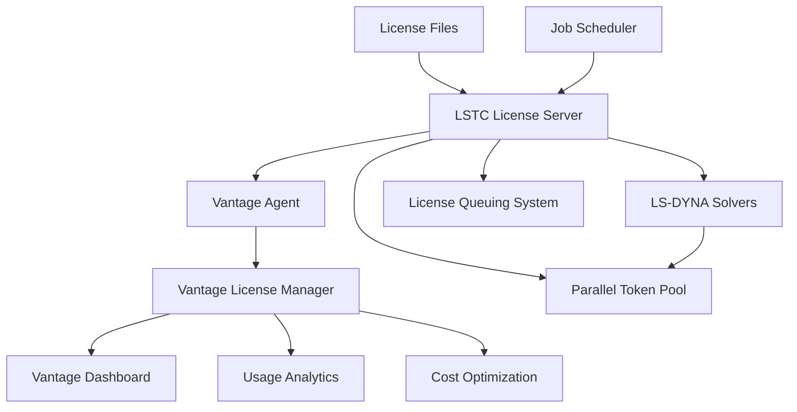
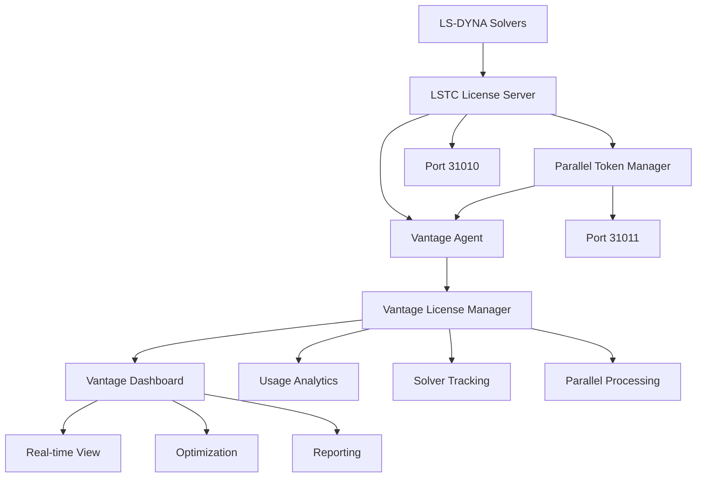

# LS-DYNA License Manager

LS-DYNA License Manager by Livermore Software Technology Corporation (LSTC) provides specialized license management for LS-DYNA explicit finite element analysis software. This system offers unique features including solver-specific licensing, parallel processing tokens, and advanced analytics capabilities that integrate seamlessly with the Vantage platform for comprehensive license optimization and monitoring.

## Overview

LS-DYNA licensing integrates with Vantage to provide enterprise-grade license management with real-time monitoring, automated optimization, and detailed analytics. The Vantage License Manager extends LSTC's native capabilities with advanced business intelligence, cost tracking, and predictive analytics designed specifically for high-performance computing environments.

### Key Features

- **Solver-Specific Licensing**: Support for different LS-DYNA solvers (Explicit, Implicit, EM, Thermal)
- **Parallel Processing Management**: Intelligent allocation of SMP and MPP tokens for optimal performance
- **Real-time Monitoring**: Live tracking of license usage, queue status, and solver performance
- **Cost Analytics**: Detailed usage reporting for license cost optimization and budget planning
- **Queue Intelligence**: Advanced job scheduling based on license availability and solver requirements
- **Integration APIs**: Native Vantage integration for automated license lifecycle management

### Supported LS-DYNA Products

LS-DYNA licensing typically covers:
- **LS-DYNA Explicit**: Primary explicit dynamics solver
- **LS-DYNA Implicit**: Implicit analysis capabilities
- **LS-DYNA EM**: Electromagnetic analysis
- **LS-DYNA Thermal**: Thermal analysis
- **LS-PrePost**: Pre and post-processing tools
- **SMP Tokens**: Shared memory parallel processing
- **MPP Tokens**: Massively parallel processing

## Architecture

### LS-DYNA License System Components



**Core Components**:
- **LSTC License Server**: Central license distribution with solver-specific features
- **Vantage Agent**: Local monitoring agent that collects solver and token usage data
- **Vantage License Manager**: Enterprise integration layer with advanced analytics
- **License Queuing System**: Intelligent queuing for license and token allocation
- **Parallel Token Pool**: Management of SMP and MPP processing tokens
- **Job Scheduler Integration**: Direct integration with HPC schedulers for optimal resource allocation

### Network Architecture



**Default Ports**:
- **31010**: LSTC license server (main communication)
- **31011**: Parallel token manager (SMP/MPP allocation)
- **Dynamic**: Additional solver-specific ports as needed

## Vantage Integration Benefits

### Enterprise License Management

**Centralized Visibility**:
- Unified dashboard for all LS-DYNA license usage across the organization
- Real-time monitoring of solver types, parallel tokens, and user sessions
- Cross-cluster license allocation optimization for maximum solver utilization

**Advanced Analytics**:
- Solver-specific usage trending and performance analysis
- Parallel processing efficiency metrics with cost optimization recommendations
- License ROI analysis based on solver types and computational requirements
- Predictive analytics for future license capacity and parallel token needs

**Intelligent Optimization**:
- Automated parallel token allocation based on job requirements and queue status
- Solver-aware job scheduling with license availability prediction
- Idle license reclamation with solver-specific timeout policies
- Geographic optimization for multi-site LS-DYNA deployments

### Usage Monitoring and Analytics

**Real-time Tracking**:
- Live license usage with solver type, user, hostname, and parallel token allocation
- Parallel processing efficiency monitoring across SMP and MPP jobs
- Session duration tracking with solver performance correlation
- Queue status monitoring with predictive wait time analysis

**Business Intelligence**:
- Department and project-based usage analytics with solver-specific cost allocation
- Peak usage identification for license pool and token optimization
- Solver efficiency scoring with performance improvement recommendations
- Compliance reporting for LSTC license audit requirements

**Cost Management**:
- Per-solver cost tracking with usage-based allocation methodology
- Department chargeback calculations with detailed solver and token attribution
- Budget planning tools with historical usage and growth projections
- License renewal optimization based on actual solver usage patterns

### Operational Efficiency

**Automated Management**:
- License pool optimization with solver-specific demand analysis
- Automatic parallel token allocation based on job characteristics
- Proactive alerting for license availability and solver performance issues
- Integration with Vantage job scheduler for license-aware HPC scheduling

**User Experience**:
- Self-service license status checking with solver-specific information
- License availability prediction for job planning and submission
- Unified license status across all LS-DYNA products and solvers
- Mobile access to license information and queue status

## Getting Started

### Prerequisites

- LSTC license server installed and configured (LSTC version 4.3 or later recommended)
- Network connectivity between Vantage and LSTC license server
- Administrative access to LSTC license configuration
- Valid LS-DYNA license files from LSTC

### Quick Setup

1. **[Server Configuration](/platform/licenses/how-to-guides/ls-dyna/user-managed-server-setup)**: Install and configure LSTC license server with Vantage integration
2. **[High Availability](/platform/licenses/how-to-guides/ls-dyna/high-availability)**: Set up redundant license servers for production reliability
3. **[Monitoring Setup](/platform/licenses/how-to-guides/ls-dyna/monitoring)**: Configure Vantage dashboard for comprehensive license analytics
4. **[Troubleshooting](/platform/licenses/how-to-guides/ls-dyna/troubleshooting)**: Diagnose and resolve common integration issues

### Integration Workflow

```bash
# 1. Register LSTC license server with Vantage
vantage licenses add lsdyna-server \
  --type lsdyna \
  --host lsdyna-server.company.com \
  --port 31010 \
  --parallel-port 31011 \
  --vendor lstc

# 2. Configure monitoring and analytics
vantage licenses monitor lsdyna-server \
  --enable-solver-analytics \
  --enable-parallel-tracking \
  --enable-cost-tracking \
  --collect-performance-data

# 3. Test integration
vantage licenses test lsdyna-server \
  --solver explicit \
  --parallel-tokens 8 \
  --verbose

# 4. Enable optimization features
vantage licenses optimize lsdyna-server \
  --enable-solver-scheduling \
  --enable-token-optimization \
  --idle-timeout 3600 \
  --parallel-efficiency-tracking
```

## License Features

### Solver-Specific Licensing

LS-DYNA's unique solver-based licensing model provides:

- **Solver Differentiation**: Separate license pools for different analysis types
- **Automatic Solver Detection**: License system identifies required solver based on input deck
- **Cross-Solver Optimization**: Intelligent allocation across different solver types
- **Vantage Integration**: Solver-aware job scheduling and resource allocation

### Parallel Processing Tokens

**SMP (Shared Memory Parallel) Tokens**:
- License tokens for shared memory parallel processing
- Automatic scaling based on available CPU cores
- Efficient resource utilization for single-node jobs
- Vantage optimization for SMP token allocation

**MPP (Massively Parallel Processing) Tokens**:
- License tokens for distributed memory parallel processing
- Multi-node job support with automatic token calculation
- Network-aware parallel processing optimization
- Integration with Vantage cluster management for optimal node allocation

### Advanced Queuing

**Intelligent License Queuing**:
- Priority-based license allocation with solver awareness
- Predictive queuing based on estimated job completion times
- Fair-share scheduling across users and projects
- Integration with HPC schedulers for comprehensive resource management

**Parallel Token Optimization**:
- Dynamic token allocation based on job requirements and system load
- Automatic scaling recommendations for optimal parallel efficiency
- Token pooling for improved utilization across different job sizes
- Performance tracking for parallel processing optimization

## Best Practices

### Performance Optimization

**Solver Configuration**:
- Optimize solver selection based on problem characteristics and license availability
- Configure appropriate parallel token allocation for job requirements
- Monitor solver performance and adjust licensing strategies accordingly
- Implement solver-specific timeout policies for efficient license utilization

**Parallel Processing**:
- Analyze parallel efficiency to optimize token usage and costs
- Configure appropriate SMP vs. MPP allocation based on problem size and architecture
- Monitor parallel scaling effectiveness for different solver types
- Implement intelligent token pooling for variable workload demands

### Usage Management

**License Pool Optimization**:
- Analyze solver usage patterns to optimize license distribution
- Implement solver-specific reservations for critical applications
- Configure appropriate timeout values for different solver types
- Use analytics to identify opportunities for license pool rebalancing

**User Education**:
- Train users on optimal solver selection for their analysis requirements
- Provide guidelines for efficient parallel token usage
- Implement approval workflows for high-token-count jobs
- Communicate license availability and planned maintenance schedules

### Monitoring and Maintenance

**Proactive Monitoring**:
- Set up alerts for license availability thresholds by solver type
- Monitor parallel token utilization and efficiency metrics
- Track solver performance trends for capacity planning
- Implement automated optimization based on usage patterns

**Regular Maintenance**:
- Keep LSTC license server software updated to latest versions
- Review and update license files and solver configurations regularly
- Perform capacity planning based on solver usage analytics
- Test license server failover procedures and backup systems

## Integration with HPC Environments

### Job Scheduler Integration

**Slurm Integration**:
```bash
# Configure Slurm with LS-DYNA license awareness
vantage cluster config slurm \
  --enable-lsdyna-integration \
  --license-server lsdyna-server.company.com:31010 \
  --parallel-token-awareness \
  --solver-based-scheduling

# Submit LS-DYNA job with license requirements
sbatch --licenses=lsdyna_explicit:1,smp_tokens:8 lsdyna_job.sh
```

**PBS/Torque Integration**:
```bash
# Configure PBS with LS-DYNA license tracking
vantage cluster config pbs \
  --enable-lsdyna-tracking \
  --license-resource-management \
  --parallel-token-accounting

# Submit job with resource requirements
qsub -l lsdyna_implicit=1,mpp_tokens=16 lsdyna_job.pbs
```

### Performance Analytics

**Solver Performance Tracking**:
- Monitor solver execution times and parallel efficiency
- Correlate license usage with computational performance
- Identify optimal job configurations for different problem types
- Track cost-effectiveness of different solver and parallel configurations

**Resource Utilization Analytics**:
- Analyze correlation between license allocation and compute resource usage
- Optimize job scheduling based on license and compute availability
- Track parallel token efficiency across different job sizes and types
- Provide recommendations for optimal resource allocation strategies

## Next Steps

Choose your area of focus:

- **[Server Setup](/platform/licenses/how-to-guides/ls-dyna/user-managed-server-setup)**: Detailed installation and configuration guide
- **[High Availability](/platform/licenses/how-to-guides/ls-dyna/high-availability)**: Redundancy and failover configuration
- **[Monitoring & Analytics](/platform/licenses/how-to-guides/ls-dyna/monitoring)**: Advanced usage tracking and optimization
- **[Troubleshooting](/platform/licenses/how-to-guides/ls-dyna/troubleshooting)**: Common issues and diagnostic procedures

---

> **Integration Note**: LS-DYNA's solver-specific licensing model and parallel token system make it particularly well-suited for high-performance computing environments. The Vantage integration provides comprehensive visibility into solver usage patterns and parallel processing efficiency, enabling organizations to optimize both license costs and computational performance. The combination of solver awareness and parallel token management helps maximize the value of LS-DYNA investments.
