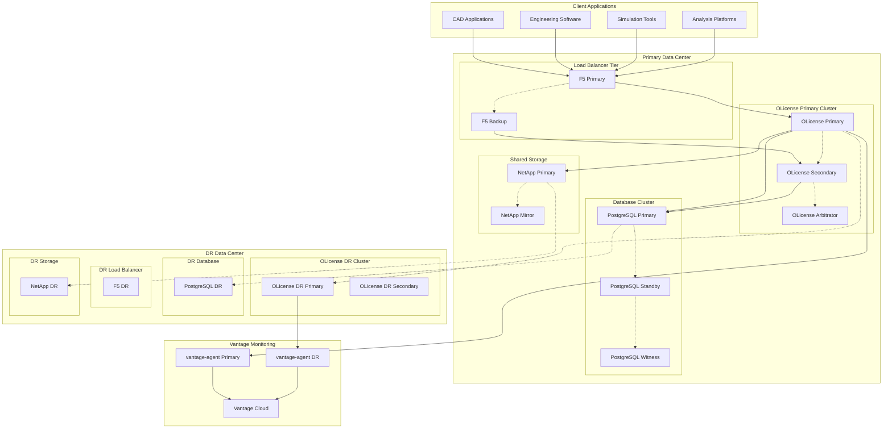

# OLicense High Availability & Disaster Recovery

This guide covers implementing high availability, redundancy, and disaster recovery for OLicense servers to ensure continuous access to enterprise software licenses. OLicense provides robust clustering capabilities, database replication, and geographic distribution features designed for enterprise environments.

## Architecture Overview

OLicense high availability architecture ensures zero-downtime license access across distributed environments:



## Database High Availability

### PostgreSQL Cluster Configuration

OLicense relies on a robust database backend for license state management. Configure PostgreSQL with streaming replication:

```bash
# Primary PostgreSQL configuration
# /etc/postgresql/15/main/postgresql.conf

# Basic settings
listen_addresses = '*'
port = 5432
max_connections = 200
shared_buffers = 256MB
effective_cache_size = 1GB

# Write-ahead logging
wal_level = replica
max_wal_senders = 10
max_replication_slots = 10
wal_keep_size = 100MB

# Archiving
archive_mode = on
archive_command = 'rsync -a %p olicense-backup:/var/lib/postgresql/15/archive/%f'

# Replication
hot_standby = on
hot_standby_feedback = on
```

### Standby Database Configuration

```bash
# Standby PostgreSQL configuration
# /etc/postgresql/15/main/postgresql.conf

# Standby-specific settings
hot_standby = on
hot_standby_feedback = on
primary_conninfo = 'host=olicense-db-primary port=5432 user=replicator'
primary_slot_name = 'standby_slot'
restore_command = 'cp /var/lib/postgresql/15/archive/%f %p'
recovery_target_timeline = 'latest'
```

### Database Replication Setup

```bash
# Create replication user on primary
sudo -u postgres psql << EOF
CREATE USER replicator WITH REPLICATION ENCRYPTED PASSWORD 'replication_password';
SELECT pg_create_physical_replication_slot('standby_slot');
EOF

# Setup pg_hba.conf for replication
echo "host replication replicator standby-server/32 md5" >> /etc/postgresql/15/main/pg_hba.conf

# Initialize standby from primary
sudo systemctl stop postgresql
sudo -u postgres pg_basebackup -h primary-server -D /var/lib/postgresql/15/main -U replicator -P -W
sudo systemctl start postgresql
```

## OLicense Server Clustering

### Primary Server Configuration

Configure the primary OLicense server with clustering enabled:

```bash
# /opt/olicense/config/olicense.conf
# OLicense Primary Server Configuration

[SERVER]
ServerID = olicense-primary-01
ClusterMode = primary
Port = 27015
WebPort = 8443

[CLUSTERING]
ClusterEnabled = true
ClusterName = production-cluster
HeartbeatInterval = 30
ElectionTimeout = 120
SyncInterval = 60

[DATABASE]
DatabaseType = postgresql
DatabaseHost = olicense-db-primary
DatabasePort = 5432
DatabaseName = olicense
DatabaseUser = olicense
DatabasePassword = secure_password
ConnectionPool = 50

[HIGH_AVAILABILITY]
FailoverEnabled = true
FailoverTimeout = 90
SplitBrainDetection = true
QuorumSize = 2

[LICENSING]
LicenseFile = /opt/olicense/licenses/master.lic
LicenseBackup = /opt/olicense/backup/licenses/
LicenseSync = true
UsageLogging = comprehensive

[PERFORMANCE]
MaxConnections = 1000
ThreadPool = 100
CacheSize = 512MB
SessionTimeout = 3600
```

### Secondary Server Configuration

```bash
# /opt/olicense/config/olicense.conf
# OLicense Secondary Server Configuration

[SERVER]
ServerID = olicense-secondary-01
ClusterMode = secondary
Port = 27015
WebPort = 8443

[CLUSTERING]
ClusterEnabled = true
ClusterName = production-cluster
PrimaryServer = olicense-primary-01:27015
HeartbeatInterval = 30
SyncTimeout = 120

[DATABASE]
DatabaseType = postgresql
DatabaseHost = olicense-db-standby
DatabasePort = 5432
DatabaseName = olicense
DatabaseUser = olicense
DatabasePassword = secure_password
ConnectionPool = 25
ReadOnly = true

[HIGH_AVAILABILITY]
BackupMode = active
PromotionDelay = 60
DataSync = real_time
HealthCheck = enabled

[LICENSING]
LicenseSync = true
LicenseValidation = continuous
BackupLicenseSource = olicense-primary-01
```

### Arbitrator Configuration

```bash
# /opt/olicense/config/arbitrator.conf
# OLicense Arbitrator Configuration

[ARBITRATOR]
ArbitratorID = olicense-arbitrator-01
ClusterName = production-cluster
VoteWeight = 1
QuorumRole = witness

[CLUSTER_MEMBERS]
Primary = olicense-primary-01:27015
Secondary = olicense-secondary-01:27015

[HEALTH_MONITORING]
HealthCheckInterval = 15
HealthCheckTimeout = 30
FailureThreshold = 3
RecoveryThreshold = 2

[SPLIT_BRAIN_PREVENTION]
SplitBrainDetection = true
NetworkPartitionDetection = true
AutoQuarantine = true
ManualIntervention = false
```

## Load Balancer Configuration

### F5 Big-IP Configuration

Configure F5 load balancer for OLicense high availability:

```bash
# F5 Big-IP configuration for OLicense
create ltm pool olicense_pool {
    members {
        olicense-primary-01:27015 {
            address 192.168.1.10
            session user-enabled
            state user-up
            priority-group 100
        }
        olicense-secondary-01:27015 {
            address 192.168.1.11
            session user-enabled
            state user-up
            priority-group 50
        }
    }
    monitor olicense_monitor
    load-balancing-mode priority-group
}

create ltm monitor tcp olicense_monitor {
    defaults-from tcp
    destination *:27015
    interval 30
    timeout 90
    send "STATUS\r\n"
    recv "OK"
}

create ltm virtual olicense_vs {
    destination 192.168.1.100:27015
    ip-protocol tcp
    pool olicense_pool
    profiles {
        tcp { }
    }
    persist {
        source_addr {
            default yes
        }
    }
}
```

### HAProxy Alternative Configuration

```bash
# /etc/haproxy/haproxy.cfg
# HAProxy configuration for OLicense

global
    daemon
    log stdout local0
    chroot /var/lib/haproxy
    stats socket /run/haproxy/admin.sock mode 660
    stats timeout 30s
    user haproxy
    group haproxy

defaults
    mode tcp
    log global
    option tcplog
    option dontlognull
    option tcp-check
    timeout connect 5000ms
    timeout client 300000ms
    timeout server 300000ms
    retries 3

backend olicense_servers
    mode tcp
    balance first
    option tcp-check
    tcp-check send "STATUS\r\n"
    tcp-check expect string "SERVER_STATUS: ACTIVE"
    
    server olicense-primary olicense-primary-01:27015 check port 27015 inter 30s rise 2 fall 3 weight 100
    server olicense-secondary olicense-secondary-01:27015 check port 27015 inter 30s rise 2 fall 3 weight 50 backup

frontend olicense_frontend
    bind *:27015
    mode tcp
    option tcplog
    default_backend olicense_servers

frontend olicense_web
    bind *:8443 ssl crt /etc/ssl/certs/olicense.pem
    mode http
    option httplog
    default_backend olicense_web_servers

backend olicense_web_servers
    mode http
    balance roundrobin
    option httpchk GET /api/health
    
    server olicense-web-primary olicense-primary-01:8443 check ssl verify none
    server olicense-web-secondary olicense-secondary-01:8443 check ssl verify none backup
```

## Geographic Distribution

### Multi-Site License Sharing

Configure OLicense for geographic distribution across multiple sites:

```bash
# /opt/olicense/config/geo-distribution.conf
# Geographic Distribution Configuration

[GLOBAL_SETTINGS]
GlobalLicensePool = true
SiteFailover = automatic
LatencyOptimization = true
BandwidthThrottling = adaptive

[SITE_PRIMARY]
SiteID = datacenter-east
Location = "New York, USA"
Priority = 100
LocalServers = olicense-ny-01,olicense-ny-02
Bandwidth = 10Gbps
LatencyThreshold = 50ms

[SITE_SECONDARY]
SiteID = datacenter-west
Location = "San Francisco, USA"
Priority = 80
LocalServers = olicense-sf-01,olicense-sf-02
Bandwidth = 10Gbps
LatencyThreshold = 75ms

[SITE_TERTIARY]
SiteID = datacenter-emea
Location = "London, UK"
Priority = 60
LocalServers = olicense-ldn-01,olicense-ldn-02
Bandwidth = 1Gbps
LatencyThreshold = 150ms

[REPLICATION]
ReplicationMode = asynchronous
ReplicationInterval = 300
ConflictResolution = timestamp
ConsistencyLevel = eventual

[FAILOVER_RULES]
AutomaticFailover = true
FailoverLatency = 100ms
FailbackDelay = 300
CrossSiteFailover = enabled
```

### Site-to-Site VPN Configuration

```bash
# Configure secure site-to-site connectivity
# /etc/ipsec.conf

conn datacenter-east-west
    left=203.0.113.10
    leftsubnet=192.168.1.0/24
    right=198.51.100.10
    rightsubnet=192.168.2.0/24
    authby=secret
    auto=start
    ike=aes256-sha2;modp2048
    esp=aes256-sha2;modp2048

conn datacenter-east-emea
    left=203.0.113.10
    leftsubnet=192.168.1.0/24
    right=192.0.2.10
    rightsubnet=192.168.3.0/24
    authby=secret
    auto=start
    ike=aes256-sha2;modp2048
    esp=aes256-sha2;modp2048
```

## Failover Procedures

### Automatic Failover Configuration

```bash
# /opt/olicense/scripts/automatic-failover.sh
#!/bin/bash

FAILOVER_LOG="/var/log/olicense/failover.log"
PRIMARY_SERVER="olicense-primary-01"
SECONDARY_SERVER="olicense-secondary-01"
HEALTH_CHECK_INTERVAL=30

monitor_primary() {
    while true; do
        if ! curl -s -f http://$PRIMARY_SERVER:8443/api/health > /dev/null; then
            echo "$(date): Primary server health check failed" >> $FAILOVER_LOG
            initiate_failover
            break
        fi
        sleep $HEALTH_CHECK_INTERVAL
    done
}

initiate_failover() {
    echo "$(date): Initiating automatic failover" >> $FAILOVER_LOG
    
    # Notify secondary to promote itself
    curl -X POST http://$SECONDARY_SERVER:8443/api/cluster/promote \
        -H "Content-Type: application/json" \
        -d '{"force": true, "reason": "primary_failure"}'
    
    # Update load balancer configuration
    /opt/olicense/scripts/update-load-balancer.sh promote_secondary
    
    # Notify administrators
    /opt/olicense/scripts/send-alert.sh "OLicense failover completed"
    
    echo "$(date): Failover completed successfully" >> $FAILOVER_LOG
}

monitor_primary
```

### Manual Failover Procedures

```bash
# Manual failover script
#!/bin/bash
# /opt/olicense/scripts/manual-failover.sh

echo "Initiating manual OLicense failover..."

# Step 1: Verify cluster status
echo "Checking cluster status..."
curl -s http://olicense-primary-01:8443/api/cluster/status | jq '.'

# Step 2: Initiate graceful shutdown of primary
echo "Gracefully shutting down primary server..."
curl -X POST http://olicense-primary-01:8443/api/server/shutdown \
    -H "Content-Type: application/json" \
    -d '{"graceful": true, "timeout": 300}'

# Step 3: Promote secondary server
echo "Promoting secondary server to primary..."
curl -X POST http://olicense-secondary-01:8443/api/cluster/promote \
    -H "Content-Type: application/json" \
    -d '{"manual": true, "verify": true}'

# Step 4: Update DNS records
echo "Updating DNS records..."
nsupdate -k /etc/bind/keys/olicense-update.key << EOF
server dns-server.company.com
update delete olicense.company.com A
update add olicense.company.com 300 A 192.168.1.11
send
EOF

# Step 5: Verify new primary is operational
echo "Verifying new primary server..."
sleep 30
curl -s http://olicense-secondary-01:8443/api/server/status | jq '.status'

echo "Manual failover completed successfully"
```

## Disaster Recovery

### DR Site Setup

Configure disaster recovery site with automated replication:

```bash
# /opt/olicense/config/dr-site.conf
# Disaster Recovery Site Configuration

[DR_SITE]
SiteID = disaster-recovery
ReplicationMode = asynchronous
SyncInterval = 900  # 15 minutes
RetentionPeriod = 30  # days

[SOURCE_SERVERS]
PrimaryDB = olicense-db-primary:5432
PrimaryOL = olicense-primary-01:27015
SecondaryOL = olicense-secondary-01:27015

[DR_SERVERS]
DRDB = olicense-dr-db:5432
DROL = olicense-dr-01:27015

[REPLICATION_SETTINGS]
DatabaseSync = postgresql_streaming
ConfigSync = rsync
LicenseSync = real_time
LogSync = compressed

[RECOVERY_SETTINGS]
RecoveryMode = manual
RecoveryVerification = comprehensive
RecoveryRollback = enabled
RecoveryNotification = all_admins
```

### Automated DR Synchronization

```bash
# /opt/olicense/scripts/dr-sync.sh
#!/bin/bash

DR_SERVER="olicense-dr-01.dr-site.company.com"
PRIMARY_SERVER="olicense-primary-01.main-site.company.com"
DR_LOG="/var/log/olicense/dr-sync.log"

echo "$(date): Starting DR synchronization" >> $DR_LOG

# Sync database
echo "$(date): Syncing database to DR site" >> $DR_LOG
pg_dump -h olicense-db-primary -U olicense olicense | \
    psql -h $DR_SERVER -U olicense olicense

# Sync configuration files
echo "$(date): Syncing configuration files" >> $DR_LOG
rsync -avz --delete \
    /opt/olicense/config/ \
    $DR_SERVER:/opt/olicense/config/

# Sync license files
echo "$(date): Syncing license files" >> $DR_LOG
rsync -avz --delete \
    /opt/olicense/licenses/ \
    $DR_SERVER:/opt/olicense/licenses/

# Sync usage logs
echo "$(date): Syncing usage logs" >> $DR_LOG
rsync -avz --compress \
    /opt/olicense/logs/usage/ \
    $DR_SERVER:/opt/olicense/logs/usage/

# Verify DR site health
echo "$(date): Verifying DR site health" >> $DR_LOG
ssh $DR_SERVER "/opt/olicense/bin/olicense-server --verify-config"

echo "$(date): DR synchronization completed" >> $DR_LOG
```

## Monitoring and Health Checks

### Comprehensive Health Monitoring

```bash
# /opt/olicense/scripts/health-monitor.sh
#!/bin/bash

CLUSTER_NODES="olicense-primary-01 olicense-secondary-01 olicense-arbitrator-01"
HEALTH_LOG="/var/log/olicense/health.log"

check_cluster_health() {
    echo "$(date): Starting cluster health check" >> $HEALTH_LOG
    
    for node in $CLUSTER_NODES; do
        echo "Checking node: $node" >> $HEALTH_LOG
        
        # Basic connectivity
        if ! ping -c 1 $node > /dev/null 2>&1; then
            echo "ERROR: Node $node is unreachable" >> $HEALTH_LOG
            alert_administrators "Node $node unreachable"
            continue
        fi
        
        # Service status
        SERVICE_STATUS=$(ssh $node "systemctl is-active olicense")
        echo "  Service status: $SERVICE_STATUS" >> $HEALTH_LOG
        
        if [ "$SERVICE_STATUS" != "active" ]; then
            echo "ERROR: OLicense service not active on $node" >> $HEALTH_LOG
            alert_administrators "OLicense service down on $node"
        fi
        
        # License availability
        LICENSE_COUNT=$(curl -s http://$node:8443/api/licenses/available | jq '.available')
        echo "  Available licenses: $LICENSE_COUNT" >> $HEALTH_LOG
        
        if [ "$LICENSE_COUNT" -lt 10 ]; then
            echo "WARNING: Low license availability on $node: $LICENSE_COUNT" >> $HEALTH_LOG
            alert_administrators "Low license count on $node: $LICENSE_COUNT"
        fi
        
        # Database connectivity
        DB_STATUS=$(ssh $node "pg_isready -h localhost -p 5432")
        echo "  Database status: $DB_STATUS" >> $HEALTH_LOG
        
        # Memory and CPU usage
        MEMORY_USAGE=$(ssh $node "free | grep Mem | awk '{printf \"%.1f\", \$3/\$2 * 100.0}'")
        CPU_USAGE=$(ssh $node "top -bn1 | grep load | awk '{printf \"%.1f\", \$(NF-2)}'")
        echo "  Memory usage: ${MEMORY_USAGE}%" >> $HEALTH_LOG
        echo "  CPU load: ${CPU_USAGE}" >> $HEALTH_LOG
        
        echo "" >> $HEALTH_LOG
    done
}

alert_administrators() {
    local message="$1"
    
    # Send email alert
    echo "$message" | mail -s "OLicense Alert: $message" admin@company.com
    
    # Send Slack alert
    curl -X POST -H 'Content-type: application/json' \
        --data "{\"text\":\"OLicense Alert: $message\"}" \
        https://hooks.slack.com/services/YOUR/SLACK/WEBHOOK
    
    # Log to syslog
    logger -t olicense-monitor "$message"
}

# Run health check
check_cluster_health
```

### Vantage Integration for HA Monitoring

```yaml
# /etc/vantage-agent/olicense-ha.yaml
ha_monitoring:
  cluster_health:
    check_interval: 30
    failover_detection: true
    split_brain_detection: true
    database_replication_lag: true
    
  metrics:
    - cluster_status
    - database_replication_health
    - license_server_availability
    - failover_readiness
    - geographic_distribution_health
    
  alerts:
    primary_failure:
      severity: critical
      notification: immediate
      escalation: 5_minutes
    database_lag:
      threshold: 60  # seconds
      severity: warning
    split_brain:
      severity: critical
      action: auto_quarantine
    site_connectivity:
      threshold: 1000  # ms latency
      severity: warning
```

## Performance Optimization

### Connection Pooling and Caching

```bash
# /opt/olicense/config/performance.conf
# Performance Optimization Configuration

[CONNECTION_POOLING]
MaxConnections = 1000
MinConnections = 50
ConnectionTimeout = 30
IdleTimeout = 300
ValidationQuery = "SELECT 1"

[CACHING]
CacheSize = 1GB
CacheTTL = 3600
CacheCompression = true
CacheReplication = true

[THREADING]
WorkerThreads = 200
IOThreads = 50
BackgroundThreads = 20
ThreadStackSize = 2MB

[MEMORY_MANAGEMENT]
HeapSize = 4GB
GCAlgorithm = G1GC
GCThreads = 8
GCTargetPause = 100ms
```

### Database Performance Tuning

```sql
-- PostgreSQL performance tuning for OLicense
-- /opt/olicense/sql/performance-tuning.sql

-- Indexes for license queries
CREATE INDEX CONCURRENTLY idx_licenses_status_user ON license_usage(status, user_id, checkout_time);
CREATE INDEX CONCURRENTLY idx_licenses_feature_time ON license_usage(feature_name, checkout_time);
CREATE INDEX CONCURRENTLY idx_licenses_server_status ON license_servers(server_id, status, last_update);

-- Partitioning for usage logs
CREATE TABLE license_usage_y2024m01 PARTITION OF license_usage 
FOR VALUES FROM ('2024-01-01') TO ('2024-02-01');

-- Materialized views for reporting
CREATE MATERIALIZED VIEW license_usage_summary AS
SELECT 
    feature_name,
    DATE(checkout_time) as usage_date,
    COUNT(*) as total_checkouts,
    SUM(duration) as total_usage_time,
    AVG(duration) as avg_usage_time
FROM license_usage 
WHERE checkout_time >= CURRENT_DATE - INTERVAL '30 days'
GROUP BY feature_name, DATE(checkout_time);

-- Automatic refresh
CREATE OR REPLACE FUNCTION refresh_license_summary()
RETURNS void AS $$
BEGIN
    REFRESH MATERIALIZED VIEW CONCURRENTLY license_usage_summary;
END;
$$ LANGUAGE plpgsql;

-- Schedule refresh every hour
SELECT cron.schedule('refresh-license-summary', '0 * * * *', 'SELECT refresh_license_summary();');
```

## Testing and Validation

### HA Testing Procedures

```bash
# /opt/olicense/scripts/test-ha.sh
#!/bin/bash

TEST_LOG="/var/log/olicense/ha-testing.log"

echo "$(date): Starting OLicense HA testing" >> $TEST_LOG

# Test 1: Planned failover
echo "Test 1: Planned failover" >> $TEST_LOG
/opt/olicense/scripts/manual-failover.sh
sleep 120
curl -s http://olicense-secondary-01:8443/api/server/status | jq '.status' >> $TEST_LOG

# Test 2: Database failover
echo "Test 2: Database failover" >> $TEST_LOG
ssh olicense-db-primary "sudo systemctl stop postgresql"
sleep 60
ssh olicense-db-standby "sudo -u postgres pg_ctl promote -D /var/lib/postgresql/15/main"
sleep 60
curl -s http://olicense-primary-01:8443/api/database/status | jq '.status' >> $TEST_LOG

# Test 3: Network partition simulation
echo "Test 3: Network partition simulation" >> $TEST_LOG
ssh olicense-primary-01 "sudo iptables -A INPUT -s olicense-secondary-01 -j DROP"
sleep 180
ssh olicense-primary-01 "sudo iptables -D INPUT -s olicense-secondary-01 -j DROP"
sleep 60
curl -s http://olicense-primary-01:8443/api/cluster/status | jq '.cluster_health' >> $TEST_LOG

# Test 4: Geographic failover
echo "Test 4: Geographic site failover" >> $TEST_LOG
/opt/olicense/scripts/activate-dr-site.sh --test-mode
sleep 300
curl -s http://olicense-dr-01:8443/api/server/status | jq '.status' >> $TEST_LOG

echo "$(date): HA testing completed" >> $TEST_LOG
```

## Next Steps

With OLicense high availability configured, proceed to:

- **[Troubleshooting](olicense-troubleshooting)**: Resolve HA and performance issues

---

> **High Availability Best Practice**: OLicense enterprise deployments require careful coordination between database replication, server clustering, and geographic distribution. The combination of PostgreSQL streaming replication, OLicense native clustering, and comprehensive monitoring through Vantage ensures maximum uptime for critical enterprise software licenses. Regular testing of failover procedures and performance optimization is essential for maintaining enterprise-grade availability.
