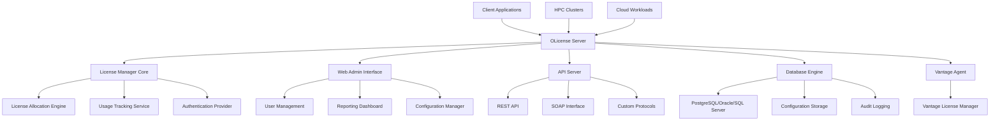

# OLicense License Management

OLicense is a sophisticated license management system developed by Optimal Computing Solutions that provides advanced floating license capabilities, usage analytics, and enterprise integration features. The Vantage License Manager offers comprehensive integration with OLicense servers, providing centralized monitoring, cost optimization, and automated license management for organizations using OLicense-protected software.

## What is OLicense?

OLicense is an enterprise-grade license management platform that offers:

- **Floating License Management**: Dynamic license allocation across distributed teams and computing resources
- **Advanced Analytics**: Comprehensive usage tracking, reporting, and optimization insights
- **Enterprise Integration**: LDAP authentication, database connectivity, and API-driven automation
- **High Availability**: Redundant server configurations with automatic failover capabilities
- **Geographic Distribution**: Multi-site license sharing with intelligent routing and latency optimization

### Key OLicense Features

**Flexible License Models**:
- Concurrent user licensing with queue management
- Named user licenses with roaming capabilities
- Counted feature licensing with automatic increment/decrement
- Time-based licensing with flexible expiration handling
- Custom license models with scripted business logic

**Advanced Usage Controls**:
- User group-based license allocation and priority systems
- Time-based usage policies and scheduling
- Resource-based licensing tied to hardware characteristics
- Application-specific licensing with version management
- Geographic usage restrictions and compliance reporting

**Enterprise Administration**:
- Web-based administration console with role-based access
- RESTful API for automated license management and integration
- Database-driven configuration with backup and replication
- Comprehensive audit logging and compliance reporting
- Integration with enterprise directory services and SSO systems

## Vantage Integration Benefits

### Centralized License Visibility

The Vantage License Manager transforms OLicense data into actionable business intelligence:

**Real-time Dashboards**:
- Live license utilization across all OLicense servers and software packages
- User activity tracking with detailed session analytics
- Cost optimization recommendations based on actual usage patterns
- Predictive analytics for license capacity planning and budget forecasting

**Advanced Analytics**:
- Peak usage analysis with automatic scaling recommendations
- User behavior patterns and software adoption metrics
- License efficiency scoring with improvement suggestions
- ROI analysis for software investments and license optimization

**Multi-tenant Visibility**:
- Department and team-based license allocation tracking
- Project-specific usage reporting with cost allocation
- Geographic usage distribution and compliance monitoring
- Vendor relationship management with license portfolio optimization

### Automated Cost Optimization

**Intelligent License Allocation**:
- Automatic license reallocation based on usage patterns and business priorities
- Predictive license provisioning with machine learning optimization
- Peak shaving strategies with intelligent queuing and scheduling
- Cross-application license sharing with conflict resolution

**Budget Management**:
- Real-time cost tracking with automated budget alerts and controls
- License utilization forecasting with seasonal adjustment algorithms
- Vendor negotiation support with usage-based recommendations
- Contract optimization with renewal timing and quantity suggestions

### Enterprise Integration

**HPC Environment Integration**:
- Seamless integration with job schedulers (Slurm, PBS, SGE, LSF)
- Container and cloud-native licensing for modern HPC workloads
- Multi-cluster license sharing with intelligent resource allocation
- Performance monitoring with license-aware job optimization

**Cloud-Native Architecture**:
- Kubernetes-native license management with automatic scaling
- Multi-cloud license distribution with latency optimization
- Serverless license allocation for dynamic workloads
- Edge computing license management with offline capabilities

## Common OLicense Use Cases

### Engineering and CAD Software

**Mechanical Design Tools**:
- SolidWorks, AutoCAD, Inventor license optimization
- Multi-site design team coordination with license sharing
- Project-based license allocation with automatic cleanup
- Version management with backward compatibility tracking

**Electronic Design Automation**:
- Cadence, Synopsys, Mentor Graphics license pooling
- Design flow optimization with license-aware scheduling
- Multi-vendor tool integration with unified license management
- Performance correlation analysis between license availability and design productivity

### Scientific Computing

**Simulation Software**:
- MATLAB, Mathematica, Ansys license management
- High-performance computing integration with job-aware licensing
- Research group collaboration with fair-share licensing policies
- Academic vs. commercial license segregation and reporting

**Data Analytics Platforms**:
- Statistical software licensing with usage-based optimization
- Big data tool integration with elastic license scaling
- Machine learning platform licensing with GPU-aware allocation
- Collaborative analytics with shared license pool management

### Enterprise Software

**Business Applications**:
- ERP and CRM software license optimization
- Office productivity suite management with user behavior analytics
- Database licensing with connection-based optimization
- Legacy application licensing with modernization planning

**Development Tools**:
- IDE and development platform licensing
- Version control and collaboration tool integration
- Build system integration with license-aware CI/CD pipelines
- Code quality tool licensing with project-based allocation

## Architecture Overview

### OLicense Server Components

### Integration Architecture

**Multi-Layer Integration**:
- **Data Layer**: Direct database connectivity for real-time usage extraction
- **API Layer**: RESTful and SOAP API integration for automated management
- **Event Layer**: Real-time event streaming for immediate response to license events
- **Analytics Layer**: Advanced data processing for business intelligence and optimization

**Security Framework**:
- End-to-end encryption for all license management communications
- Role-based access control with granular permission management
- Audit logging with tamper-proof storage and compliance reporting
- Network security with VPN and firewall integration for multi-site deployments

## Getting Started

### Quick Setup Guide

1. **OLicense Server Deployment**:
   - Install OLicense server with enterprise database backend
   - Configure authentication and user management integration
   - Set up license files and software product definitions
   - Establish high availability and backup procedures

2. **Vantage Integration Configuration**:
   - Connect Vantage to OLicense server via secure API endpoints
   - Configure real-time data synchronization and event processing
   - Set up monitoring dashboards and alert notification systems
   - Enable automated optimization and cost management features

3. **Client Application Setup**:
   - Deploy OLicense client libraries to software applications
   - Configure license server discovery and failover mechanisms
   - Implement usage tracking and session management
   - Test license acquisition and release procedures

4. **Monitoring and Optimization**:
   - Establish baseline usage patterns and performance metrics
   - Configure alerting for license availability and cost thresholds
   - Implement automated optimization policies and business rules
   - Set up regular reporting and license portfolio review processes

### Prerequisites

**Technical Requirements**:
- OLicense server version 4.0 or higher with API access enabled
- Database server (PostgreSQL 12+, Oracle 19c+, or SQL Server 2019+)
- Network connectivity between Vantage and OLicense infrastructure
- Administrative access for integration configuration and monitoring setup

**Licensing Requirements**:
- Valid OLicense server license with appropriate user and feature limits
- Software vendor licenses compatible with OLicense management
- Vantage License Manager subscription with OLicense integration features
- Compliance verification for multi-site and cloud deployment scenarios

## Next Steps

This introduction provides the foundation for understanding OLicense integration with Vantage. For detailed implementation guidance, explore the following sections:

- **[Server Setup](/platform/licenses/how-to-guides/olicense/server-setup)**: Deploy and configure OLicense servers
- **[Monitoring & Analytics](/platform/licenses/how-to-guides/olicense/monitoring)**: Set up comprehensive monitoring
- **[High Availability](/platform/licenses/how-to-guides/olicense/high-availability)**: Configure clustering and disaster recovery
- **[Troubleshooting](/platform/licenses/how-to-guides/olicense/troubleshooting)**: Resolve common issues and performance problems

---

> **Integration Tip**: OLicense provides extensive API capabilities that enable deep integration with Vantage for automated license management and optimization. The combination of OLicense's enterprise features with Vantage's analytics and cost optimization creates a powerful platform for managing complex software licensing environments. Start with basic monitoring and gradually implement advanced automation features as your team becomes familiar with the integrated platform capabilities.
