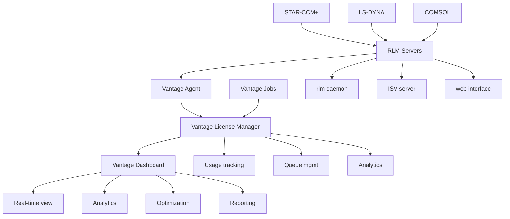

# RLM License Management with Vantage

Reprise License Manager (RLM) is a modern, web-based floating license system designed for engineering and scientific applications. Vantage provides comprehensive RLM integration through the Vantage License Manager, offering centralized monitoring, advanced analytics, and seamless license optimization for your RLM infrastructure.

## What is RLM?

RLM (Reprise License Manager) is a next-generation license management system that combines traditional floating license capabilities with modern web-based administration. Key features include:

- **Web-based administration**: Modern browser interface for license management
- **Floating and node-locked licenses**: Support for multiple licensing models
- **Roaming licenses**: Allow users to work offline with checked-out licenses
- **License borrowing**: Temporary license checkout for disconnected operation
- **Detailed analytics**: Comprehensive usage tracking and reporting

## Vantage License Manager Integration

Vantage License Manager provides enhanced capabilities for managing RLM servers:

### Centralized Dashboard

The Vantage License Manager dashboard provides:

- **Real-time usage monitoring**: Live view of RLM license consumption across all applications
- **User analytics**: Track individual and team license usage patterns with detailed insights
- **Cost optimization**: Identify underutilized licenses and optimize license allocations
- **Historical trends**: Analyze usage patterns over time for strategic capacity planning

### Automated License Management

- **Auto-discovery**: Automatically detect and configure RLM servers across your infrastructure
- **Health monitoring**: Continuous monitoring with intelligent alerting and notification systems
- **Advanced queuing**: Smart license queuing with priority-based allocation
- **License optimization**: AI-driven recommendations for license pool optimization

### Enterprise Integration

- **SSO integration**: Seamless single sign-on with your organization's identity provider
- **RBAC**: Fine-grained role-based access control for license administration
- **API access**: RESTful APIs for integration with existing workflows and automation
- **Audit logging**: Comprehensive audit trails for compliance and governance requirements

## Common RLM Applications

RLM is used by many leading engineering and scientific software vendors:

### Siemens Products
- **Simcenter STAR-CCM+**: Computational fluid dynamics and heat transfer
- **NX CAE**: Computer-aided engineering and simulation
- **Teamcenter**: Product lifecycle management

### MSC Software
- **Marc**: Nonlinear finite element analysis
- **Patran**: Pre and post-processing for finite element analysis
- **Cradle**: Computational fluid dynamics software

### Other Major Applications
- **LS-DYNA**: Explicit dynamic finite element analysis
- **COMSOL Multiphysics**: Simulation software for physics-based problems
- **BETA CAE ANSA**: Pre-processing software for finite element analysis
- **ESI PAM-CRASH**: Crash simulation software

## Getting Started with Vantage

### Quick Setup Guide

1. **Add RLM Server to Vantage**
   ```bash
   vantage licenses add rlm-server \
     --host license-server.company.com \
     --port 5053 \
     --vendor siemens \
     --name "Siemens RLM License Server"
   ```

2. **Verify Connection**
   ```bash
   vantage licenses test rlm-server
   ```

3. **Enable Monitoring**
   ```bash
   vantage licenses monitor rlm-server --enable
   ```

4. **Access Dashboard**
   Navigate to the Vantage web interface and view real-time license usage under "License Management"

### Configuration for Jobs

Configure Vantage jobs to use RLM licenses:

```yaml
apiVersion: batch.vantage.com/v1
kind: Job
metadata:
  name: starccm-simulation
spec:
  template:
    spec:
      containers:
      - name: starccm
        image: vantage/siemens-starccm:2023.1
        resources:
          requests:
            licenses:
              rlm/STARCCM: 4  # Request 4 STAR-CCM+ licenses
          limits:
            licenses:
              rlm/STARCCM: 8  # Maximum 8 licenses
        env:
        - name: RLM_LICENSE
          value: "5053@license-server.company.com"
```

## Architecture Overview

### License Server Components

RLM consists of several key components:

- **rlm**: Main license server daemon
- **Web interface**: Browser-based administration tool (typically port 5054)
- **ISV server**: Vendor-specific license server component
- **License file**: Contains license definitions and server configuration
- **Client libraries**: Applications link to RLM client libraries

### Vantage Integration Architecture



## License Types and Features

### License Models

- **Floating licenses**: Shared across multiple users with dynamic allocation
- **Node-locked licenses**: Tied to specific hardware for dedicated workstations
- **Roaming licenses**: Allow offline operation with temporary checkout
- **Borrowed licenses**: Extended checkout periods for mobile workers

### Advanced Features

- **License pools**: Group related licenses for efficient sharing
- **User groups**: Define access controls and priority levels
- **Time-based restrictions**: Configure usage windows and scheduling
- **Geographic restrictions**: Control license access by location

### Example License File Structure

```bash
# RLM license file structure
HOST server1 ANY 5053
ISV siemens

LICENSE siemens STARCCM 2023.1000 permanent 20 \
    HOSTID=ANY \
    PLATFORMS="x64_linux x64_win64" \
    SIGN=ABC123DEF456

LICENSE siemens NXCAE 2023.1000 31-Dec-2024 10 \
    HOSTID=ANY \
    PLATFORMS="x64_linux x64_win64" \
    SIGN=GHI789JKL012
```

## Best Practices

### License Server Management

1. **High Availability Setup**
   - Use redundant license servers for critical applications
   - Implement automated failover and monitoring procedures
   - Regular backup of license files and server configurations

2. **Performance Optimization**
   - Monitor license checkout response times
   - Optimize network connectivity between servers and clients
   - Use local license caching and connection pooling

3. **Security Considerations**
   - Secure web interface access with HTTPS and strong authentication
   - Implement network-level access controls and firewalling
   - Regular security updates and patch management

### Cost Optimization

1. **Usage Analytics**
   - Monitor peak usage patterns and identify optimization opportunities
   - Track individual and team usage for accurate cost allocation
   - Identify underutilized licenses for potential reallocation

2. **License Pooling**
   - Share licenses across departments and projects
   - Implement time-based usage policies for optimal utilization
   - Use roaming licenses for mobile and remote workers

3. **Capacity Planning**
   - Analyze historical usage trends for informed license purchasing
   - Plan license renewals based on actual utilization data
   - Consider seasonal usage patterns and project-based demands

## Monitoring and Alerting

### Key Metrics to Monitor

- **License utilization**: Real-time and historical usage percentages
- **Queue times**: User wait times for license availability
- **Server performance**: Response times and system health
- **Feature popularity**: Most and least used applications and features

### Automated Alerts

Configure alerts for:
- License server failures and connectivity issues
- High utilization approaching license limits
- Unusual usage patterns indicating potential issues
- License expiration warnings and renewal notifications

### Reporting Capabilities

Vantage provides comprehensive reporting:
- Daily, weekly, and monthly usage reports with trend analysis
- Cost analysis and chargeback reports for budget allocation
- User productivity metrics and utilization efficiency
- Compliance and audit reports for governance requirements

## RLM Documentation Sections

This documentation is organized into specialized sections:

### [Server Setup](/platform/licenses/how-to-guides/rlm/server-setup)
Complete guide to installing and configuring RLM servers, including:
- Installation procedures for different operating systems
- License file configuration and web interface setup
- Network configuration and security hardening
- Integration with Vantage License Manager

### [High Availability](/platform/licenses/how-to-guides/rlm/high-availability)
Configure redundant RLM servers for continuous operation:
- Multi-server redundancy setup and configuration
- Load balancing and automated failover procedures
- Backup strategies and disaster recovery planning
- Performance optimization for HA environments

### [Monitoring & Analytics](/platform/licenses/how-to-guides/rlm/monitoring)
Leverage Vantage's monitoring capabilities for comprehensive license oversight:
- Real-time usage dashboards and analytics
- User and team analytics with behavioral insights
- Cost optimization strategies and recommendations
- Historical trend analysis and predictive planning

### [Troubleshooting](/platform/licenses/how-to-guides/rlm/troubleshooting)
Diagnose and resolve common RLM issues:
- Server connectivity and communication problems
- License checkout failures and client issues
- Performance optimization and tuning
- Integration troubleshooting with Vantage

## Getting Help

### Vantage Support Resources

- **Documentation**: Comprehensive guides and API references
- **Support Portal**: Submit tickets and track issues with expert assistance
- **Community Forums**: Connect with other Vantage users and share experiences
- **Training Resources**: Webinars, certification programs, and best practices

### RLM Vendor Support

For application-specific issues, contact the software vendor:
- Siemens: support.siemens.com
- MSC Software: support.mscsoftware.com
- ESI Group: support.esi-group.com

### Emergency Procedures

For critical license server failures:
1. Check Vantage dashboard for comprehensive server status
2. Use automated failover if configured and available
3. Contact Vantage support for immediate assistance
4. Implement emergency license server recovery procedures

---

> **Next Steps**: Choose the appropriate section based on your needs - start with [Server Setup](/platform/licenses/how-to-guides/rlm/server-setup) for new installations, [High Availability](/platform/licenses/how-to-guides/rlm/high-availability) for redundancy, or [Monitoring](/platform/licenses/how-to-guides/rlm/monitoring) to optimize existing deployments.
