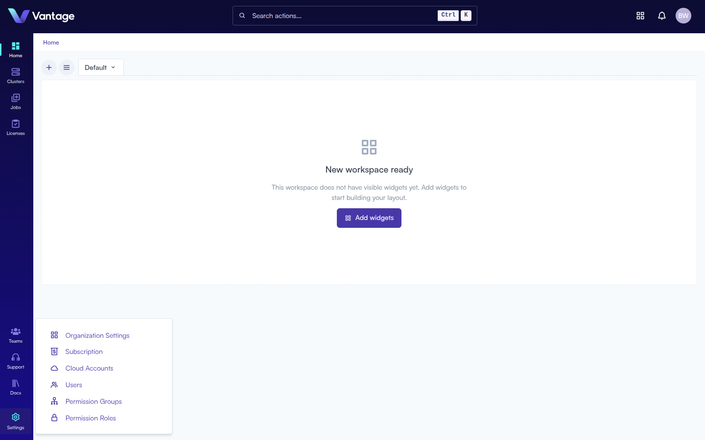
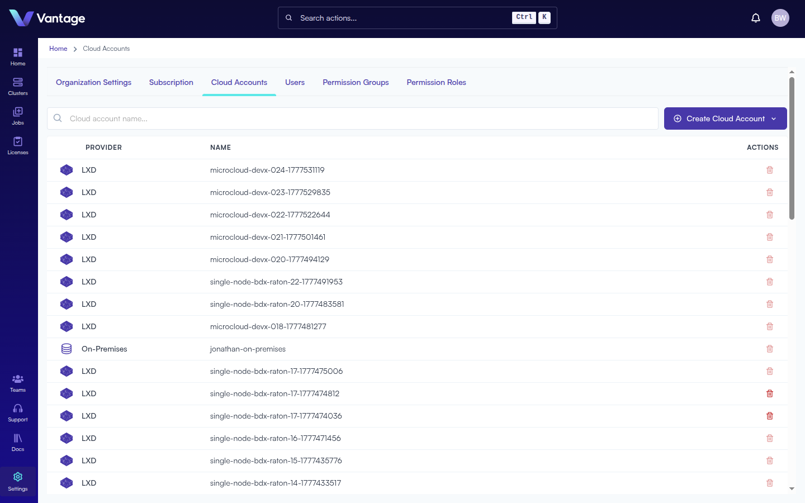
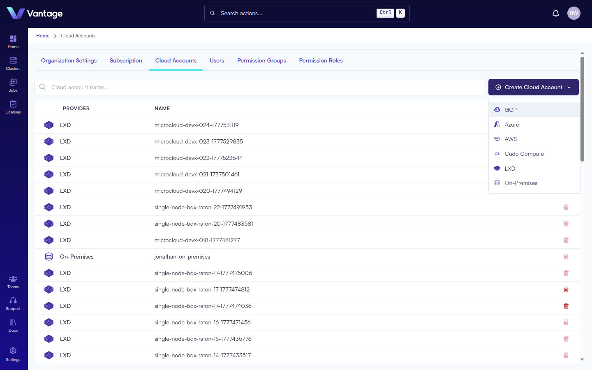
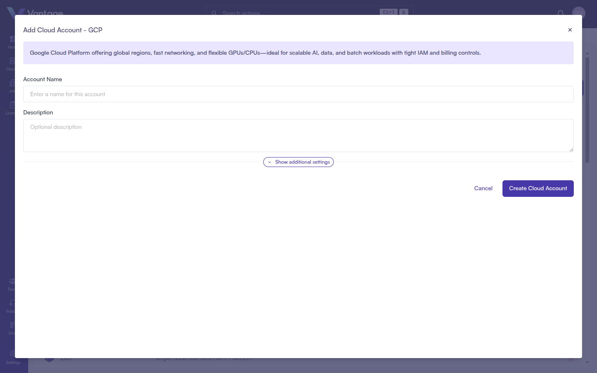

## Overview

Cloud Accounts connect your external cloud infrastructure to the Vantage platform, enabling you to provision and manage compute resources. Vantage supports six cloud providers: GCP, Azure, AWS, Cudo Compute, LXD, and On-Premises.

:::note Alternative Methods

Cloud Accounts can also be managed via the [Vantage CLI](https://docs.vantagecompute.ai/cli), [Vantage SDK](https://docs.vantagecompute.ai/sdk), and [Vantage API](https://docs.vantagecompute.ai/api). For more information, see the respective documentation sections.

:::

## What You'll Learn

- How to navigate to Cloud Accounts in Settings
- How to create a Cloud Account for your provider

## Prerequisites

- A Vantage account and organization ([Sign Up](./sign-up.md))
- Credentials or access details for your cloud provider

## Step 1: Open Settings

From any page, click the **Settings** icon (gear) in the bottom-left navigation sidebar. A pop-up menu appears with options including **Cloud Accounts**.

## Step 2: Click "Cloud Accounts"

Click **Cloud Accounts** from the Settings menu. You will be taken to the Cloud Accounts page at `/admin/cloud-accounts`, which lists all existing accounts with columns for **Provider**, **Name**, and **Actions**. You can search for accounts by name using the search bar.

## Step 3: Click "+ Create Cloud Account"

Click the **+ Create Cloud Account** button in the top-right corner. A dropdown appears listing all supported providers:

- **GCP** — Google Cloud Platform
- **Azure** — Microsoft Azure
- **AWS** — Amazon Web Services
- **Cudo Compute**
- **LXD**
- **On-Premises**

## Step 4: Select a Provider and Fill in the Form

Click your desired provider. A modal dialog opens with fields specific to that provider.

<Tabs>
<TabItem value="gcp" label="GCP" default>

> Google Cloud Platform offers global regions, fast networking, and flexible GPUs/CPUs — ideal for scalable AI, data, and batch workloads with tight IAM and billing controls.

| Field | Required | Notes |
|---|---|---|
| Account Name | Yes | Name for this account |
| Description | No | Optional description |
| Additional Fields | No | Click **Show additional settings** to add key-value pairs |

Click **+ Add Field** to add more key-value pairs. Click **Create Cloud Account** to finish.

</TabItem>
<TabItem value="azure" label="Azure">

> Microsoft Azure delivers enterprise-grade compute across worldwide regions, with strong identity/security integration and a broad GPU/VM catalog for AI training, inference, and HPC.

| Field | Required | Notes |
|---|---|---|
| Account Name | Yes | Name for this account |
| Description | No | Optional description |
| Additional Fields | No | Click **Show additional settings** to add key-value pairs |

Click **Create Cloud Account** to finish.

</TabItem>
<TabItem value="aws" label="AWS">

AWS requires Vantage to have role-based access to your account. Two setup methods are available:

**Option A — Assisted Setup** *(recommended for first-time users)*

1. Enter an **Account Name** (required, max 45 characters) and optional **Description**.
2. Under "Assisted Setup", click **Access the AWS Stack Creation page** — this opens AWS CloudFormation in a new tab.
3. In AWS: provide a Stack Name, check the acknowledgement box for CloudFormation resources, then click **Create Stack**.
4. Wait for the stack status to change from blue "IN PROGRESS" to green "CREATE_COMPLETE" (typically a couple of minutes).
5. Close the AWS tab, return to Vantage, and click **Next** to validate and finish.

**Option B — Existing ARN Configuration** *(if you already have an IAM role for Vantage)*

1. Select **Existing ARN Configuration**.
2. Enter your **IAM Role ARN** in the field provided.
3. Click **Create Cloud Account**.

</TabItem>
<TabItem value="cudo" label="Cudo Compute">

> Cudo Compute offers cost-efficient GPU cloud with on-demand and reserved options, simple provisioning, and strong price/performance for AI training, inference, and rendering.

| Field | Required | Notes |
|---|---|---|
| Account Name | Yes | Name for this account |
| Description | No | Optional description |
| Datacenter ID | Yes | Your Cudo Compute datacenter ID |
| API Key | Yes | Your Cudo Compute API key |
| Additional Fields | No | Click **Show additional settings** to add key-value pairs |

Click **Create Cloud Account** to finish.

</TabItem>
<TabItem value="lxd" label="LXD">

> LXD runs system containers like lightweight VMs, enabling fast, isolated Linux environments on your infrastructure — ideal for multi-tenant dev/test, CI, and smaller batch workloads.

| Field | Required | Notes |
|---|---|---|
| Account Name | Yes | Name for this account |
| Description | No | Optional description |
| Server URL | Yes | e.g., `https://your-lxd-server:8443` |
| Client Certificate | Yes | Paste your client certificate |
| Client Key | Yes | Paste your client key |
| Additional Fields | No | Click **Show additional settings** to add key-value pairs |

Click **Create Cloud Account** to finish.

</TabItem>
<TabItem value="on-prem" label="On-Premises">

> Customer-hosted compute in your data center for maximum control, data residency, and security — ideal for steady-state workloads, specialized networking, and integrating with existing HPC stacks.

| Field | Required | Notes |
|---|---|---|
| Account Name | Yes | Name for this account |
| Description | No | Optional description |
| Additional Fields | No | Click **Show additional settings** to add key-value pairs |

Click **Create Cloud Account** to finish.

</TabItem>
</Tabs>

## Summary

Your Cloud Account is now configured and will appear in the Cloud Accounts list. It will be selectable when creating clusters, enabling Vantage to provision and manage compute resources on your behalf.

## Next Steps

- [Create a Cluster](./create-cluster-intro.md)
