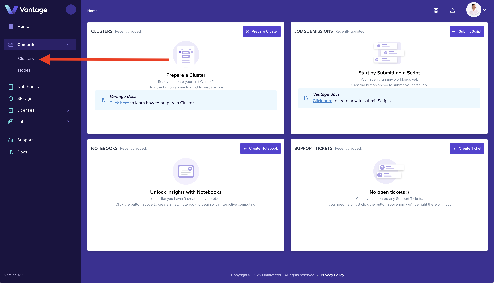
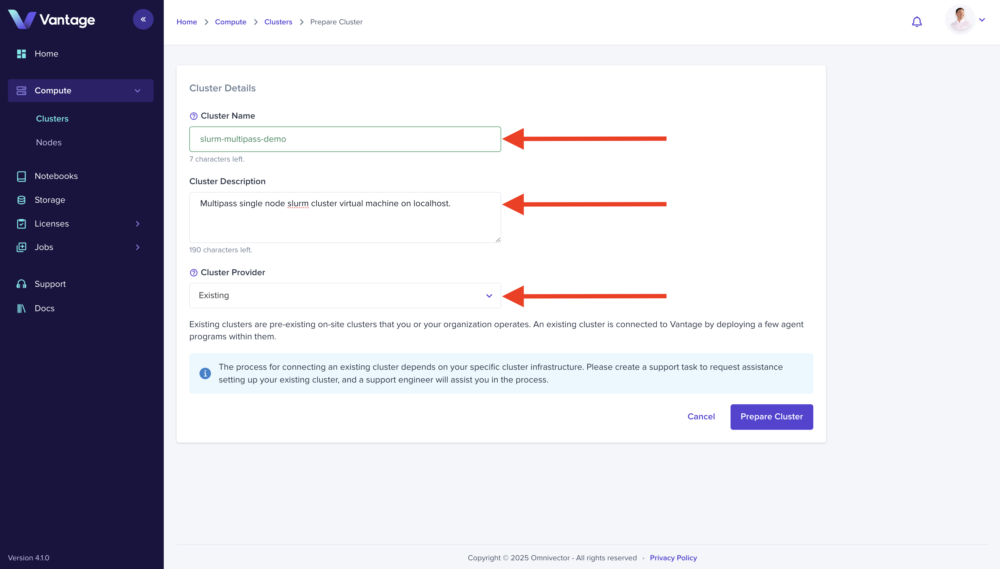
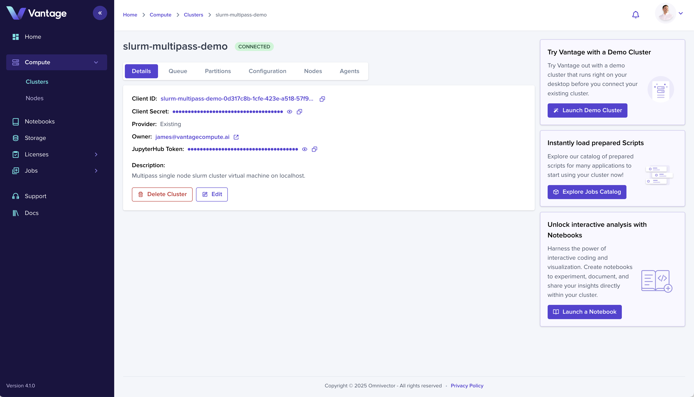

## Overview

Clusters are the foundation of your compute infrastructure in Vantage. This guide walks you through creating a cluster entry in Vantage and deploying a Slurm cluster on your local machine using the Vantage CLI.

:::note Alternative Methods

Clusters can also be created via the [Vantage CLI](https://docs.vantagecompute.ai/cli), [Vantage SDK](https://docs.vantagecompute.ai/sdk), and [Vantage API](https://docs.vantagecompute.ai/api). For more information, see the respective documentation sections.

:::

## What You'll Learn

- How to create a cluster entry in the Vantage web UI
- How to install the Vantage CLI
- How to deploy a Slurm cluster using Deployment Applications

## Prerequisites

- Ubuntu 24.04 desktop or server
- [Multipass](https://canonical.com/multipass) installed
- [UV package manager](https://docs.astral.sh/) installed

## Step 1: Access the Cluster Dashboard

Navigate to the **Clusters** dashboard in the Vantage web UI to prepare your first compute resource.



## Step 2: Prepare a Cluster

Click the **Prepare Cluster** button in the upper right corner to begin creating a new cluster.


## Step 3: Configure Cluster Details

Enter a name for your cluster and select **Existing** as the cluster type. This indicates you're connecting your own infrastructure. Click **Prepare** to create the cluster entry.



## Step 4: View Cluster Details

The cluster entry is now created in Vantage, but it's not yet connected. The cluster detail view shows its current status as not connected.


## Step 5: Install the Vantage CLI

To connect your cluster, you'll use Deployment Applications to provision a Slurm cluster. First, install the Vantage CLI.

### Install UV

Install the UV package manager:

```bash
sudo snap install astral-uv --classic
```

### Install Vantage CLI

Create a virtual environment and install the Vantage CLI:

```bash
uv venv && \
    source .venv/bin/activate && \
    uv pip install vantage-cli
```

### Login to Vantage

Authenticate with the Vantage platform:

```bash
vantage login
```

This command provides a URL to open in your browser for authentication.

## Step 6: Create a Slurm Cluster

Choose your preferred infrastructure medium and run the corresponding command:

<Tabs>
<TabItem value="multipass" label="Multipass" default>

### Install Multipass

```bash
sudo snap install multipass
```

### Create the Slurm Cluster

```bash
uv run vantage cluster create my-first-cluster --cloud localhost --app slurm-multipass-localhost
```

</TabItem>
<TabItem value="lxd" label="LXD">

### Install LXD and Juju

```bash
sudo snap install lxd
sudo lxd init --auto
lxc network set lxdbr0 ipv6.nat false
sudo snap install juju --channel 3/stable
juju bootstrap lxd
```

### Create the Slurm Cluster

```bash
vantage app deployment slurm-lxd-localhost create my-first-cluster
```

</TabItem>
</Tabs>

## Step 7: Verify Cluster Connection

Return to the cluster detail view in the Vantage web UI. The cluster status will change to **Connected** when it's successfully linked to the platform.



## Summary

Your cluster is now connected and ready for workloads. You can launch notebooks, submit jobs, and manage compute resources through the Vantage platform.

## Next Steps

- [Launch a Notebook](./notebook-intro.md)
- [Create a Job Script](./create-job-script-intro.md)
- [Submit Your First Job](./create-job-submission-intro.md)
- [Manage Team Access](./teams-intro.md)
