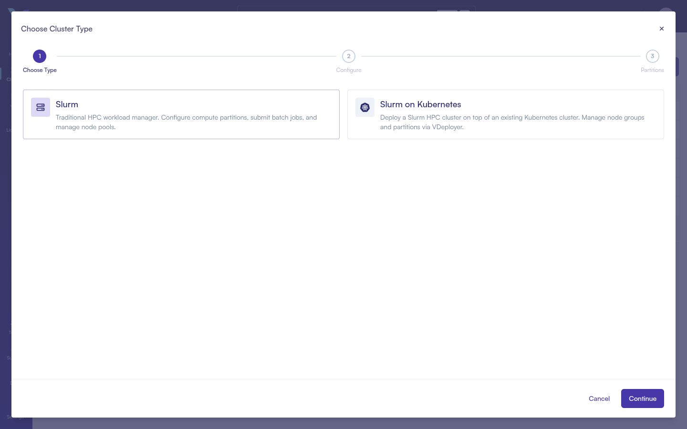
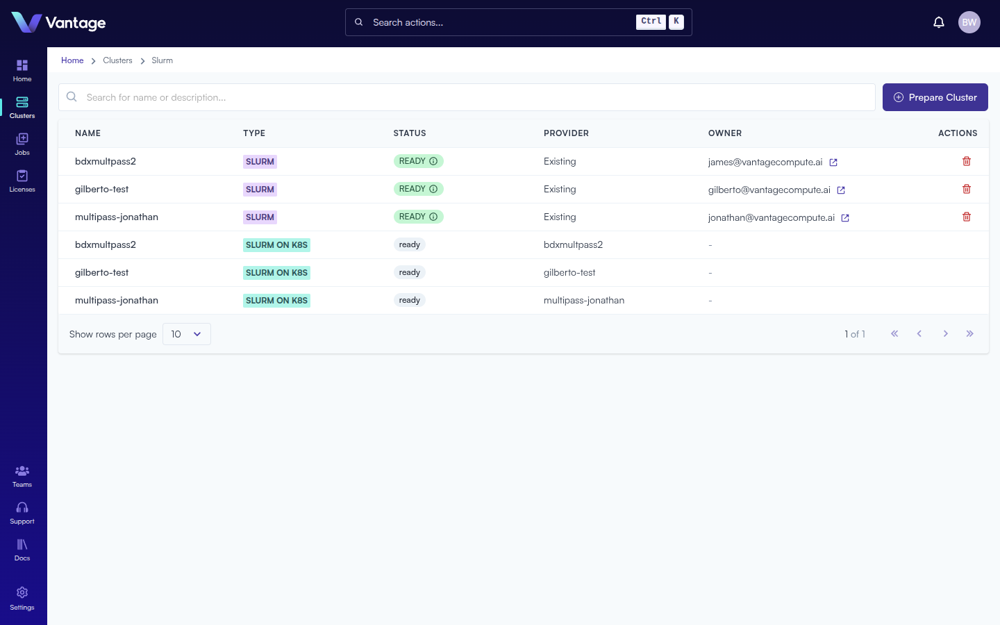

## Overview

Clusters are the compute environments where jobs run in Vantage. This guide walks you through creating a cluster using the Vantage web UI. Two cluster types are supported: **Slurm** (traditional HPC) and **Slurm on Kubernetes** (Slurm deployed on an existing K8s cluster).

:::note Alternative Methods

Clusters can also be created via the [Vantage CLI](https://docs.vantagecompute.ai/cli), [Vantage SDK](https://docs.vantagecompute.ai/sdk), and [Vantage API](https://docs.vantagecompute.ai/api). For more information, see the respective documentation sections.

:::

## What You'll Learn

- How to navigate to the Clusters dashboard
- How to create a Slurm cluster or a Slurm on Kubernetes cluster

## Prerequisites

- A Vantage account and organization ([Sign Up](./sign-up.md))
- A configured [Cloud Account](./create-cloud.md) — required before creating a cluster

## Step 1: Access the Cluster Dashboard

Click the **Clusters** icon in the left navigation sidebar. The Clusters list page shows all existing clusters with columns for **Name**, **Type** (SLURM or SLURM ON K8S), **Status**, **Provider**, **Owner**, and **Actions**.

## Step 2: Prepare a Cluster

Click the **+ Prepare Cluster** button in the top-right corner. A multi-step wizard opens titled **"Choose Cluster Type"**.

## Step 3: Choose a Cluster Type and Configure

Select the type of cluster you want to create:

<Tabs>
<TabItem value="slurm" label="Slurm" default>

Traditional HPC workload manager. Configure compute partitions, submit batch jobs, and manage node pools.

Click the **Slurm** card and then click **Continue**.

### Configure Cluster Details

| Field | Required | Notes |
|---|---|---|
| Cluster Name | No | Max 27 characters |
| Cluster Description | No | Max 255 characters |
| Cloud Account | Yes | Select from your configured cloud accounts |

The remaining steps depend on the **Cloud Account** type selected:

**LXD or On-Premises accounts** — No additional fields appear. Click **Create Cluster** to finish. The wizard completes in 2 steps.

**Cloud provider accounts (e.g., AWS)** — A notice appears: *"Cloud clusters are deployed in AWS and scale automatically to the size of the workloads submitted to them."* Additional fields appear:

| Field | Required | Notes |
|---|---|---|
| Region | Yes | Select your cloud region |
| Head Node Machine Type | Yes | Select a region first, then click **Select Head Node** to choose a machine type |
| SSH Key Name | Yes | Select a cloud account and region first |

**Advanced Options** (expand to configure custom networking — leave empty to use cloud defaults):

| Field | Required | Notes |
|---|---|---|
| VPC ID | No | Select a Cloud Account and region first |
| Head Node Subnet ID | Yes, if VPC selected | Select a VPC first |
| Compute Node Subnet ID | No | Select a VPC first |

Click **Proceed to Select Partitions** to continue. Configure your Slurm partitions, then click **Create Cluster**.

</TabItem>
<TabItem value="k8s" label="Slurm on Kubernetes">

Deploy a Slurm HPC cluster on top of an existing Kubernetes cluster. Manage node groups and partitions via VDeployer.

Click the **Slurm on Kubernetes** card and then click **Continue**. This path has 4 steps: Choose Type → Select K8s Cluster → Configure → Creating.

### Step 2 — Select K8s Cluster

A grid of available Kubernetes clusters is shown, with each cluster's name and cloud provider type. Click a cluster card to select it (it will show a highlighted border), then click **Configure Slurm Cluster**.

### Step 3 — Configure

**Cluster Name section:**

| Field | Notes |
|---|---|
| Slurm Cluster Name | Enter a name for the Slurm cluster |
| Parent K8s Cluster | Pre-filled from the previous step (read-only) |

**Node Groups section:**

Two node group types are pre-configured — **Control Plane** and **Compute Group**:

| Field | Default | Options |
|---|---|---|
| Name | — | Enter a name for the node group |
| Profile | Medium (Control Plane) / Small (Compute) | Small (4 vCPU / 8 GiB), Medium (8 vCPU / 16 GiB), Large (16 vCPU / 32 GiB) |
| Max Nodes | 1 (Control Plane) / 10 (Compute) | Maximum number of nodes |

Click **+ Add Compute Group** to add additional compute node groups.

**Partitions section:**

| Field | Default | Notes |
|---|---|---|
| Partition Name | "compute" | Name for the Slurm partition |
| Node Group | — | Select from the compute groups defined above |
| Default | Enabled | Whether this is the default partition |

Click **+ Add Partition** to add additional partitions.

Click **Create Slurm Cluster** to begin provisioning.

</TabItem>
</Tabs>

## Step 4: Verify Cluster Status

Return to the Clusters list page. The cluster status shows **"preparing"** while provisioning, then transitions to **"ready"** when complete.

## Summary

Your cluster is now ready for workloads. You can launch notebooks, submit jobs, and manage compute resources through the Vantage platform.

## Next Steps

- [Launch a Notebook](./notebook-intro.md)
- [Create a Job Script](./create-job-script-intro.md)
- [Submit Your First Job](./create-job-submission-intro.md)
- [Manage Team Access](./teams-intro.md)
