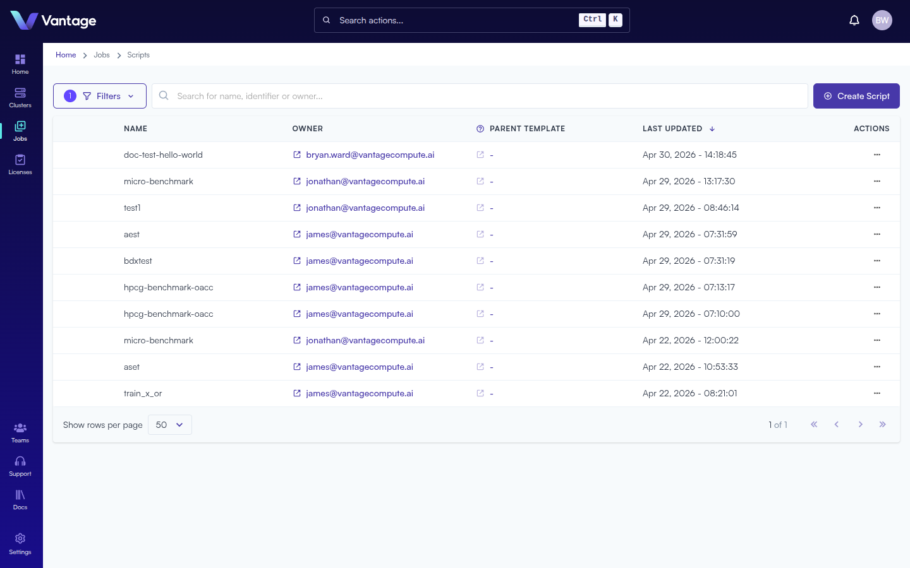
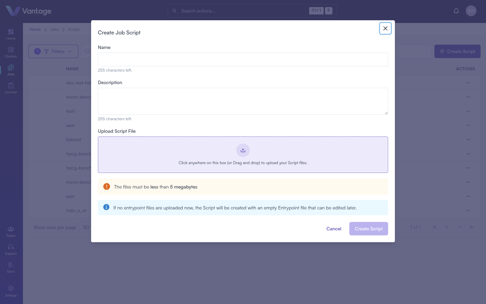
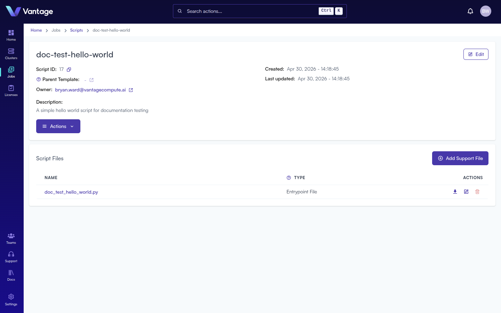
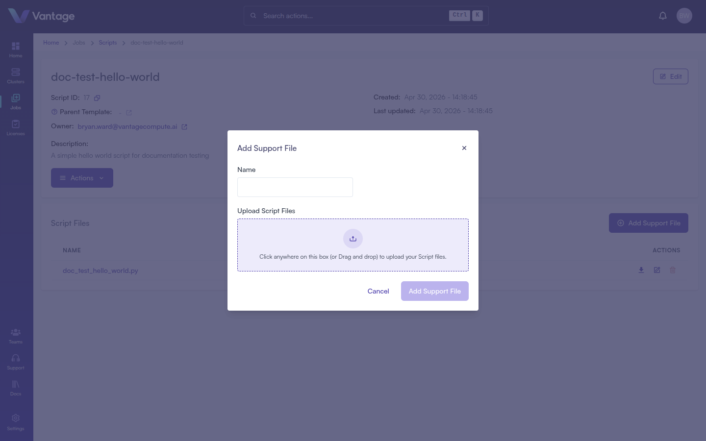

## Overview

Job Scripts are the workloads you submit to your cluster. Vantage provides a built-in script library with an integrated editor, so you can write, manage, and submit scripts without leaving the browser. Scripts can be shared with your team, cloned, templated, and organized with support files.

:::note Alternative Methods

Job Scripts can also be managed via the [Vantage CLI](https://docs.vantagecompute.ai/cli), [Vantage SDK](https://docs.vantagecompute.ai/sdk), and [Vantage API](https://docs.vantagecompute.ai/api). For more information, see the respective documentation sections.

:::

## What You'll Learn

- How to navigate to the Scripts library
- How to create a job script
- How to write a Slurm script using the built-in editor
- How to manage scripts with actions like clone and archive

## Prerequisites

- A Vantage account and organization ([Sign Up](./sign-up.md))
- A connected cluster ([Create a Cluster](./create-cluster-intro.md))

## Step 1: Navigate to Scripts

Click **Jobs** in the left navigation sidebar, then select **Scripts**. The Scripts library lists all of your job scripts with columns for **Name**, **Owner**, **Parent Template**, **Last Updated**, and **Actions**.



Use the **Search** field to find scripts by name or owner. Click **Filters** to show or hide archived scripts and filter by source.

## Step 2: Create a Script

Click the **Create Script** button in the top-right corner.



Fill in the form:

| Field | Required | Notes |
|---|---|---|
| Name | Yes | Max 255 characters; becomes the entrypoint filename |
| Description | No | Max 255 characters; shown in the list and detail views |
| Upload Script File | No | Drag-and-drop or browse; max 5 MB |

If no file is uploaded, an empty entrypoint file is created automatically — you can write content using the built-in editor after creation.

Click **Create Script**. You will be redirected to the new script's detail page.


## Step 3: Write Your Script

In the **Script Files** table, click the **edit** icon next to the entrypoint file to open the built-in editor.



The editor supports syntax highlighting, a minimap, line numbers, and standard keyboard shortcuts. Write your Slurm batch script using the structure below:

```bash
#!/usr/bin/env bash
#SBATCH --job-name=my-job
#SBATCH --output=my-job.%j.out
#SBATCH --error=my-job.%j.err
#SBATCH --time=00:10:00
#SBATCH --ntasks=1
#SBATCH --cpus-per-task=2
#SBATCH --mem=512M

set -euo pipefail
echo "Job start: $(date)"
echo "Hello from $(hostname)"
```

A Slurm script has three sections:
1. **Shebang** — the interpreter line (`#!/usr/bin/env bash`)
2. **`#SBATCH` directives** — resource requests processed by Slurm before execution
3. **Workload** — the commands to run

Click **Save** when done. If you navigate away with unsaved changes, a dialog will ask whether to keep editing, discard, or save.

## Step 4: Add Support Files (Optional)

Support files are auxiliary resources your entrypoint script references — configuration files, Python modules, input data, etc.

Click **+ Add Support File** in the Script Files section, provide a name, and upload the file (max 5 MB).



## Script Actions

Click the **···** icon in the script list or the **Actions** button on the detail page to access:

| Action | Description |
|---|---|
| Submit Script | Opens the job submission dialog |
| Clone Script | Creates a copy with a new name |
| Archive Script | Hides the script from the default view; restore via Filters |
| Delete Script | Permanently removes the script and all its files |

Prefer **Archive** over **Delete** for scripts you may want to reference later.

## Summary

You now have a job script ready to submit. The script lives in your library, can be shared with teammates, and can be cloned to create variants without modifying the original.

## Next Steps

- [Submit Your First Job](./create-job-submission-intro.md)
