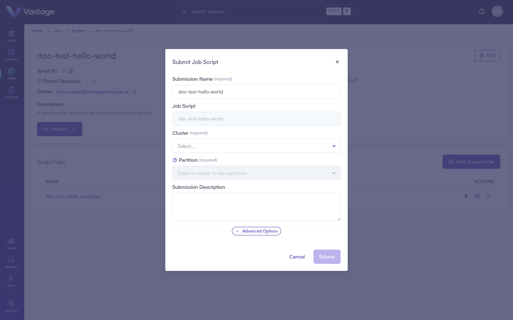
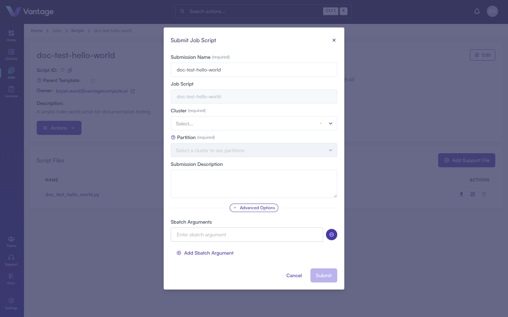
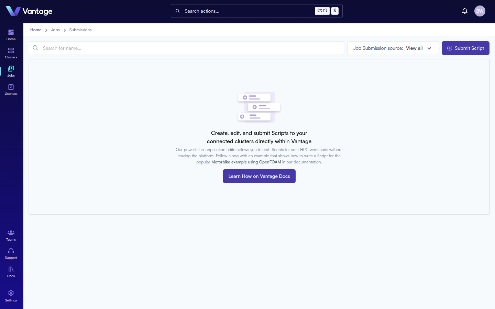

## Overview

Job Submissions let you run computational workloads on your cluster with real-time monitoring and metrics. Once submitted, you can track job progress, view logs, and monitor resource usage.

:::note Alternative Methods

Jobs can also be submitted via the [Vantage CLI](https://docs.vantagecompute.ai/cli), [Vantage SDK](https://docs.vantagecompute.ai/sdk), and [Vantage API](https://docs.vantagecompute.ai/api). For more information, see the respective documentation sections.

:::

## What You'll Learn

- How to submit a job script to a cluster
- How to configure submission options and advanced sbatch arguments
- How to monitor job status in the Submissions dashboard

## Prerequisites

- A connected cluster ([Create a Cluster](./create-cluster-intro.md))
- A job script ([Create a Job Script](./create-job-script-intro.md))

## Step 1: Open the Submit Dialog

The Submit dialog can be opened from three places:

- **Script list** — click the **···** Actions menu on any script row and select **Submit Script**
- **Script detail page** — click the **Actions** button and select **Submit Script**
- **Submissions page** — click the **Submit Script** button in the top-right corner



## Step 2: Configure the Submission

Fill in the submission form:

| Field | Required | Notes |
|---|---|---|
| Submission Name | Yes | Pre-filled from the script name; editable |
| Job Script | Auto | Pre-filled with the selected script; read-only |
| Cluster | Yes | Searchable dropdown — begin typing to filter |
| Partition | Yes | Populates automatically after a cluster is selected |
| Submission Description | No | Optional notes about this particular run |

Select your target cluster from the **Cluster** dropdown. Once selected, the **Partition** field populates with the available partitions on that cluster.

> **Note:** If the platform cannot reach the cluster registry, an error is shown. Verify your cluster is connected and try again, or contact support if the problem persists.

## Step 3: Advanced Options (Optional)

Click **Advanced Options** to add additional `sbatch` flags that are passed at submission time.



Click **+ Add Sbatch Argument** to add flags. These supplement — and can override — the `#SBATCH` directives embedded in the script file, which makes them useful for one-off adjustments like requesting more memory for a debugging run.

**Common examples:**

```
--mem=32G
--gres=gpu:2
--time=02:00:00
--mail-type=END,FAIL
--mail-user=you@example.com
```

## Step 4: Submit

Click **Submit** to dispatch the job. You will be redirected to the **Submissions** page.

## Step 5: Monitor Job Status

The Submissions page at `/jobs/submissions` shows all submitted jobs with their current status.



Job statuses progress through: **Pending → Running → Completed** (or **Failed**). Click a submission to view logs and near real-time metrics for your workload.

## Summary

You've submitted your first job to a Vantage-connected cluster. You now have the full foundation: cloud account, cluster, job script, and job submission with monitoring.

## Next Steps

- [Cloud Clusters - AWS](https://docs.vantagecompute.ai/platform/compute-providers/)
- [Cloud Clusters - GCP](https://docs.vantagecompute.ai/platform/compute-providers/)
- [Cloud Clusters - Azure](https://docs.vantagecompute.ai/platform/compute-providers/)
- [On-Premises Clusters](https://docs.vantagecompute.ai/platform/clusters/)
- [Storage Solutions](https://docs.vantagecompute.ai/platform/storage/)
- [License Management](https://docs.vantagecompute.ai/platform/licenses/)
- [Cluster Federations](https://docs.vantagecompute.ai/platform/federations/)
- [Learn about Jobs](https://docs.vantagecompute.ai/platform/jobs/)
- [Explore Job Templates](https://docs.vantagecompute.ai/platform/jobs/tutorials/)
- [Connect a Cloud Provider](https://docs.vantagecompute.ai/platform/compute-providers/)
