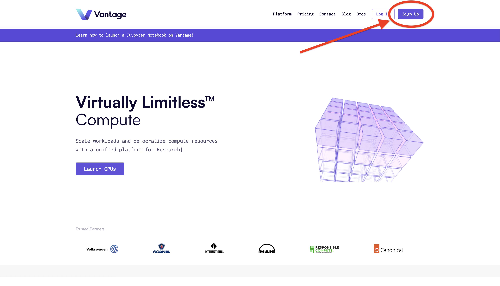
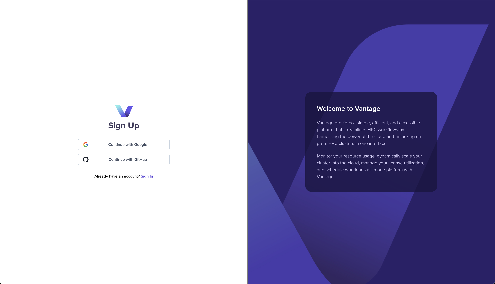
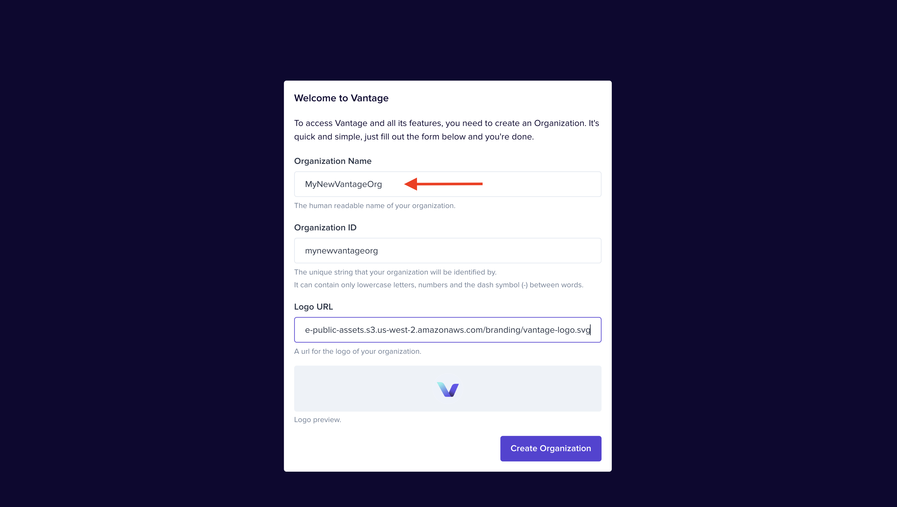
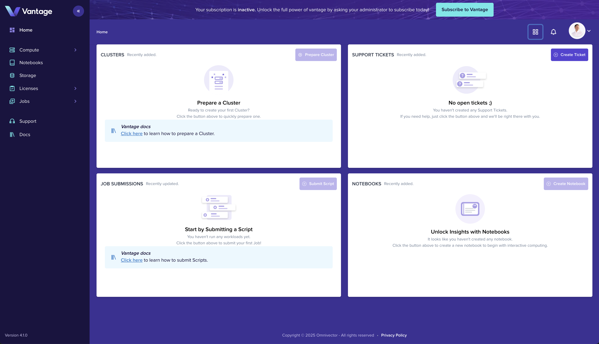

Welcome to Vantage! This guide walks you through setting up your first organization, creating a cluster, and submitting your first job.

## What You'll Build

By the end of this guide, you'll have:

- A Vantage account and organization
- A running Slurm cluster
- A job script you can submit to your cluster
- A running job submission with real-time monitoring

**Estimated time:** ~15 minutes

## Prerequisites

- A modern web browser
- An email address (for SSO authentication)
- For local clusters: Ubuntu 24.04 with [multipass](https://canonical.com/multipass) installed

## Step 1: Sign Up and Create Your Organization

The first step to using Vantage is creating your account. Vantage uses **Single Sign-On (SSO)** authentication, which means you don't need to manage another password — you authenticate with an identity provider you already trust.

Vantage supports three identity providers:

- **Google** — Best for personal accounts and quick onboarding
- **Microsoft** — Best if your organization uses Microsoft Entra ID (formerly Azure AD), enabling corporate security policies
- **GitHub** — Best for developers already embedded in the GitHub ecosystem

### Navigate to Sign Up

Navigate to the [Vantage Homepage](https://vantagecompute.ai) and click the **Sign Up** button to begin the account creation process.

<!--  -->

### Authenticate

Choose your preferred SSO provider to authenticate. You'll be redirected to your provider's login page where you enters your credentials and authorizes Vantage to access your basic profile information (name and email).

<!--  -->

### Create Your Organization

After authentication, you'll be prompted to create an organization. Organizations are the top-level container in Vantage that group:

- **Users** — Team members who access the organization
- **Clusters** — Compute resources you create or connect
- **Billing** — subscription and payment management
- **Settings** — Permissions, integrations, and preferences

Provide an organization name, this is how your team will identify your workspace. Optionally upload a logo to personalize your workspace.

<!--  -->

### Welcome to Vantage

Once your organization is created, you'll land on the Vantage platform home page. From here you can:

- Navigate to **Clusters** to create or connect compute resources
- Navigate to **Notebooks** to launch interactive environments
- Access **Jobs** to submit computational workloads
- Invite team members through **Settings**

<!--  -->

## Step 2: Create a Cluster

Clusters are the foundation of your compute infrastructure in Vantage. A cluster is a collection of compute nodes (servers) running **Slurm**, an open-source job scheduler used by supercomputers and research institutions worldwide.

When you create a cluster in Vantage, you can:
- Submit batch jobs to run computational workloads
- Launch interactive notebooks that connect to the cluster
- Monitor GPU utilization, job metrics, and system health
- Scale resources dynamically across nodes

### Install the Vantage CLI

The Vantage CLI (command-line interface) is the recommended way to deploy and manage clusters. It handles:

- Authenticating with the Vantage platform
- Provisioning infrastructure (Multipass, LXD, or AWS)
- Deploying the Slurm cluster
- Connecting the cluster to Vantage

First, install the **UV** package manager, then install the Vantage CLI:

#### Install UV

UV is a fast Python package manager written in Rust. Install it via snap:

```bash
sudo snap install astral-uv --classic
```

#### Install Vantage CLI

Create a virtual environment and install the Vantage CLI:

```bash
uv venv && \
    source .venv/bin/activate && \
    uv pip install vantage-cli
```

#### Login to Vantage

Authenticate with the Vantage platform:

```bash
uv run vantage login
```

This command provides a URL to open in your browser. Click the URL to authenticate (using your SSO provider), then return to your terminal. The CLI will detect the successful authentication and store your session.

<Tabs>
<TabItem value="single" label="Single Node Slurm Cluster" default>

**Best for:** Quick local testing, learning, or development. Uses Multipass to create a single-node Ubuntu VM with Slurm.

#### Install Multipass

```bash
sudo snap install multipass
```

#### Create the Slurm Cluster

```bash
uv run vantage cluster create my-cluster --cloud localhost --app slurm-multipass-localhost
```

This command:
1. Creates a Multipass VM running Ubuntu
2. Installs and configures Slurm
3. Starts the Slurm controller and compute node
4. Registers the cluster with your Vantage organization

</TabItem>
<TabItem value="existing" label="Existing Slurm Cluster">

**Best for:** Connecting your own existing Slurm infrastructure to Vantage.

#### Prerequisites

- An existing Slurm cluster that you manage
- Administrative access to the cluster's head node
- SSH access from your local machine

#### Connect to Vantage

Register your existing cluster with Vantage:

```bash
vantage app deployment slurm-existing create my-cluster \
    --host <slurm-head-node-ip> \
    --user <ssh-username>
```

</TabItem>
<TabItem value="lxd" label="LXD Slurm Cluster">

**Best for:** Production workloads. LXD provides system containers with better resource efficiency than VMs.

#### Install LXD and Juju

```bash
sudo snap install lxd
sudo lxd init --auto
lxc network set lxdbr0 ipv6.nat false
sudo snap install juju --channel 3/stable
juju bootstrap lxd
```

#### Create the Slurm Cluster

```bash
vantage app deployment slurm-lxd-localhost create my-cluster
```

</TabItem>
<TabItem value="aws" label="AWS Slurm Cluster">

**Best for:** Cloud-native workloads. Deploys Slurm directly on AWS EC2 instances.

#### Configure AWS

1. Install the AWS CLI:

```bash
curl "https://awscli.amazonaws.com/awscli-exe-linux-x86_64.zip" -o "awscliv2.zip"
unzip awscliv2.zip
sudo ./aws/install
```

2. Configure your AWS credentials:

```bash
aws configure
```

3. Ensure you have appropriate IAM permissions for EC2, VPC, and S3.

#### Create the Slurm Cluster

```bash
vantage app deployment slurm-aws create my-cluster \
    --region us-east-1 \
    --instance-type t3.medium
```

</TabItem>
</Tabs>

### Verify Cluster Connection

Run the following command to verify your cluster is connected:

```bash
vantage app deployment list
```

When connected, you can:
- Submit jobs to the cluster
- Launch notebooks on cluster partitions
- Monitor cluster health and metrics

## Step 3: Create a Job Script

Job Scripts define the workloads you want to run on your cluster. They can be submitted to your cluster, shared with your team, customized, cloned, and templated for different use cases.

### Access the Job Scripts Dashboard

Navigate to the [Job Scripts section](https://app.vantagecompute.ai/jobs/scripts) in the Vantage web UI using the left sidebar.

### Create a Job Script

Click the **Create Job Script** button in the upper right corner to open the job script creation form.

### Select Entrypoint

Provide a name for your job script and select an entrypoint file. Click **Create** to proceed.

### Edit Entrypoint File

Click on the entrypoint file to open the editor. Add the following content and save:

```bash
#!/bin/bash
#SBATCH -J sleep-job-%j

sleep 60
```

Your job script is now saved and ready to be submitted to your cluster.

## Step 4: Submit a Job

Job Submissions let you run computational workloads on your cluster with real-time monitoring and metrics. Once submitted, you can track job progress, view logs, and monitor resource usage.

### Access the Job Submissions Dashboard

Navigate to the [Job Submissions section](https://app.vantagecompute.ai/jobs/submissions) in the Vantage web UI using the left sidebar.

### Create a Job Submission

Click the **Create Job Submission** button in the upper right corner to open the submission form.

### Configure Submission

Provide the following details:

- **Name**: Enter a name for your submission (e.g., `my-first-job`)
- **Job Script**: Select your previously created job script
- **Cluster**: Select your connected cluster
- **Partition**: Select the appropriate partition

Click **Create** to submit the job.

### Monitor Job Progress

After submission, you'll be redirected to the Job Submission Progress view. Watch the job state change as it moves through the queue from pending to running to completed.

### View Job Metrics

Job Submission metrics provide near real-time observability and diagnostics for your workload.

## Step 5: Launch a Notebook

Notebooks provide an interactive development environment for data science and research. A **Jupyter Notebook** is a web-based interface where you can write and execute code, visualize results, and document your analysis — all in one place.

With Vantage notebooks, you get:
- **Instant access** — Launch a notebook with just a few clicks
- **Slurm integration** — Notebooks run on your cluster's compute nodes
- **GPU support** — Access GPU partitions for deep learning
- **Persistence** — Your work is saved to cluster storage

### Access the Notebook Dashboard

Navigate to the [Notebooks section](https://app.vantagecompute.ai/notebooks) in the Vantage web UI using the left sidebar navigation.

### Create a Notebook

Click the **Create Notebook** button in the upper right corner to open the notebook creation form.

### Configure Notebook Resources

Complete the form by providing:

- **Name** — A friendly name for your notebook (e.g., `my-notebook`)
- **Cluster** — Select your connected cluster
- **Partition** — Select the appropriate partition. Partitions define the compute resources available to your notebook:
  - **Compute** — CPU-only nodes for general workloads
  - **GPU** — Nodes with GPUs (NVIDIA V100, A100, H100, etc.)
  - **Large** — High-memory nodes for large datasets

Click **Create Notebook** to submit the form.

### Access Your Notebook

Click on your newly created notebook in the list to open it in the Vantage web UI.

Your notebook starts on a compute node in your cluster. You'll see the Jupyter interface where you can create cells, write code (Python, R, Julia, etc.), and execute them interactively.

### Start Coding

Your notebook environment is ready. You can now:

- Write code in cells and execute with **Shift + Enter**
- Load data from cluster storage or cloud storage
- Run computations that utilize the cluster's CPU/GPU resources
- Visualize results inline
- Export notebooks as Python scripts or PDFs

## Summary

You now have:

- A Vantage account and organization
- A connected Slurm cluster
- A job script you can submit to your cluster
- A running job submission with real-time monitoring
- A running Jupyter Notebook

You're ready to run computational workloads, collaborate with your team, and explore the full Vantage platform.

## Next Steps

<Tabs>
<TabItem value="researcher" label="I'm a Researcher">

- [Interactive Notebooks](/get-started/notebook-intro) — Start coding immediately
- [Job Submissions](/get-started/create-job-submission-intro) — Run experiments at scale
- [Storage Solutions](/products/storage) — Manage your research data

</TabItem>
<TabItem value="admin" label="I'm an Admin">

- [Cluster Management](/platform/clusters) — Advanced cluster configuration
- [Compute Providers](/platform/compute-providers) — Connect AWS, Azure, GCP
- [License Management](/platform/licenses) — Configure license servers

</TabItem>
<TabItem value="developer" label="I'm a Developer">

- [CLI Installation](/reference/cli) — Automate tasks from the command line
- [API Reference](/reference/api) — Build custom integrations
- [SDK Documentation](/reference/sdk) — Type-safe libraries for your applications

</TabItem>
</Tabs>