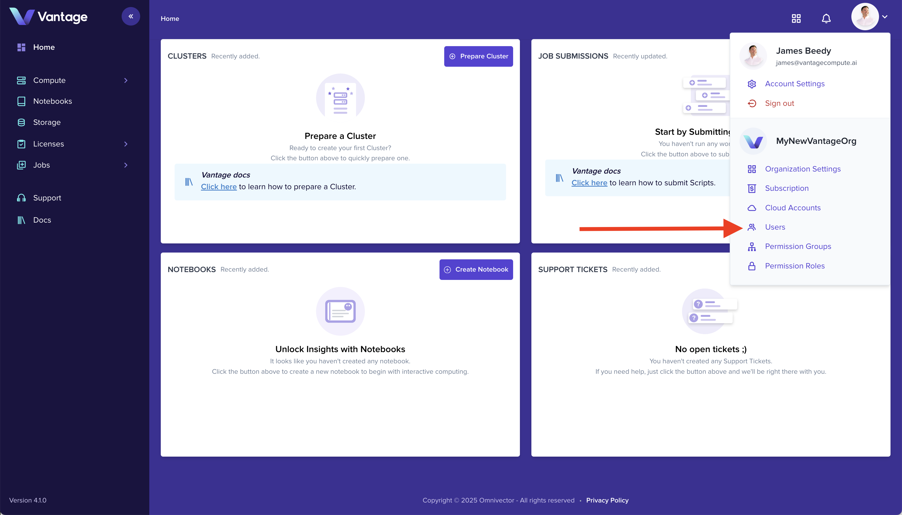
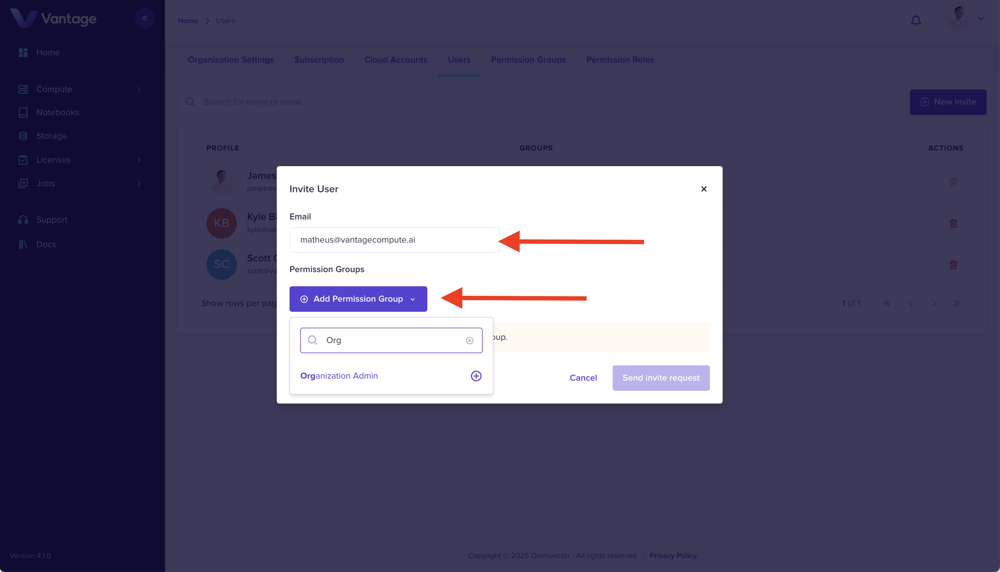

## Overview

Collaborate with your team by inviting colleagues to your Vantage organization. You can assign permissions to control access to clusters, jobs, and administrative features.

## What You'll Learn

- How to navigate to user management
- How to send team invitations
- How to assign permissions to new members

## Prerequisites

- A Vantage account and organization
- Admin or User Management permissions in your organization

## Step 1: Navigate to Users

Go to the [Users page](https://app.vantagecompute.ai/admin/users) in the Vantage platform by selecting it from the settings dropdown menu.

## Step 2: Create New Invite

Click the **New Invite** button in the upper right corner of the Users page to open the invitation form.

## Step 3: Enter Invitee Details

Complete the invitation form by entering the invitee's email address and selecting the appropriate permissions groups. Click **Send Invite Request** to send the invitation.

## Summary

The invitee will receive an email from `invites@vantagecompute.ai` with a link to join your organization. Once they accept, they'll have access based on the permissions you assigned.

## Go Deeper

Vantage offers advanced identity management capabilities including custom permission groups, teams, federated identity realms, multiple identity providers, and SSO integration.

- [Identity and Access Management](https://docs.vantagecompute.ai/platform/iam/)

## Next Steps

- [Create your first cluster](./create-cluster-intro.md)
- [Connect a compute provider](https://docs.vantagecompute.ai/platform/compute-providers/)
