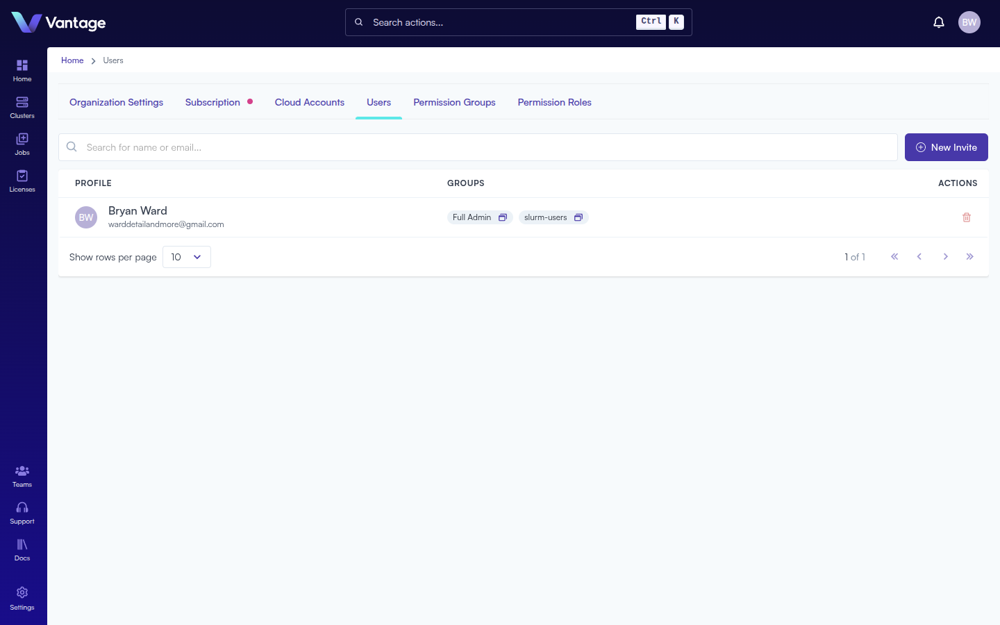
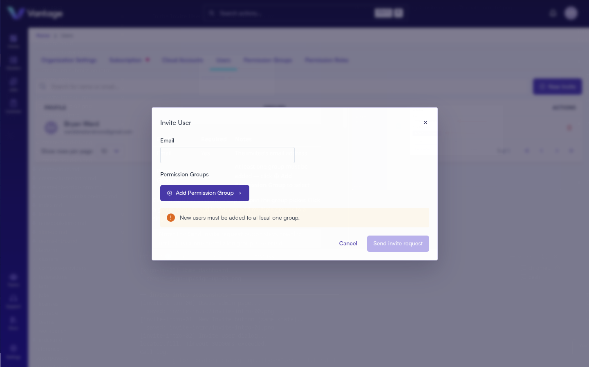

## Overview

After creating your organization, you can invite colleagues to join Vantage. Each invited user is assigned to one or more permission groups that control what they can see and do. Once you have multiple users, you can organize them into teams to manage cluster access and grant tool-specific roles.

## What You'll Learn

- How to send invitations to new users
- How to assign permission groups to control access
- How to create teams for cluster-level access control

## Prerequisites

- A Vantage account and organization ([Sign Up](./sign-up.md))
- Admin or User Management permissions in your organization

## Step 1: Navigate to Users

Go to the [Users page](https://app.vantagecompute.ai/admin/users) by clicking **Settings** in the left sidebar, then selecting the **Users** tab from the admin panel.

The Users tab shows all members of your organization with their assigned permission groups.

## Step 2: Create a New Invite

Click the **⊕ New Invite** button in the upper right corner of the Users tab.

## Step 3: Enter Invitee Details

In the **Invite User** dialog, complete the form:

| Field | Required | Notes |
|---|---|---|
| Email | Yes | The invitee's email address |
| Permission Groups | Yes | At least one group must be added — click **⊕ Add Permission Group** to select |

Click **⊕ Add Permission Group** to open the group picker. Click a group name to add it. You can add multiple groups to a single user.

> **Note:** The **Send invite request** button stays disabled until at least one permission group is selected.

## Step 4: Send the Invitation

Click **Send invite request**. The invitee will receive an email from `invites@vantagecompute.ai` with a link to join your organization. Once accepted, they'll have access based on the permission groups you assigned.

## Permission Groups

Choose the permission groups that match each user's role:

| Group | Description |
|---|---|
| Regular User | Standard user access |
| Full Admin | Full platform administration |
| Cluster Admin | Manage clusters |
| Jobs Admin | Manage jobs and scripts |
| Licenses Admin | Manage software licenses |
| Notebook Admin | Manage notebook environments |
| Organization Admin | Manage organization settings |
| Team Admin | Manage teams |

## Managing Teams

Teams let you group users and control access to specific clusters and tools. Click **Teams** in the left sidebar to navigate to the [Teams page](https://app.vantagecompute.ai/teams).

From the Teams page you can search existing teams by name, description, or owner. Click **⊕ Create Team** to create a new team, then add members and configure cluster access.

> **Note:** Creating teams requires an active Vantage subscription.

## Summary

Invited users receive an email and join your organization with the permissions you assigned. Use teams to further segment access — grouping users and granting them access to specific clusters and tool-specific roles.

## Go Deeper

Vantage offers advanced identity management including custom permission groups, federated identity realms, multiple identity providers, and SSO integration.

- [Identity and Access Management](https://docs.vantagecompute.ai/platform/iam/)
- [Teams](https://docs.vantagecompute.ai/platform/teams/)

## Next Steps

- [Create your first cluster](./create-cluster-intro.md)
- [Connect a compute provider](https://docs.vantagecompute.ai/platform/compute-providers/)
