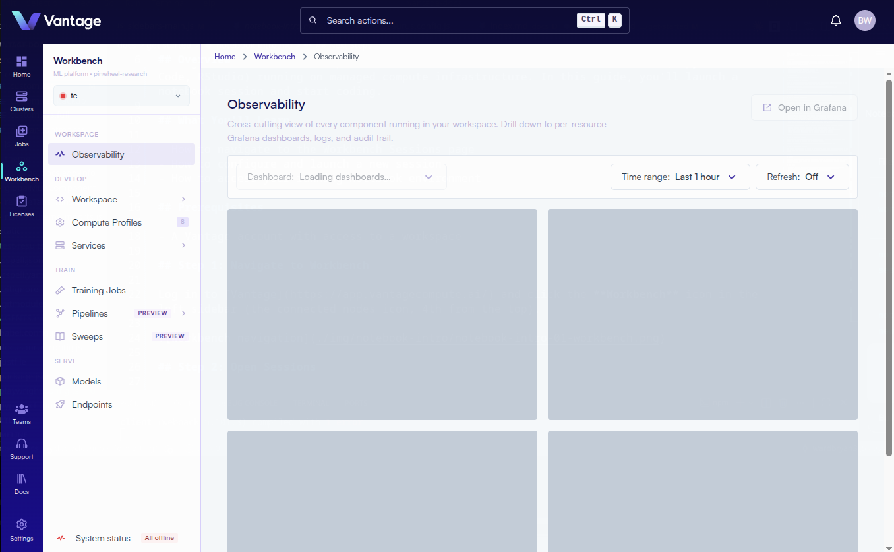
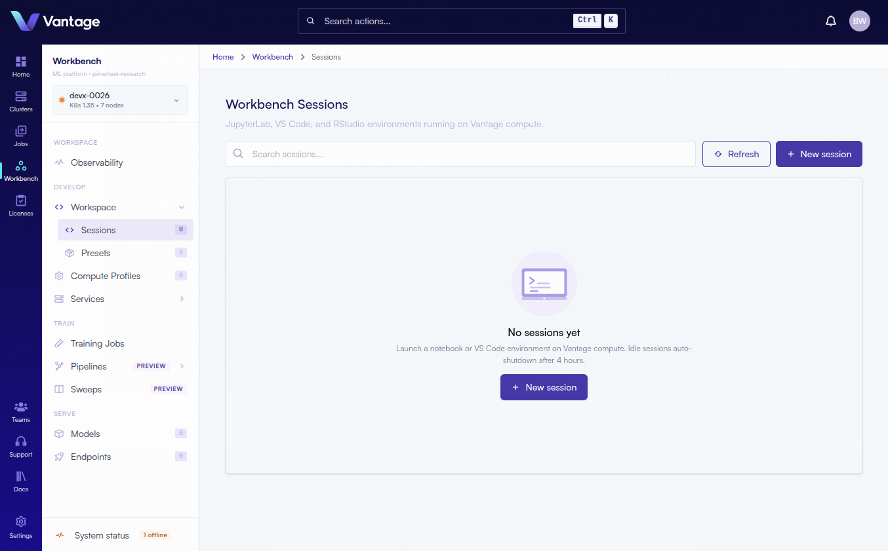
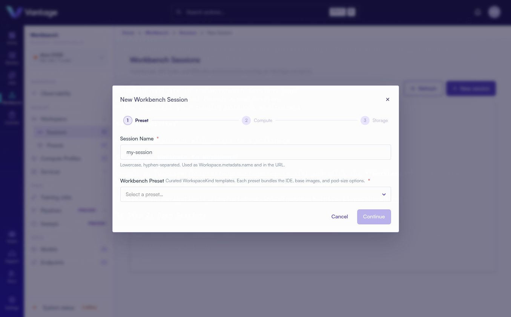

## Overview

Vantage Workbench Sessions provide interactive notebook and IDE environments (JupyterLab, VS Code, RStudio) running on managed compute infrastructure. In this guide, you'll launch a notebook session and start coding.

:::note Alternative Methods

Workbench Sessions can also be created via the [Vantage CLI](https://docs.vantagecompute.ai/cli), [Vantage SDK](https://docs.vantagecompute.ai/sdk), and [Vantage API](https://docs.vantagecompute.ai/api). For more information, see the respective documentation sections.

:::

## What You'll Learn

- How to navigate to the Workbench Sessions page
- How to configure and launch a new session
- How to access your running notebook environment

## Prerequisites

- A Vantage account with access to a workspace

## Step 1: Navigate to Workbench

Log in to [Vantage](https://app.vantagecompute.ai/) and click the **Workbench** icon in the left sidebar (the connected nodes icon, 4th from the top).

## Step 2: Open Sessions

In the Workbench left sidebar, under the **Workspace** section, click **Sessions**.

## Step 3: Create a New Session

Click the **"+ New session"** button in the top-right corner of the Sessions page.

A dialog titled **"New Workbench Session"** will appear with configuration options.

## Step 4: Configure the Session

Fill in the session form with your desired settings:

| Field | Required | Notes |
|---|---|---|
| Session Name | Yes | Default: `my-session` |
| Preset | No | Pre-configured environment preset if available |
| Compute Pool | No | Defaults to "Server default" |
| CPU | No | Number of CPU cores (default: `0.5`, e.g., `0.5`, `2`, `500m`) |
| Memory | No | RAM allocation (default: `1Gi`, e.g., `1Gi`, `4Gi`) |
| GPU Count | No | Number of GPUs (default: `0` for CPU-only) |

For advanced configuration, click **"Advanced Options"** to reveal additional fields:

| Field | Required | Notes |
|---|---|---|
| Custom Image | No | Override the preset with a specific Docker image URI |
| GPU Type | No | Specify the Kubernetes GPU resource name (e.g., `nvidia.com/gpu`) |
| Workspace Size | No | Persistent storage volume size (default: `10Gi`) |
| Mount /dev/shm | No | Recommended for ML workloads (checked by default) |

## Step 5: Launch the Session

Click **"Launch session"** to provision your environment. The dialog will close and your session will appear in the list with a "Starting" status.

## Step 6: Access Your Notebook

Wait for the session status to change to **"Running"**, then click the **Open** button on the session card. Your notebook environment (JupyterLab, VS Code, or RStudio) will open in your browser.

> **Note:** If your session remains in "Starting" status for more than 5 minutes or fails to launch, check session logs by clicking the session card, or contact support for assistance.

## Summary

You have a production-grade notebook environment running on Vantage compute. You can create multiple sessions, share access with team members, and manage resources directly from the Workbench interface.

## Next Steps

- [Workbench Sessions Documentation](https://docs.vantagecompute.ai/platform/sessions/)
- [Compute Profiles](https://docs.vantagecompute.ai/platform/compute-profiles/)
- [Training Jobs](https://docs.vantagecompute.ai/platform/training/)
- [Submit a Job](./create-job-submission-intro.md)
- [Invite Team Members](./invite-intro.md)
