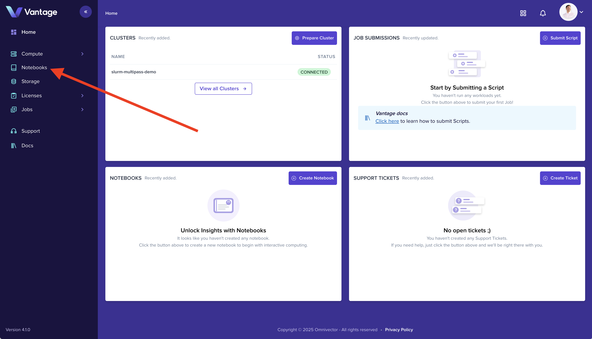
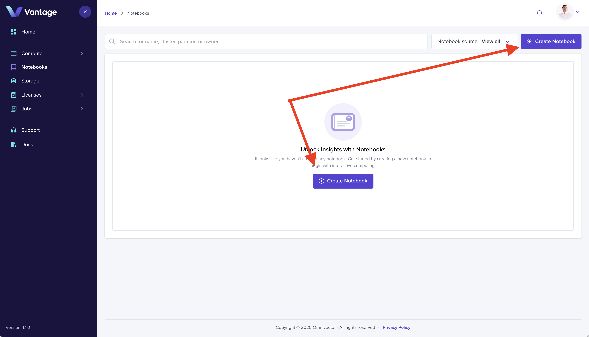
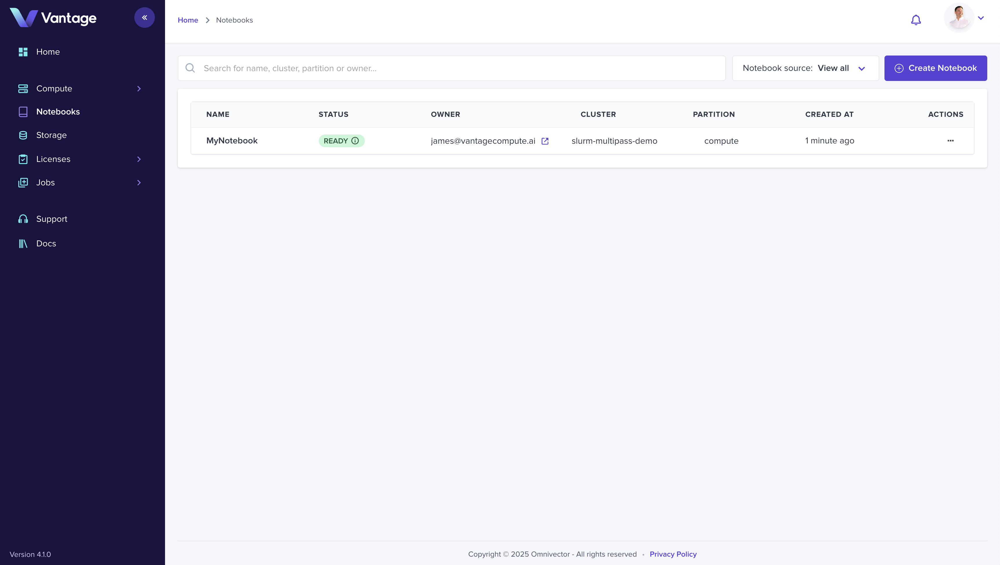
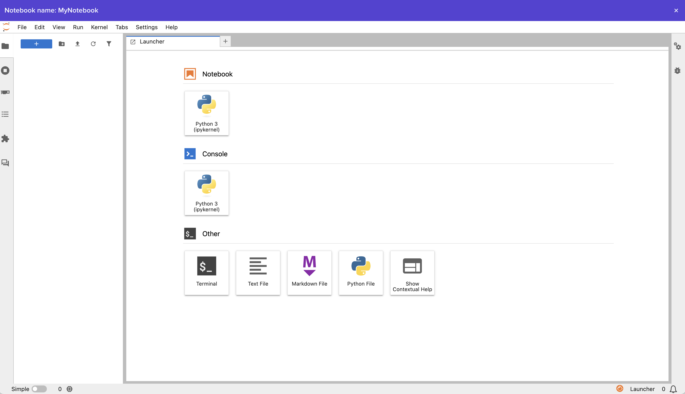

## Overview

Notebooks provide an interactive development environment for data science and research. In this guide, you'll launch a Jupyter Notebook on your cluster and start coding immediately.

## What You'll Learn

- How to navigate to the Notebooks dashboard
- How to create a new notebook
- How to configure and access your notebook environment

## Prerequisites

- A connected cluster (see [Create a Cluster](./create-cluster-intro.md))

## Step 1: Access the Notebook Dashboard

Navigate to the [Notebooks section](https://app.vantagecompute.ai/notebooks) in the Vantage web UI using the left sidebar navigation.

## Step 2: Create a Notebook

Click the **Create Notebook** button in the upper right corner to open the notebook creation form.

## Step 3: Configure Notebook Resources

Complete the form by providing:

- **Name**: Enter a name for your notebook (e.g., `my-notebook`)
- **Cluster**: Select `my-first-cluster`
- **Partition**: Select the appropriate partition (e.g., `compute`)

Click **Create Notebook** to submit the form.

## Step 4: Access Your Notebook

Click on your newly created notebook in the list to open it in the Vantage web UI.

## Step 5: Start Coding

Your notebook environment is ready. You can now write and execute code directly in your browser.

## Summary

You have a production-grade Jupyter Notebook running on your Slurm cluster. You can share your cluster with team members, submit batch jobs, federate with other clusters, and more.

## Go Deeper

- [Notebooks Documentation](https://docs.vantagecompute.ai/platform/notebooks/)
- [Storage Solutions](https://docs.vantagecompute.ai/platform/storage/)
- [Job Templates](https://docs.vantagecompute.ai/platform/jobs/tutorials/)

## Next Steps

- [Create a Job Script](./create-job-script-intro.md)
- [Submit Your First Job](./create-job-submission-intro.md)
- [Manage Team Access](./teams-intro.md)
