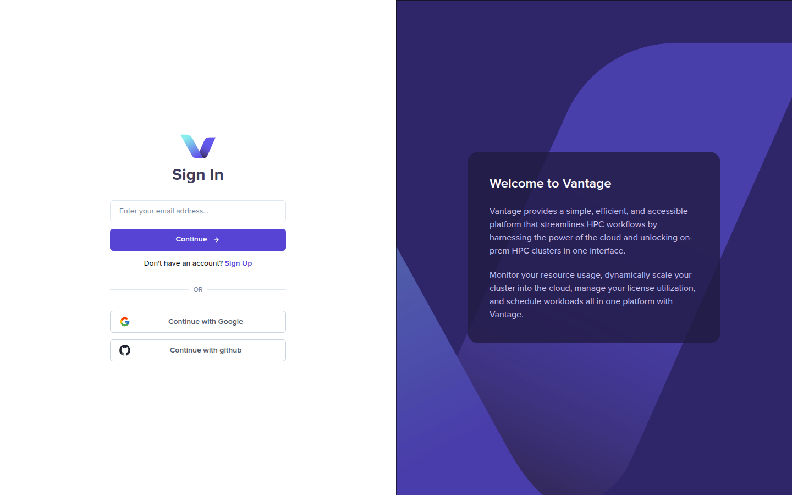
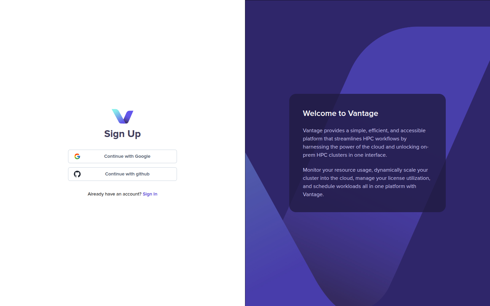
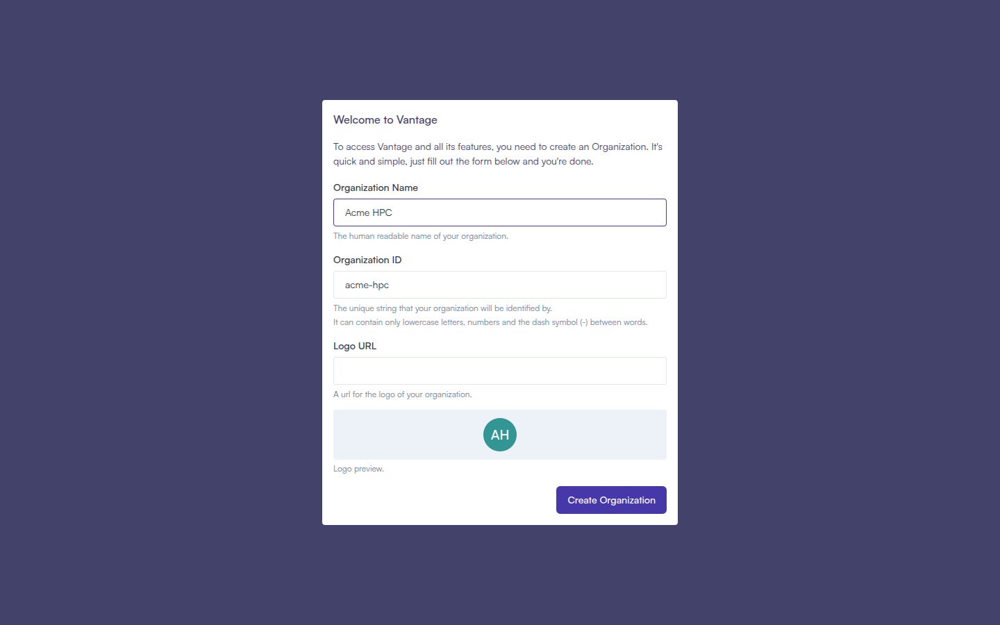
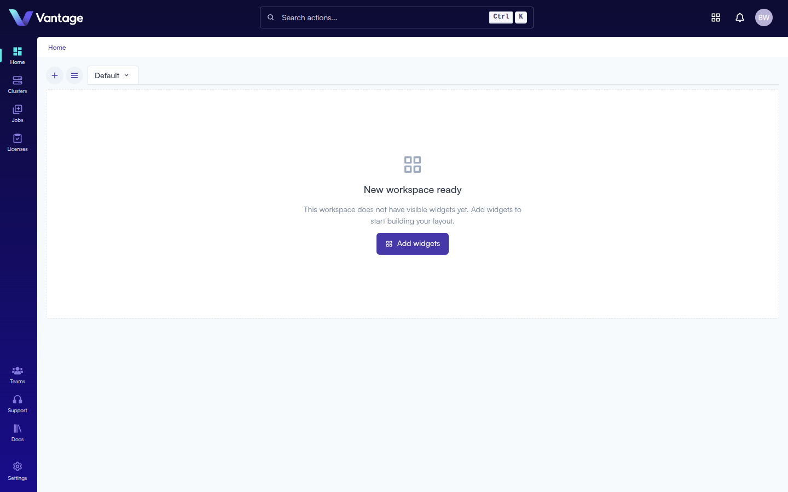

## Overview

To access Vantage, you'll create an account using Google or GitHub OAuth, then set up your organization. This guide walks through every step from the sign-in page to your first look at the dashboard.

## What You'll Learn

- How to reach the sign-up page and authenticate with an OAuth provider
- How to create your organization
- How to complete (or skip) the onboarding tour

## Step 1: Go to the Sign-Up Page

Open [app.vantagecompute.ai](https://app.vantagecompute.ai) in your browser. You'll land on the sign-in page.

Click the **Sign Up** link below the Continue button. The form changes to show only the OAuth provider buttons.

## Step 2: Authenticate

Click **Continue with Google** or **Continue with github** to begin authentication. You'll be taken to the selected provider's sign-in flow and redirected back to Vantage once complete.

## Step 3: Create Your Organization

After authenticating for the first time, a **Welcome to Vantage** modal appears. Your organization is your team's workspace — it holds your clusters, users, and jobs.

Fill in the form:

| Field | Required | Notes |
|---|---|---|
| Organization Name | Yes | Displayed throughout the platform |
| Organization ID | Auto | Fills from the name — lowercase letters, numbers, and dashes only |
| Logo URL | No | A URL to an image used as your organization logo |

> **Important:** The Organization ID cannot be changed after creation. Review it before clicking **Create Organization**.

Click **Create Organization** to continue.

## Step 4: Complete the Onboarding Tour

After your organization is created, a 5-step tour highlights the key areas of the platform:

1. **Welcome** — an overview of what Vantage provides
2. **Managing Users and Organizations** — the user avatar and organization settings panel
3. **Managing Clusters and Nodes** — the Clusters section in the sidebar
4. **Managing Jobs** — the Jobs section for scripts and submissions
5. **Getting Support** — the Support section for around-the-clock assistance

Click **Next** to advance, or **Skip the Tour** at any time. On the final step, click **Begin using Vantage** to land on the dashboard.

## Summary

You now have a Vantage account and organization. You're ready to invite teammates, connect a cluster, and run workloads.

## Next Steps

- [Invite your team](./invite-intro.md)
- [Create your first cluster](./create-cluster-intro.md)
