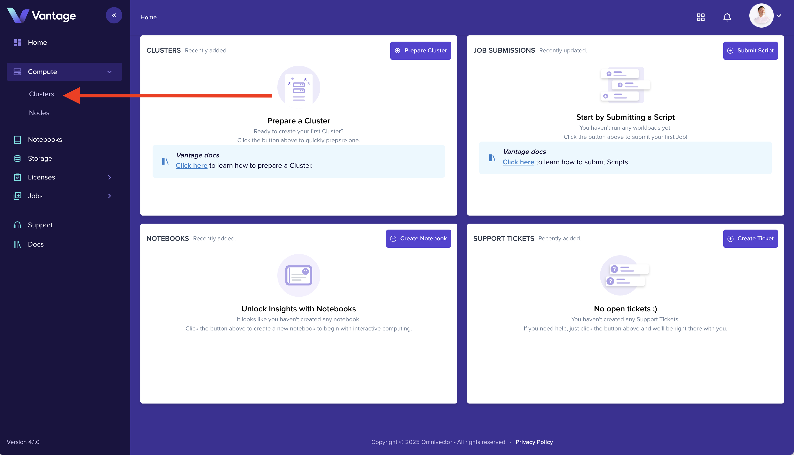
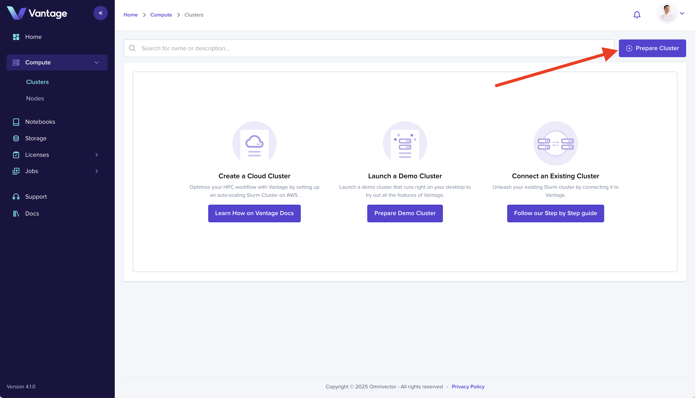
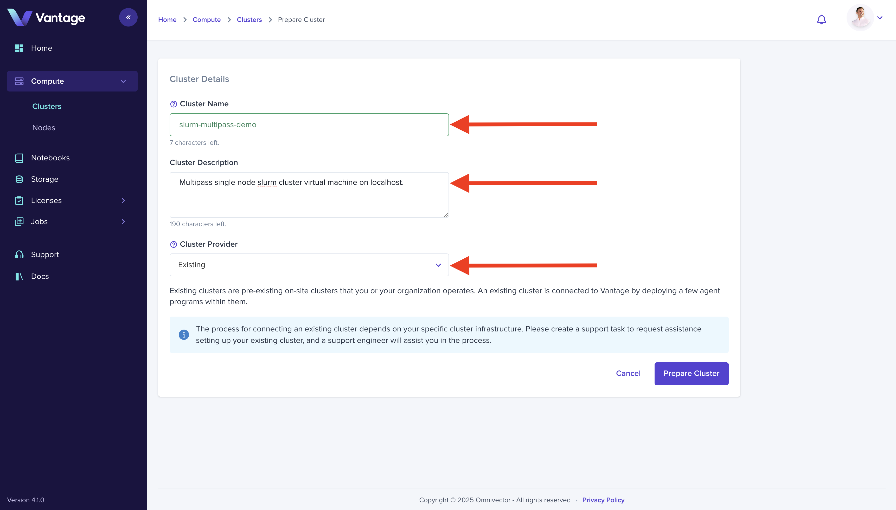
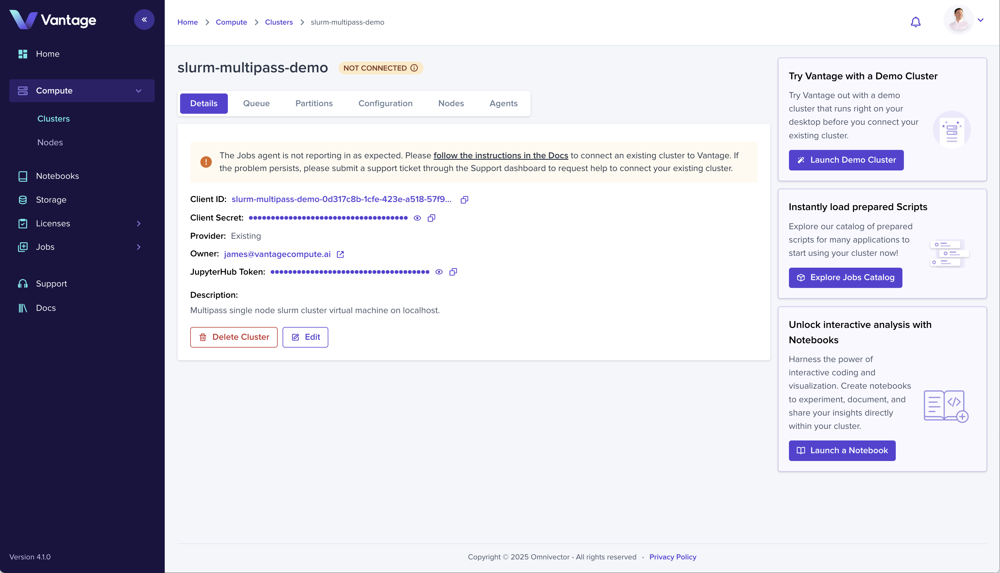
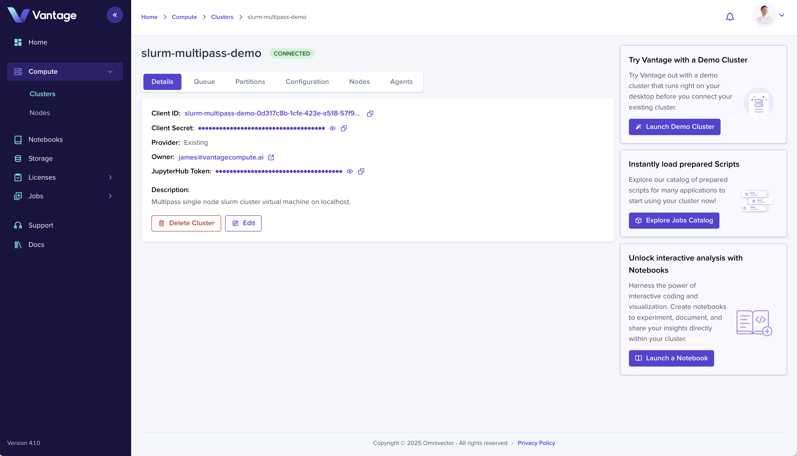

Adding compute infrastructure in Vantage is a breeze. Choose your desired cloud provider and start running workloads.

This tutorial will teach you how to create a slurm cluster on your local machine using the Vantage CLI.

More information on [Deployment Applications](/cli/deployment-applications/).

:::note

In this tutorial we create the cluster in the Vantage web ui, but clusters can a be created via the [`vantage-cli`](/cli), [`vantage-sdk`](/sdk), and [`vantage-api`](/api).

Please see the documentation for cluster creation in the respective sections:

- **[Vantage CLI - Cluster Create](/cli/commands#cluster-management)**
- **[Vantage SDK - Cluster Create](/cli/commands#cluster-management)**
- **[Vantage API - Cluster Create](/cli/commands#cluster-management)**

:::

#### Prerequisites

- 1 x Ubuntu 24.04 desktop or server
- Access to the terminal of the machine with multipass
- astral-uv - we will use this to install vantage-cli from pypi

## 1. Access the Cluster Dashboard

Navigate to the "Clusters" dashboard to prepare your first compute resource.



## 2. Prepare a Cluster

Select the "Prepare Cluster" button in the upper right hand corner.



## 3. Existing == On-Premises == Localhost

Give your cluster a name and choose the "Existing" cluster type from the dropdown, then click "Prepare" to create a Cluster entry in the Vantage platform.



## 4. Cluster Created in Vantage

You now have an entry in the Vantage database that represents your cluster, but as you will notice in the cluster detail
view, there isn't anything connected yet.

This is because "Existing" clusters are infrastructure that you provide and connect to the Vantage platform.

To deploy a minimal slurm cluster and connect it to Vantage, proceed to the next step.



## 5. Deploy a Slurm Cluster with Vantage CLI

Vantage exposes the concept of "Deployment Applications". "Deployment Applications" are curated
automation that Vantge uses to provision HPC clusters and other peripheral application infrastructure.

In this tutorial you will create slurm cluster by means of a "Deployment Application" on the "localhost" cloud. The
"localhost" cloud supports `multipass`, `lxd`, and `microk8s` as infrastructre mediums.

Install the Vantage CLI and choose the appropriate "Deployment Application" for your desired "localhost" cloud.

### Install Vantage CLI

#### Install UV

Install [`uv`](https://docs.astral.sh/).

```bash
sudo snap install astral-uv --classic
```

#### Vantage CLI

Install the [Vantage CLI](https://vantagecompute.github.io/vantage-cli).

```bash
uv venv && \
    source .venv/bin/activate && \
    uv pip install vantage-cli
```

#### Login with Vantage CLI

Run the `vantage login` command to authenticate with the Vantage platform and acquire a token.

This command returns a url that you need to enter into your browser to authenticate.

```bash
vantage login
```

Following successful authentication, you will be ready to create an actual HPC cluster and connect it to Vantage.

### Install Dependencies and Create a Deployment Application

<Tabs>
<TabItem value="multipass" label="Multipass" default>

#### Install Multipass

Install [`multipass`](https://canonical.com/multipass).

```bash
sudo snap install multipass
```

#### Create the `slurm-multipass-localhost` Deployment Application

Now that the dependencies have been satisfied, create your slurm cluster using the
`slurm-multipass-localhost` deployment application.

The command format is:

`vantage app deployment <deployment-application-name> create <vantage-cluster-name>`

Using the cluster name (`vantage-tutorial-cluster`) from above, the command would be:

```bash
vantage app deployment slurm-multipass-localhost create vantage-tutorial-cluster
```

</TabItem>
<TabItem value="lxd" label="LXD">

#### Install Juju and LXD

Install [`lxd`](https://linuxcontainers.org/lxd/).

```bash
sudo snap install lxd
sudo lxd init --auto
lxc network set lxdbr0 ipv6.nat false
```

Install [`juju`](https://canonical.com/juju/).

```bash
sudo snap install juju --channel 3/stable
```

Bootstrap a Juju controller on LXD.

```bash
juju bootstrap lxd
```

#### Create the `slurm-lxd-localhost` Deployment Application

Now that the dependencies have been satisfied, create your slurm cluster using the
`slurm-lxd-localhost` deployment application.

The command format is:

`vantage app deployment <deployment-application-name> create <vantage-cluster-name>`

Using the cluster name (`vantage-tutorial-cluster`) from above, the command would be:

```bash
vantage app deployment slurm-lxd-localhost create vantage-tutorial-cluster
```

</TabItem>
<TabItem value="microk8s" label="MicroK8S">

#### Install and Configure MicroK8S

Install [`microk8s`](https://microk8s.io/).

```bash
sudo snap install microk8s --channel 1.29/stable --classic
```

##### Configure ACLS and `~/.kube` Perms

```bash
sudo usermod -a -G microk8s $USER
sudo chown -f -R $USER ~/.kube
```

##### Initialize MicroK8S

###### Storage

```bash
sudo microk8s.enable hostpath-storage
```

###### DNS & Ingress

```bash
microk8s.enable dns
microk8s.enable metallb:10.64.140.43-10.64.140.49
```

#### Create the `slurm-microk8s-localhost` Deployment Application

Now that the dependencies have been satisfied, create your slurm cluster using the
`slurm-microk8s-localhost` deployment application.

The command format is:

`vantage app deployment <deployment-application-name> create <vantage-cluster-name>`

Using the cluster name (`vantage-tutorial-cluster`) from above, the command would be:

```bash
vantage app deployment slurm-microk8s-localhost create vantage-tutorial-cluster
```

</TabItem>
</Tabs>

## 6. Cluster Connected, Let's go

Navigate back to the cluster detail view in the Vantage web ui and you will see the cluster status is now green and reads "Connected".
You are now ready to begin using your cluster.



### Next Steps

- [`Launch a Notebook`](./notebook-intro.md)
- [`Create a Job Script`](./create-job-script-intro.md)
- [`Submit a Job`](./create-job-submission-intro.md)
- [`Assign Access`](./teams-intro.md)
