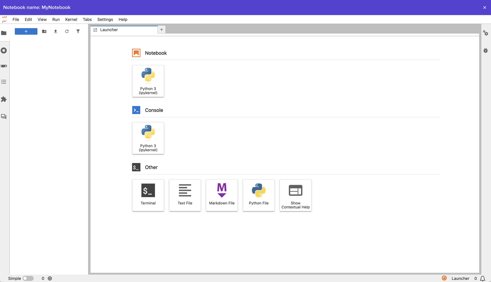

##### Job Scripts can be submitted to your new cluster, shared with your team, customized, cloned, templated, and more

Follow along with the steps below to create a Job Script in the Vantage web ui!

## 1. Job Script Dashboard

Navigate to the [Job Script Dashboard](https://app.vantagecompute.ai/jobs/scripts) using the left side navbar.



## 2. Create a Job Script

Select the "Create Job Script" button in the upper right hand corner of the UI to open the Job Script creation modal.


### 2.1 Select Entrypoint File

Give your Job Script a name and select an entrypoint, then click "Create".


### 2.2 Edit Entrypoint File

Select the entrypoint file to edit it. Add the following text and save.

```bash
#!/bin/bash
#SBATCH -J sleep-job-%j

sleep 60
```


At this point you have successfully created a Job Script and are ready to submit it to a cluster!

### Next Steps

- [`Create a Job Submission`](./create-job-submission-intro.md)