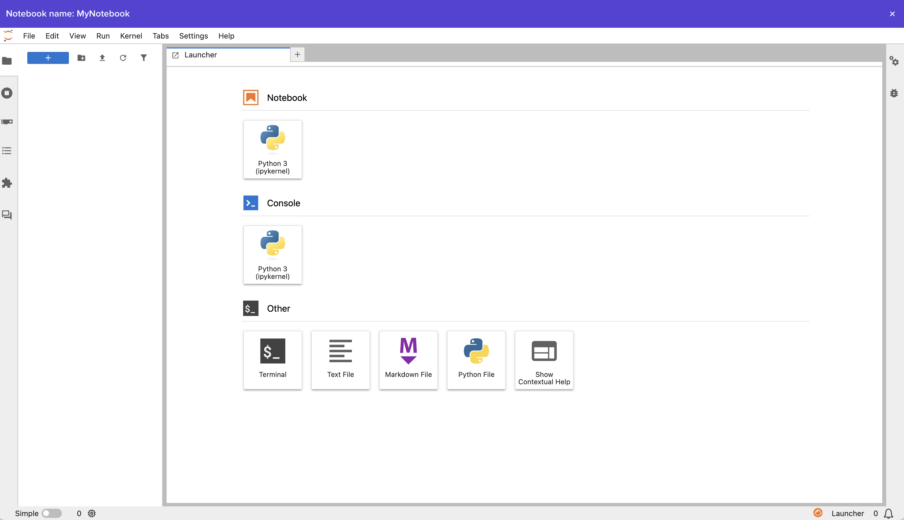

##### Create a Job Submission and get insights on job performance in real time

Follow along with the steps below to create a Job Script in the Vantage web ui!

## 1. Job Submission Dashboard

Navigate to the [Job Submission Dashboard](https://app.vantagecompute.ai/jobs/submissions) using the left side navbar.

## 2. Create a Job Submission

Select the "Create Job Submission" button in the upper right hand corner of the UI to open the Job Submission creation modal.

### 2.1 Select Job Script, Cluster, and Partition

Give your Job Submission a name and select an Job Script, Cluster, and a Partition, then click "Create".

### 2.2 Observe Job Submission Progress Log

After submitting your job you will be redirected to the Job Submission Progress tab where you will
observe the job state change as it moves through the queue.

### 2.2 Observe Job Submission Metrics

Job Submission metrics provide near-realm-time job-level observability and diagnostics.

At this point you have successfully created a Job Submission and have covered the basics of the Vantage platform!

## Next Steps

### Clouds

- [`Vantage Compute Partner Clouds`](/platform/)
- [`Public Clouds`](/platform/)
- [`On-Premises Clouds`](/platform/)
- [`K8S Clouds`](/platform/)

### Clusters

- [`Create a Cloud Cluster - AWS`](/platform/)
- [`Create a Cloud Cluster - GCP`](/platform/)
- [`Create a Cloud Cluster - AZURE`](/platform/)

### Federations

- [`Federations`](/platform/)

### Storage

- [`Storage`](/platform/)

### Licenses

- [`Licenses`](/platform/)

### Support

- [`Support Dashboard`](/platform/)

