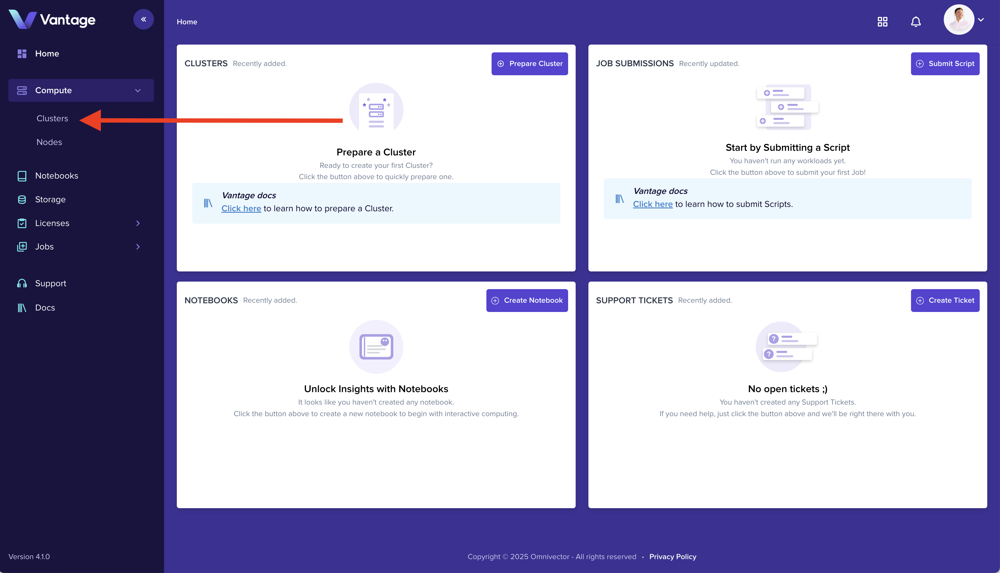
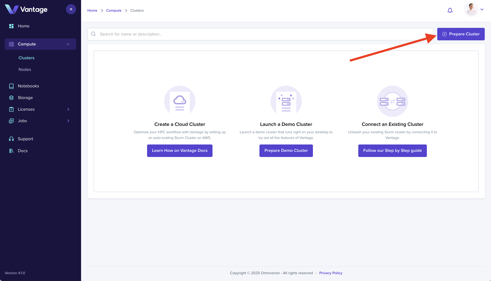
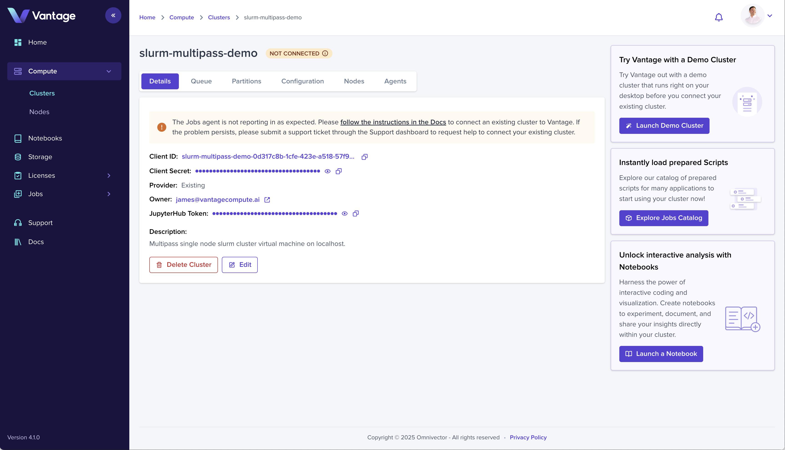
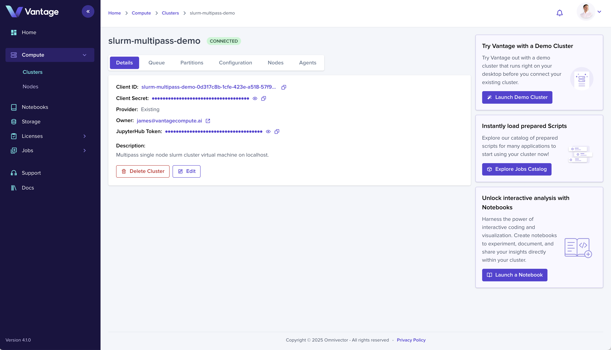
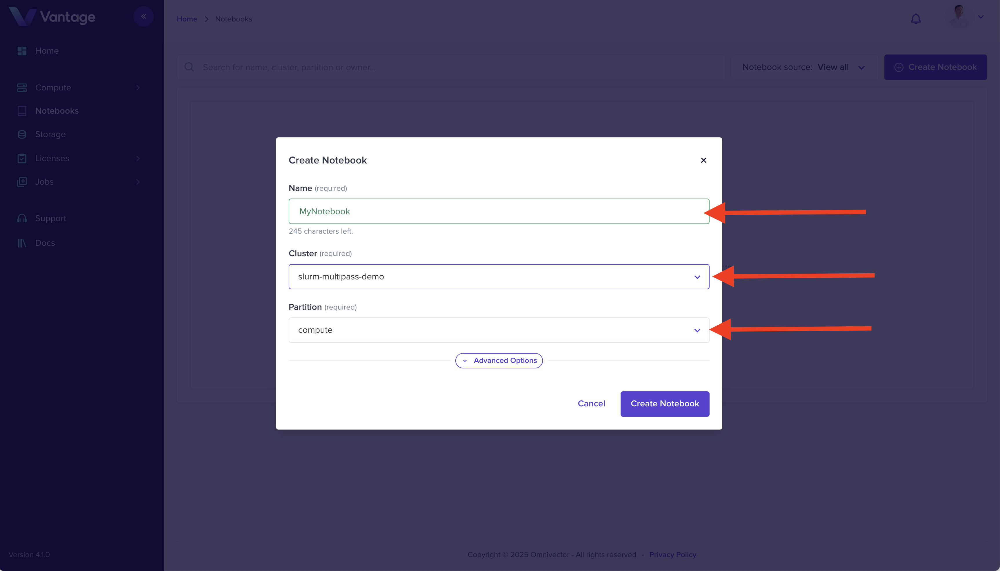

Welcome to Vantage! This guide walks you through setting up your first organization, creating a cluster, and launching a notebook.

## What You'll Build

By the end of this guide, you'll have:

- A Vantage account and organization
- A running Slurm cluster
- A Jupyter notebook environment

**Estimated time:** ~15 minutes

## Prerequisites

- A modern web browser
- An email address (for SSO authentication)
- For local clusters: Ubuntu 24.04 with [multipass](https://canonical.com/multipass) installed

## Step 1: Sign Up and Create Your Organization

The first step to using Vantage is creating your account. Vantage uses **Single Sign-On (SSO)** authentication, which means you don't need to manage another password — you authenticate with an identity provider you already trust.

Vantage supports three identity providers:

- **Google** — Best for personal accounts and quick onboarding
- **Microsoft** — Best if your organization uses Microsoft Entra ID (formerly Azure AD), enabling corporate security policies
- **GitHub** — Best for developers already embedded in the GitHub ecosystem

### Navigate to Sign Up

Navigate to the [Vantage Homepage](https://vantagecompute.ai) and click the **Sign Up** button to begin the account creation process.

<!--  -->

### Authenticate

Choose your preferred SSO provider to authenticate. You'll be redirected to your provider's login page where you enters your credentials and authorizes Vantage to access your basic profile information (name and email).

<!--  -->

### Create Your Organization

After authentication, you'll be prompted to create an organization. Organizations are the top-level container in Vantage that group:

- **Users** — Team members who access the organization
- **Clusters** — Compute resources you create or connect
- **Billing** — subscription and payment management
- **Settings** — Permissions, integrations, and preferences

Provide an organization name, this is how your team will identify your workspace. Optionally upload a logo to personalize your workspace.

<!--  -->

### Welcome to Vantage

Once your organization is created, you'll land on the Vantage platform home page. From here you can:

- Navigate to **Clusters** to create or connect compute resources
- Navigate to **Notebooks** to launch interactive environments
- Access **Jobs** to submit computational workloads
- Invite team members through **Settings**

<!--  -->

## Step 2: Create a Cluster

Clusters are the foundation of your compute infrastructure in Vantage. A cluster is a collection of compute nodes (servers) running **Slurm**, an open-source job scheduler used by supercomputers and research institutions worldwide.

When you create a cluster in Vantage, you can:
- Submit batch jobs to run computational workloads
- Launch interactive notebooks that connect to the cluster
- Monitor GPU utilization, job metrics, and system health
- Scale resources dynamically across nodes

### Choosing Your Infrastructure

Vantage supports three ways to deploy a local Slurm cluster, depending on your needs:

| Option | Best For | Complexity |
|--------|---------|------------|
| **Multipass** | Quick testing, local development | Low — minimal setup |
| **LXD** | Production containers, multi-node | Medium — requires Juju |
| **MicroK8S** | Kubernetes-native workloads | Medium — requires K8s |

We'll walk through creating a cluster entry in the web UI, then deploying using the Vantage CLI.

### Access the Cluster Dashboard

Navigate to the **Clusters** dashboard in the Vantage web UI. This is where you create and manage cluster entries — the logical representation of your compute resources in Vantage.

<!--  -->

### Prepare a Cluster

Click the **Prepare Cluster** button in the upper right corner to begin creating a new cluster entry.

<!--  -->

### Configure Cluster Settings

Enter a name for your cluster and select **Existing** as the cluster type. This indicates you're connecting your own infrastructure (as opposed to provisioning cloud resources through Vantage).

- **Cluster name** — A friendly name like `my-first-cluster` or `research-cluster`
- **Cluster type** — Select **Existing** to connect your own infrastructure

Click **Prepare** to create the cluster entry.

<!--  -->

### View Cluster Details

The cluster entry is now created in Vantage, but it's not yet connected. The cluster detail view shows its current status as **Not Connected**. This is expected — we haven't deployed the Slurm cluster yet.

<!--  -->

### Install the Vantage CLI

The Vantage CLI (command-line interface) is the recommended way to deploy and manage clusters. It handles:

- Authenticating with the Vantage platform
- Provisioning infrastructure (Multipass, LXD, or MicroK8S)
- Deploying the Slurm cluster
- Connecting the cluster to Vantage

First, install the **UV** package manager, then install the Vantage CLI:

#### Install UV

UV is a fast Python package manager written in Rust. Install it via snap:

```bash
sudo snap install astral-uv --classic
```

#### Install Vantage CLI

Create a virtual environment and install the Vantage CLI:

```bash
uv venv && \
    source .venv/bin/activate && \
    uv pip install vantage-cli
```

#### Login to Vantage

Authenticate with the Vantage platform:

```bash
vantage login
```

This command provides a URL to open in your browser. Click the URL to authenticate (using your SSO provider), then return to your terminal. The CLI will detect the successful authentication and store your session.

### Deploy a Slurm Cluster

Now deploy your Slurm cluster. Choose your preferred infrastructure:

<Tabs>
<TabItem value="multipass" label="Multipass" default>

**Best for:** Quick local testing, learning, or development. Multipass creates Ubuntu VMs on your local machine with a single command.

#### Install Multipass

```bash
sudo snap install multipass
```

#### Create the Slurm Cluster

```bash
vantage app deployment slurm-multipass-localhost create my-first-cluster
```

This command:
1. Creates a Multipass VM running Ubuntu
2. Installs and configures Slurm
3. Starts the Slurm controller and compute node
4. Registers the cluster with your Vantage organization

</TabItem>
<TabItem value="lxd" label="LXD">

**Best for:** Production workloads. LXD provides system containers (like VMs) that run full Linux distributions with better resource efficiency.

#### Install LXD and Juju

```bash
sudo snap install lxd
sudo lxd init --auto
lxc network set lxdbr0 ipv6.nat false
sudo snap install juju --channel 3/stable
juju bootstrap lxd
```

#### Create the Slurm Cluster

```bash
vantage app deployment slurm-lxd-localhost create my-first-cluster
```

</TabItem>
<TabItem value="microk8s" label="MicroK8S">

**Best for:** Kubernetes-native workloads. If you need to run containerized workloads alongside Slurm, or integrate with an existing Kubernetes cluster.

#### Install and Configure MicroK8S

```bash
sudo snap install microk8s --channel 1.29/stable --classic
sudo usermod -a -G microk8s $USER
sudo chown -f -R $USER ~/.kube
microk8s.enable hostpath-storage
microk8s.enable dns
microk8s.enable metallb:10.64.140.43-10.64.140.49
```

#### Create the Slurm Cluster

```bash
vantage app deployment slurm-microk8s-localhost create my-first-cluster
```

</TabItem>
</Tabs>

### Verify Cluster Connection

Return to the cluster detail view in the Vantage web UI. The cluster status will change to **Connected** when it's successfully linked to the platform.

When connected, you can:
- Submit jobs to the cluster
- Launch notebooks on cluster partitions
- Monitor cluster health and metrics

<!--  -->

## Step 3: Launch a Notebook

Notebooks provide an interactive development environment for data science and research. A **Jupyter Notebook** is a web-based interface where you can write and execute code, visualize results, and document your analysis — all in one place.

With Vantage notebooks, you get:
- **Instant access** — Launch a notebook with just a few clicks
- **Slurm integration** — Notebooks run on your cluster's compute nodes
- **GPU support** — Access GPU partitions for deep learning
- **Persistence** — Your work is saved to cluster storage

### Access the Notebook Dashboard

Navigate to the [Notebooks section](https://app.vantagecompute.ai/notebooks) in the Vantage web UI using the left sidebar navigation.

<!--  -->

### Create a Notebook

Click the **Create Notebook** button in the upper right corner to open the notebook creation form.

<!--  -->

### Configure Notebook Resources

Complete the form by providing:

- **Name** — A friendly name for your notebook (e.g., `my-notebook`)
- **Cluster** — Select your connected cluster (e.g., `my-first-cluster`)
- **Partition** — Select the appropriate partition. Partitions define the compute resources available to your notebook:
  - **Compute** — CPU-only nodes for general workloads
  - **GPU** — Nodes with GPUs (NVIDIA V100, A100, H100, etc.)
  - **Large** — High-memory nodes for large datasets

Click **Create Notebook** to submit the form.

<!--  -->

### Access Your Notebook

Click on your newly created notebook in the list to open it in the Vantage web UI.

Your notebook starts on a compute node in your cluster. You'll see the Jupyter interface where you can create cells, write code (Python, R, Julia, etc.), and execute them interactively.

<!--  -->

### Start Coding

Your notebook environment is ready. You can now:

- Write code in cells and execute with **Shift + Enter**
- Load data from cluster storage or cloud storage
- Run computations that utilize the cluster's CPU/GPU resources
- Visualize results inline
- Export notebooks as Python scripts or PDFs

<!--  -->

## Summary

You now have:

- A Vantage account and organization
- A connected Slurm cluster
- A running Jupyter Notebook

You're ready to run computational workloads, collaborate with your team, and explore the full Vantage platform.

## Next Steps

<Tabs>
<TabItem value="researcher" label="I'm a Researcher">

- [Interactive Notebooks](./notebook-intro.md) — Start coding immediately
- [Job Submissions](./create-job-submission-intro.md) — Run experiments at scale
- [Storage Solutions](./platform/storage/) — Manage your research data

</TabItem>
<TabItem value="admin" label="I'm an Admin">

- [Cluster Management](./platform/clusters/) — Advanced cluster configuration
- [Compute Providers](./platform/compute-providers/) — Connect AWS, Azure, GCP
- [License Management](./platform/licenses/) — Configure license servers

</TabItem>
<TabItem value="developer" label="I'm a Developer">

- [CLI Installation](/cli) — Automate tasks from the command line
- [API Reference](/api) — Build custom integrations
- [SDK Documentation](/sdk) — Type-safe libraries for your applications

</TabItem>
</Tabs>