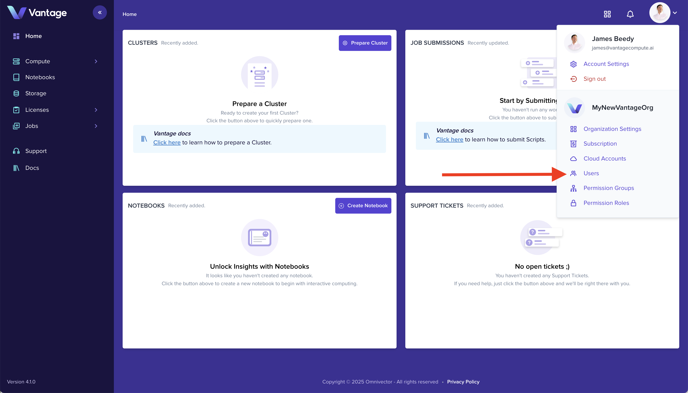
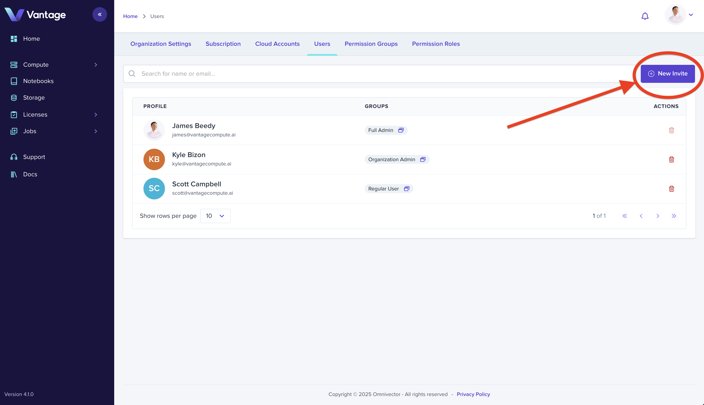
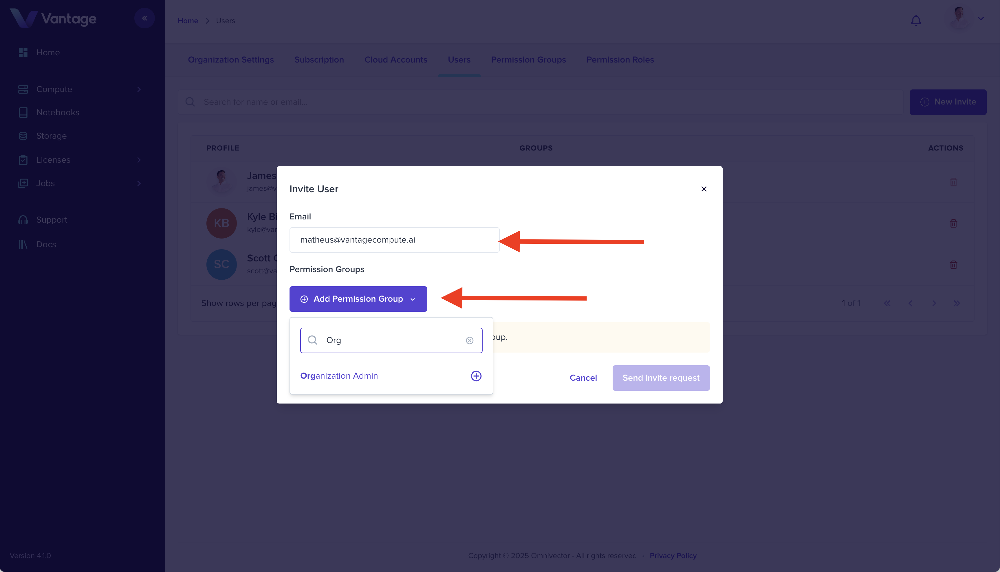

Invite your colleagues, manage permissions, and assign team membership in your Vantage organization.

## 1. Navigate to the Users section

Select the [Users](https://app.vantagecompute.ai/admin/users) navigation from the settings dropdown to navigate
to the user management dashaboard.

## 2. Click "New Invite"

Find the "New Invite" button in the upper right hand corner of the Users tab. Click the button to open the new invite form.

## 3. Enter Invitee Email Address and Assign Permissions

Complete the "New Invite" form by entering the invitee's email address and desired permissions group(s) and
click the "Send Invite Request" button to initiate the invitation process.

## 4. Summary

The invitee will receive an email from `invites@vantagecompute.ai`. The invitee should click the link in the email to
join the Vantage organization.

### Go Deeper with Vantage Identity and Access Management

Vantage has advanced identity management capabilities.

Explore custom permission groups, teams, federated identity realms, multiple identity providers, SSO and more!

- [`Identity and Access Management in Vantage`](/platform/iam/)

### Next Steps

- [`Connect your First Cluster`](./create-cluster-intro.md)
- [`Configure a Compute Provider`](/platform/compute-providers/)
