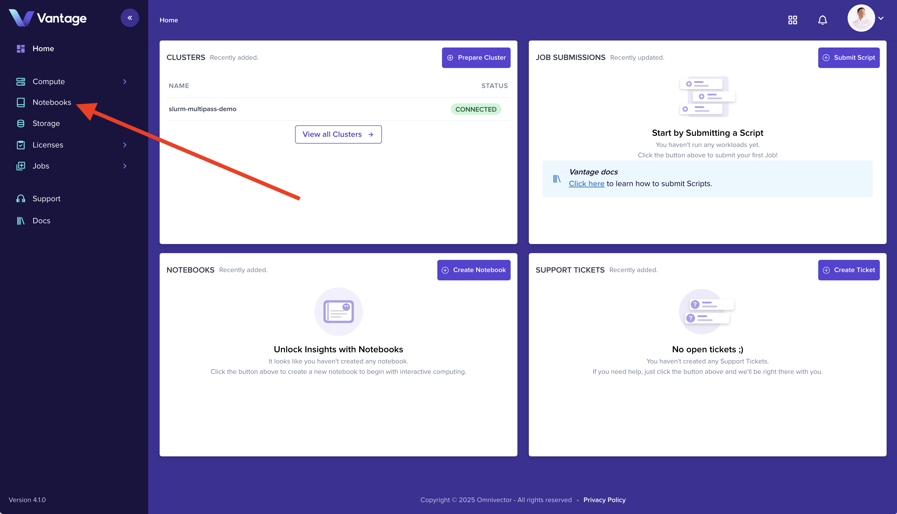
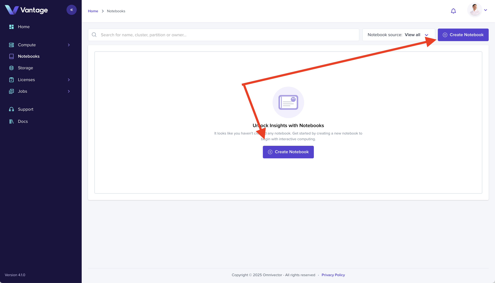
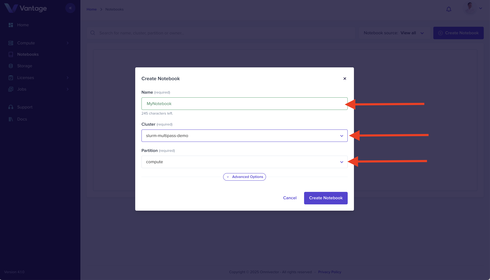
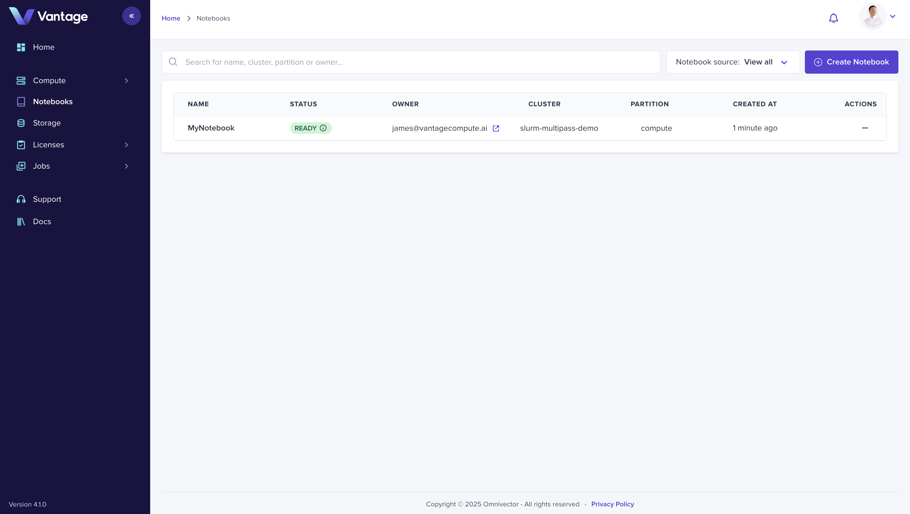

##### Launch a Jupyter Notebook on your new Cluster in seconds

Building on the the previous section, [Create Your First Cluster](./create-cluster-intro.md),
we will make use of our newly added cluster by deploying a a Jupyter Notebook on it.

## 1. Notebook Dashboard

Navigate to the Notebook dashboard by selecting the [Notebooks](https://vantagecompute.ai/notebooks) navigation
in the lefthand navbar.

## 2. Create Notebook

Click the "Create Notebook" button in the upper right corner of the page to open the notebook create modal.

## 3. Configure Notebook Resources

Complete the form by giving your notebook a name, selecting the cluster we just created (slurm-multipass-demo) and the partition (compute).

Click the "Create Notebook" button to complete and submit the form.

## 4. Login to your Notebook

Click the notebook we just created in the list to open it in the Vantage UI.

Welcome to your curated notebook development environment!

## 5. Summary

At this point, you have a production grade, singlenode slurm cluster running in a virtual machine on your computer!

You can share your cluster with members of your organization by adding them to your [Team](/platform/teams/), submit [Job Scripts](/platform/jobs/tutorials), [Federate](/platform/federations) with other clusters,
orchestrate [Job Template](/platform/jobs/tutorials/) workflows, and much more!

