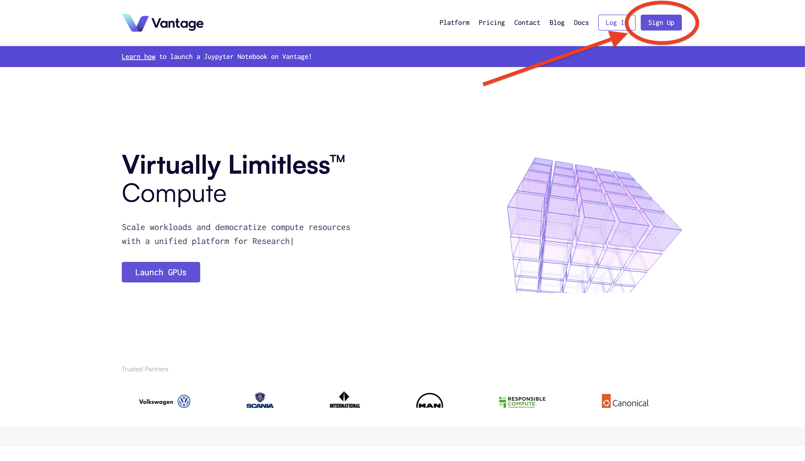
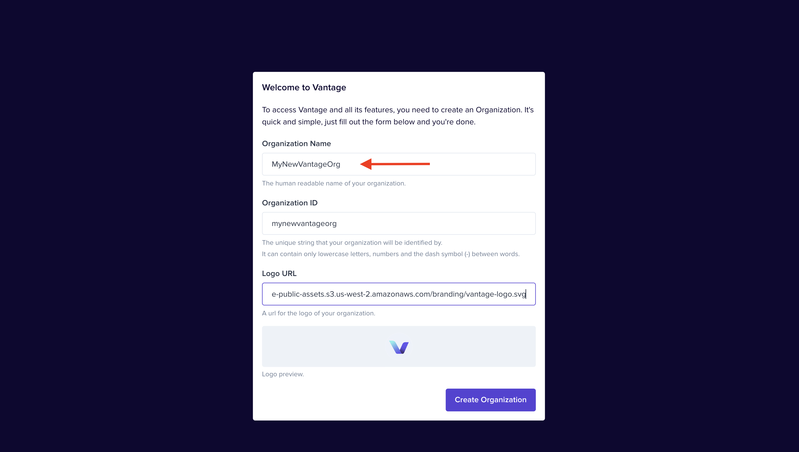
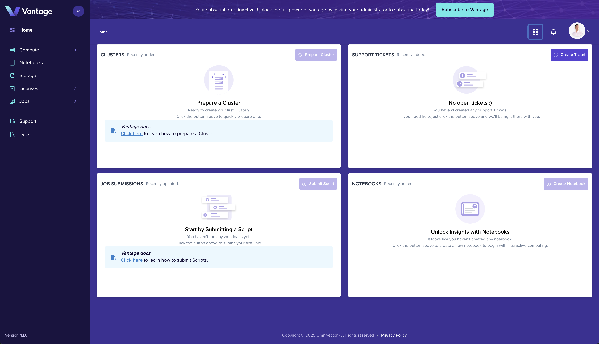

##### Getting started with Vantage is free and easy

## Account Creation

Follow along with the steps to create an account and sign in to the Vantage UI!

### 1. Sign Up

Click the "Sign Up" button on the [Vantage Homepage](https://vantagecompute.ai) to get started!

### 2. Authenticate

The "Sign Up" button will direct you to authenticate with your choice of SSO providers.

### 3. Initialize your Organization

Following successful authentication you will be presented with the organization creation form where you will
be prompted to provide an organization name and optionally a logo.

### 4. Happy Computing

After creating your organization you will land in the Vantage platform home and are ready to begin!

## Next Steps

- [Invite team members](./invite-intro.md)
- [Connect your first cluster](./create-cluster-intro.md)
